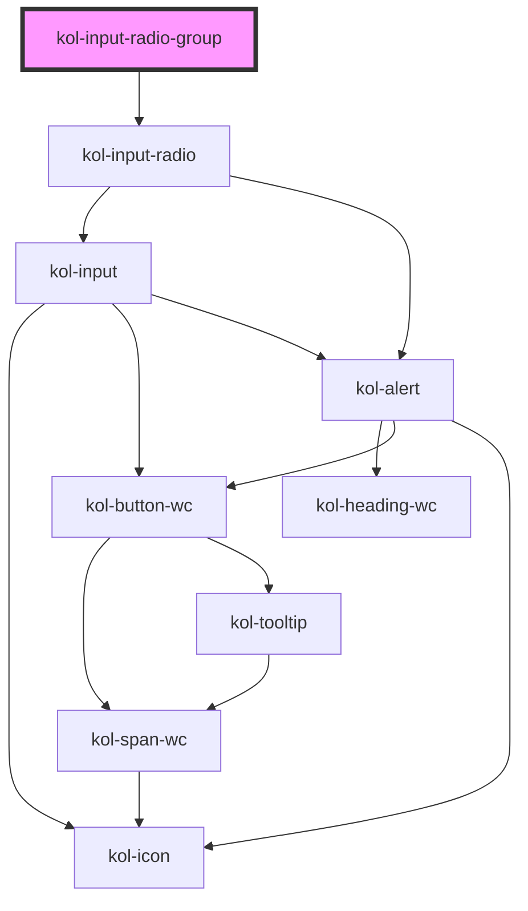

# InputRadioGroup

<!-- Auto Generated Below -->

> **[DEPRECATED]** Die Komponenten Input-Radio-Group und Input-Radio werden zur Komponente Input-Radio zusammengeführt. Verwendet einfach den Tag `<kol-input-radio>` statt `<kol-input-radio-group>`.

## Properties

| Property             | Attribute      | Description                                                                          | Type                                                                                     | Default      |
| -------------------- | -------------- | ------------------------------------------------------------------------------------ | ---------------------------------------------------------------------------------------- | ------------ |
| `_accessKey`         | `_access-key`  | Gibt an, mit welcher Tastenkombination man das Input auslösen oder fokussieren kann. | `string \| undefined`                                                                    | `undefined`  |
| `_alert`             | `_alert`       | Gibt an, ob die Fehlermeldung vorgelesen werden soll, wenn es eine gibt.             | `boolean \| undefined`                                                                   | `true`       |
| `_disabled`          | `_disabled`    | Setzt das Feld in einen inaktiven Zustand, in dem es keine Interaktion erlaubt.      | `boolean \| undefined`                                                                   | `undefined`  |
| `_error`             | `_error`       | Gibt den Text für eine Fehlermeldung an.                                             | `string \| undefined`                                                                    | `undefined`  |
| `_hideLabel`         | `_hide-label`  | Versteckt das sichtbare Label des Elements.                                          | `boolean \| undefined`                                                                   | `undefined`  |
| `_hint`              | `_hint`        | Gibt den Hinweistext an.                                                             | `string \| undefined`                                                                    | `''`         |
| `_id`                | `_id`          | Gibt die technische ID des Eingabefeldes an.                                         | `string \| undefined`                                                                    | `undefined`  |
| `_list` _(required)_ | `_list`        | Gibt die Liste der Optionen für das Eingabefeld an.                                  | `Option<W3CInputValue>[] \| string`                                                      | `undefined`  |
| `_name`              | `_name`        | Gibt den technischen Namen des Eingabefeldes an.                                     | `string \| undefined`                                                                    | `undefined`  |
| `_on`                | --             | Gibt die EventCallback-Funktionen für das Input-Event an.                            | `InputTypeOnBlur & InputTypeOnClick & InputTypeOnChange & InputTypeOnFocus \| undefined` | `undefined`  |
| `_orientation`       | `_orientation` | Gibt die Ausrichtung der LinkList an.                                                | `"horizontal" \| "vertical" \| undefined`                                                | `'vertical'` |
| `_required`          | `_required`    | Macht das Eingabeelement zu einem Pflichtfeld.                                       | `boolean \| undefined`                                                                   | `undefined`  |
| `_tabIndex`          | `_tab-index`   | Gibt an, welchen Tab-Index dieses Input hat.                                         | `number \| undefined`                                                                    | `undefined`  |
| `_touched`           | `_touched`     | Gibt an, ob dieses Eingabefeld von Nutzer:innen einmal besucht/berührt wurde.        | `boolean \| undefined`                                                                   | `false`      |
| `_value`             | `_value`       | Gibt den Wert der Radio an.                                                          | `number \| string \| undefined`                                                          | `undefined`  |

## Dependencies

### Depends on

- [kol-input-radio](../input-radio)

### Graph

----------------------------------------------

