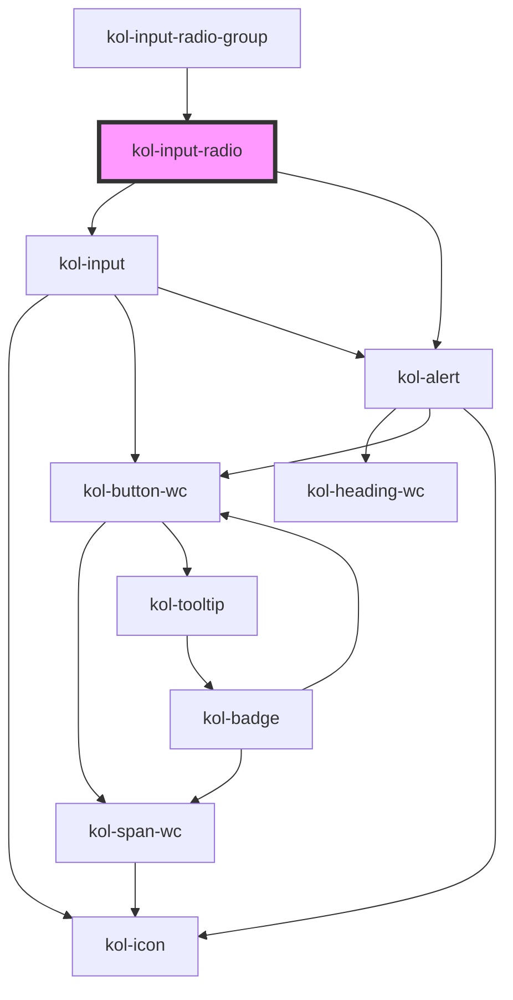

# InputRadio

Die Komponente **InputRadio** besteht aus einer Sammlung von Radio-Elementen und stellt so eine Auswahlmöglichkeit zwischen verschiedenen Werten dar. Es kann immer nur ein einzelner Wert zur gleichen Zeit ausgewählt werden. Ausgewählte Radio-Elemente werden i.d.R. mit einem gefüllten und optisch hervorgehobenen Kreis dargestellt.

<kol-alert _alert _heading="Hinweis" _level="1" _type="info">
  Das Input-Radio dient der Abbildung einer Auswahlmöglichkeit bei der mindestens und maximal eine Auswahl getroffen werden kann. Das bedeutet, dass ein Input-Radio nicht einzeln vorkommen kann. Aufgrund dessen haben wir die Komponente als Listen-Komponente umgesetzt.
</kol-alert><br/>

## Konstruktion

### Code

```html
<kol-input-radio
	_id="anrede"
	_name="anrede"
	_list='[{"label":"Herr","value":"Herr"},{"label":"Frau","value":"Frau"}, {"label":"Firma","value":"Firma"}]'
></kol-input-radio>
```

### Beispiel

<kol-input-radio _id="anrede" _name="anrede" _list='[{"label":"Herr","value":"Herr"},{"label":"Frau","value":"Frau"}, {"label":"Firma","value":"Firma"}]'></kol-input-radio>

## Verwendung

Die einzelnen Radio-Elemente innerhalb der Komponente ** InputRadio** werden über dass Attribut **_\_list_** als JSON-Objekt übergeben.

Das JSON-Objekt erwartet je Radio-Element folgende Werte:

**`label`** = Beschriftung des Radio-Elements

**`value`** = Wert des Radio-Elements

Beispiel für die Erstellung des JSON-Objekts zur Definition der Radio-Elemente:

```html
[ { label: 'Herr', value: 'Herr', }, { label: 'Frau', value: 'Frau', }, { label: 'Firma', value: 'Firma', }, ];
```

### onChange

Dem EventHandler werden zwei Parameter übergeben, das ursprüngliche Event und der Wert des ausgewählten RadioButtons.
<kol-alert _heading="Hinweis für Versionen <2" _type="info">event.target.value enthält die Nummer der Checkbox mit einem '-' davor.</kol-alert>

```jsx
<kol-input-radio
	_id="anrede"
	_name="anrede"
	_list={[
		{ label: 'Herr', value: 'Herr' },
		{ label: 'Frau', value: 'Frau' },
		{ label: 'Firma', value: 'Firma' },
	]}
	_on={{ onChange: (_event, value) => setValue(value) }}
></kol-input-radio>
```

### Best practices

- Achten sie darauf `id` und `name` korrekt zu setzen, damit die Daten beim Formular Absenden mitgesendet werden.
- Es wird immer mindestens ein Wert ausgewählt. Ähnlich dem Verhalten einer Select-Auswahl. (https://developer.mozilla.org/en-US/docs/Web/HTML/Element/input/radio#selecting_a_radio_button_by_default)

## Barrierefreiheit

### Tastatursteuerung

| Taste          | Funktion                                                                                         |
| -------------- | ------------------------------------------------------------------------------------------------ |
| `Tab`          | Fokussiert das erste Radio-Element, aktiviert es aber nicht.                                     |
| `Leer`         | Aktiviert das erste Radio-Element, nachdem die RadioGroup über die Tab-Taste angesprungen wurde. |
| `Pfeil-Tasten` | Durchlaufen aller Radio-Elemente und aktiviert das gerade fokussierte Element.                   |

## Links und Referenzen

- https://www.w3.org/TR/wai-aria-practices/#radiobutton
- https://www.w3schools.com/tags/att_input_type_radio.asp
- https://developer.mozilla.org/en-US/docs/Web/HTML/Element/input/radio
- https://medium.com/@gavyn/til-autofocus-inputs-are-an-accessibility-problem-32ced60c3109

<!-- Auto Generated Below -->

## Properties

| Property             | Attribute      | Description                                                                                | Type                                                                                     | Default      |
| -------------------- | -------------- | ------------------------------------------------------------------------------------------ | ---------------------------------------------------------------------------------------- | ------------ |
| `_accessKey`         | `_access-key`  | Gibt an, mit welcher Tastenkombination man das Input auslösen oder fokussieren kann.       | `string \| undefined`                                                                    | `undefined`  |
| `_alert`             | `_alert`       | Gibt an, ob die Fehlermeldung vorgelesen werden soll, wenn es eine gibt.                   | `boolean \| undefined`                                                                   | `true`       |
| `_disabled`          | `_disabled`    | Gibt an, ob das Eingabefeld aktiviert oder deaktiviert ist.                                | `boolean \| undefined`                                                                   | `undefined`  |
| `_error`             | `_error`       | Gibt den Text für eine Fehlermeldung an.                                                   | `string \| undefined`                                                                    | `undefined`  |
| `_hideLabel`         | `_hide-label`  | Gibt an, ob das Eingabefeld kein sichtbares Label haben soll.                              | `boolean \| undefined`                                                                   | `undefined`  |
| `_hint`              | `_hint`        | Gibt den Text für eine Hinweistext an.                                                     | `string \| undefined`                                                                    | `''`         |
| `_id`                | `_id`          | Gibt die technische ID des Eingabefeldes an.                                               | `string \| undefined`                                                                    | `undefined`  |
| `_list` _(required)_ | `_list`        | Gibt die Liste der Optionen für das Eingabefeld an.                                        | `Option<W3CInputValue>[] \| string`                                                      | `undefined`  |
| `_name`              | `_name`        | Gibt den technischen Namen des Eingabefeldes an.                                           | `string \| undefined`                                                                    | `undefined`  |
| `_on`                | --             | Gibt die EventCallback-Funktionen für das Input-Event an.                                  | `InputTypeOnBlur & InputTypeOnClick & InputTypeOnChange & InputTypeOnFocus \| undefined` | `undefined`  |
| `_orientation`       | `_orientation` | Gibt die Ausrichtung der LinkList an.                                                      | `"horizontal" \| "vertical" \| undefined`                                                | `'vertical'` |
| `_required`          | `_required`    | Gibt an, ob das Eingabefeld ein Pflichtfeld ist.                                           | `boolean \| undefined`                                                                   | `undefined`  |
| `_tabIndex`          | `_tab-index`   | Gibt an, welchen Tab-Index dieses Input hat.                                               | `number \| undefined`                                                                    | `undefined`  |
| `_touched`           | `_touched`     | Gibt an, ob dieses Eingabefeld von Nutzer:innen einmal besucht/berührt wurde.              | `boolean \| undefined`                                                                   | `false`      |
| `_value`             | `_value`       | Gibt den Wert der Radio an. (Known Bug: https://github.com/ionic-team/stencil/issues/3902) | `number \| string \| undefined`                                                          | `undefined`  |

## Dependencies

### Used by

- [kol-input-radio-group](../input-radio-group)

### Depends on

- kol-input
- [kol-alert](../alert)

### Graph



---
