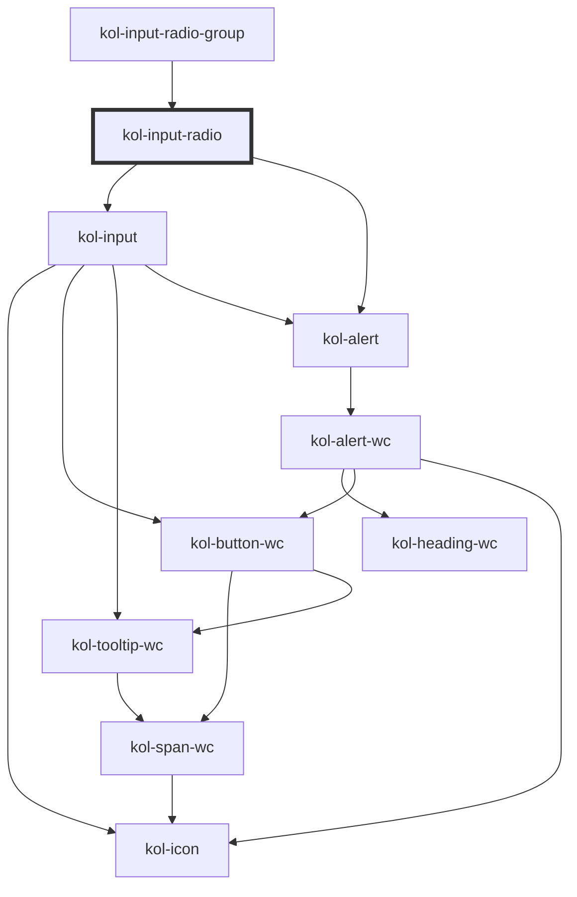

# InputRadio

Die Komponente **InputRadio** besteht aus einer Sammlung von Radio-Elementen und stellt so eine Auswahlmöglichkeit zwischen verschiedenen Werten dar. Es kann immer nur ein einzelner Wert zur gleichen Zeit ausgewählt werden. Ausgewählte Radio-Elemente werden i.d.R. mit einem gefüllten und optisch hervorgehobenen Kreis dargestellt.

<kol-alert _alert _heading="Hinweis" _level="1" _type="info">
  Das Input-Radio dient der Abbildung einer Auswahlmöglichkeit bei der mindestens und maximal eine Auswahl getroffen werden kann. Das bedeutet, dass ein Input-Radio nicht einzeln vorkommen kann. Aufgrund dessen haben wir die Komponente als Listen-Komponente umgesetzt.
</kol-alert><br/>

## Konstruktion

### Code

```html
<kol-input-radio _options='[{"label":"Herr","value":"Herr"},{"label":"Frau","value":"Frau"}, {"label":"Firma","value":"Firma"}]'></kol-input-radio>
```

### Beispiel

<kol-input-radio _options='[{"label":"Herr","value":"Herr"},{"label":"Frau","value":"Frau"}, {"label":"Firma","value":"Firma"}]'></kol-input-radio>

## Verwendung

Die einzelnen Radio-Elemente innerhalb der Komponente ** InputRadio** werden über dass Attribut **_\_options_** als JSON-Objekt übergeben.

Das JSON-Objekt erwartet je Radio-Element folgende Werte:

**`label`** = Beschriftung des Radio-Elements

**`value`** = Wert des Radio-Elements

Beispiel für die Erstellung des JSON-Objekts zur Definition der Radio-Elemente:

```html
[ { label: 'Herr', value: 'Herr', }, { label: 'Frau', value: 'Frau', }, { label: 'Firma', value: 'Firma', }, ];
```

### onChange

Dem EventHandler werden zwei Parameter übergeben, das ursprüngliche Event und der Wert des ausgewählten RadioButtons.
<kol-alert _heading="Hinweis für Versionen <2" _type="info">event.target.value enthält die Nummer der Checkbox mit einem '-' davor.</kol-alert>

```jsx
<kol-input-radio
	_options={[
		{ label: 'Herr', value: 'Herr' },
		{ label: 'Frau', value: 'Frau' },
		{ label: 'Firma', value: 'Firma' },
	]}
	_on={{ onChange: (_event, value) => setValue(value) }}
></kol-input-radio>
```

### Best practices

- Achten sie darauf `id` und `name` korrekt zu setzen, damit die Daten beim Formular Absenden mitgesendet werden.
- Es wird immer mindestens ein Wert ausgewählt. Ähnlich dem Verhalten einer Select-Auswahl. (<kol-link _href="https://developer.mozilla.org/en-US/docs/Web/HTML/Element/input/radio#selecting_a_radio_button_by_default" _label="https://developer.mozilla.org/en-US/docs/Web/HTML/Element/input/radio#selecting_a_radio_button_by_default" _target="_blank"></kol-link>)

## Barrierefreiheit

### Tastatursteuerung

| Taste          | Funktion                                                                                         |
| -------------- | ------------------------------------------------------------------------------------------------ |
| `Tab`          | Fokussiert das erste Radio-Element, aktiviert es aber nicht.                                     |
| `Leer`         | Aktiviert das erste Radio-Element, nachdem die RadioGroup über die Tab-Taste angesprungen wurde. |
| `Pfeil-Tasten` | Durchlaufen aller Radio-Elemente und aktiviert das gerade fokussierte Element.                   |

## Links und Referenzen

- <kol-link _href="https://www.w3.org/TR/wai-aria-practices/#radiobutton" _label="https://www.w3.org/TR/wai-aria-practices/#radiobutton" _target="_blank"></kol-link>
- <kol-link _href="https://www.w3schools.com/tags/att_input_type_radio.asp" _label="https://www.w3schools.com/tags/att_input_type_radio.asp" _target="_blank"></kol-link>
- <kol-link _href="https://developer.mozilla.org/en-US/docs/Web/HTML/Element/input/radio" _label="https://developer.mozilla.org/en-US/docs/Web/HTML/Element/input/radio" _target="_blank"></kol-link>
- <kol-link _href="https://medium.com/@gavyn/til-autofocus-inputs-are-an-accessibility-problem-32ced60c3109" _label="https://medium.com/@gavyn/til-autofocus-inputs-are-an-accessibility-problem-32ced60c3109" _target="_blank"></kol-link>

<!-- Auto Generated Below -->

## Properties

| Property        | Attribute        | Description                                                                                                                                                  | Type                                                                                                        | Default      |
| --------------- | ---------------- | ------------------------------------------------------------------------------------------------------------------------------------------------------------ | ----------------------------------------------------------------------------------------------------------- | ------------ |
| `_accessKey`    | `_access-key`    | Defines which key combination can be used to trigger or focus the interactive element of the component.                                                      | `string \| undefined`                                                                                       | `undefined`  |
| `_alert`        | `_alert`         | Defines whether the screen-readers should read out the notification.                                                                                         | `boolean \| undefined`                                                                                      | `true`       |
| `_disabled`     | `_disabled`      | Makes the element not focusable and ignore all events.                                                                                                       | `boolean \| undefined`                                                                                      | `false`      |
| `_error`        | `_error`         | Defines the error message text.                                                                                                                              | `string \| undefined`                                                                                       | `undefined`  |
| `_hideError`    | `_hide-error`    | Hides the error message but leaves it in the DOM for the input's aria-describedby.                                                                           | `boolean \| undefined`                                                                                      | `false`      |
| `_hideLabel`    | `_hide-label`    | Hides the caption by default and displays the caption text with a tooltip when the interactive element is focused or the mouse is over it.                   | `boolean \| undefined`                                                                                      | `false`      |
| `_hint`         | `_hint`          | Defines the hint text.                                                                                                                                       | `string \| undefined`                                                                                       | `''`         |
| `_id`           | `_id`            | Defines the internal ID of the primary component element.                                                                                                    | `string \| undefined`                                                                                       | `undefined`  |
| `_label`        | `_label`         | Defines the visible or semantic label of the component (e.g. aria-label, label, headline, caption, summary, etc.). Set to `false` to enable the expert slot. | `string \| undefined`                                                                                       | `undefined`  |
| `_list`         | `_list`          | <span style="color:red">**[DEPRECATED]**</span> Use \_options.<br/><br/>Deprecated: Gibt die Liste der Optionen für das Eingabefeld an.                      | `Option<W3CInputValue>[] \| string \| undefined`                                                            | `undefined`  |
| `_name`         | `_name`          | Defines the technical name of an input field.                                                                                                                | `string \| undefined`                                                                                       | `undefined`  |
| `_on`           | --               | Gibt die EventCallback-Funktionen für das Input-Event an.                                                                                                    | `InputTypeOnBlur & InputTypeOnClick & InputTypeOnChange & InputTypeOnFocus & InputTypeOnInput \| undefined` | `undefined`  |
| `_options`      | `_options`       | Options the user can choose from.                                                                                                                            | `Option<W3CInputValue>[] \| string \| undefined`                                                            | `undefined`  |
| `_orientation`  | `_orientation`   | Defines whether the orientation of the component is horizontal or vertical.                                                                                  | `"horizontal" \| "vertical" \| undefined`                                                                   | `'vertical'` |
| `_required`     | `_required`      | Makes the input element required.                                                                                                                            | `boolean \| undefined`                                                                                      | `false`      |
| `_tabIndex`     | `_tab-index`     | Defines which tab-index the primary element of the component has. (https://developer.mozilla.org/en-US/docs/Web/HTML/Global_attributes/tabindex)             | `number \| undefined`                                                                                       | `undefined`  |
| `_tooltipAlign` | `_tooltip-align` | Defines where to show the Tooltip preferably: top, right, bottom or left.                                                                                    | `"bottom" \| "left" \| "right" \| "top" \| undefined`                                                       | `'top'`      |
| `_touched`      | `_touched`       | Shows if the input was touched by a user.                                                                                                                    | `boolean \| undefined`                                                                                      | `false`      |
| `_value`        | `_value`         | Defines the value of the input.                                                                                                                              | `number \| string \| undefined`                                                                             | `undefined`  |

## Slots

| Slot | Description                               |
| ---- | ----------------------------------------- |
|      | Die Legende/Überschrift der Radiobuttons. |

## Dependencies

### Used by

- [kol-input-radio-group](../input-radio-group)

### Depends on

- kol-input
- [kol-alert](../alert)

### Graph



---
