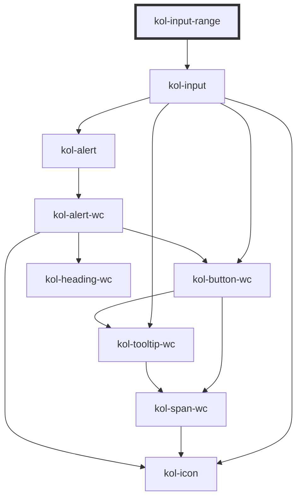

# InputRange

Der Input-Typ **Range** erzeugt ein interaktives Element, mit dem Werte durch Verschieben eines Reglers verändert werden können.

## Konstruktion

### Code

```html
<kol-input-range
	_label="Wertebereich"
	_min="100"
	_max="200"
	_value="100"
	_step="20"
	_icon='{"left": "codicon codicon-arrow-small-down", "right": "codicon codicon-arrow-small-up"}'
></kol-input-range>
```

### Beispiel

<kol-input-range
	_label="Wertebereich"
	_min="100"
	_max="200"
	_value="100"
	_step="20"
	_icon='{"left": "codicon codicon-arrow-small-down", "right": "codicon codicon-arrow-small-up"}'></kol-input-range>

## Verwendung

### Best practices

- Achten sie darauf `id` und `name` korrekt zu setzen, damit die Daten beim Formular Absenden mitgesendet werden.

## Barrierefreiheit

### Tastatursteuerung

| Taste          | Funktion                                 |
| -------------- | ---------------------------------------- |
| `Tab`          | Fokussiert das Eingabefeld.              |
| `Pfeil-Tasten` | Verändern den Wert der Range-Komponente. |

## Links und Referenzen

- <kol-link _href="https://medium.com/@gavyn/til-autofocus-inputs-are-an-accessibility-problem-32ced60c3109" _label="https://medium.com/@gavyn/til-autofocus-inputs-are-an-accessibility-problem-32ced60c3109" _target="_blank"></kol-link>

<!-- Auto Generated Below -->

## Properties

| Property        | Attribute        | Description                                                                                                                                                  | Type                                                                                                    | Default     |
| --------------- | ---------------- | ------------------------------------------------------------------------------------------------------------------------------------------------------------ | ------------------------------------------------------------------------------------------------------- | ----------- |
| `_accessKey`    | `_access-key`    | Defines which key combination can be used to trigger or focus the interactive element of the component.                                                      | `string \| undefined`                                                                                   | `undefined` |
| `_alert`        | `_alert`         | Defines whether the screen-readers should read out the notification.                                                                                         | `boolean \| undefined`                                                                                  | `true`      |
| `_autoComplete` | `_auto-complete` | Defines whether the input can be auto-completed.                                                                                                             | `"off" \| "on" \| undefined`                                                                            | `undefined` |
| `_disabled`     | `_disabled`      | Makes the element not focusable and ignore all events.                                                                                                       | `boolean \| undefined`                                                                                  | `false`     |
| `_error`        | `_error`         | Defines the error message text.                                                                                                                              | `string \| undefined`                                                                                   | `undefined` |
| `_hideError`    | `_hide-error`    | Hides the error message but leaves it in the DOM for the input's aria-describedby.                                                                           | `boolean \| undefined`                                                                                  | `false`     |
| `_hideLabel`    | `_hide-label`    | Hides the caption by default and displays the caption text with a tooltip when the interactive element is focused or the mouse is over it.                   | `boolean \| undefined`                                                                                  | `false`     |
| `_hint`         | `_hint`          | Defines the hint text.                                                                                                                                       | `string \| undefined`                                                                                   | `''`        |
| `_icon`         | `_icon`          | <span style="color:red">**[DEPRECATED]**</span> Use \_icons.<br/><br/>                                                                                       | `string \| undefined \| { right?: IconOrIconClass \| undefined; left?: IconOrIconClass \| undefined; }` | `undefined` |
| `_icons`        | `_icons`         | Defines the icon classnames (e.g. `_icons="fa-solid fa-user"`).                                                                                              | `string \| undefined \| { right?: IconOrIconClass \| undefined; left?: IconOrIconClass \| undefined; }` | `undefined` |
| `_id`           | `_id`            | Defines the internal ID of the primary component element.                                                                                                    | `string \| undefined`                                                                                   | `undefined` |
| `_label`        | `_label`         | Defines the visible or semantic label of the component (e.g. aria-label, label, headline, caption, summary, etc.). Set to `false` to enable the expert slot. | `string \| undefined`                                                                                   | `undefined` |
| `_list`         | `_list`          | <span style="color:red">**[DEPRECATED]**</span> Use \_suggestions.<br/><br/>Deprecated: Gibt die Liste der Vorschlagswörter an.                              | `Option<W3CInputValue>[] \| string \| undefined`                                                        | `undefined` |
| `_max`          | `_max`           | Defines the largest possible input value.                                                                                                                    | `number \| undefined`                                                                                   | `undefined` |
| `_min`          | `_min`           | Defines the smallest possible input value.                                                                                                                   | `number \| undefined`                                                                                   | `undefined` |
| `_name`         | `_name`          | Defines the technical name of an input field.                                                                                                                | `string \| undefined`                                                                                   | `undefined` |
| `_on`           | --               | Gibt die EventCallback-Funktionen für das Input-Event an.                                                                                                    | `InputTypeOnBlur & InputTypeOnClick & InputTypeOnChange & InputTypeOnFocus \| undefined`                | `undefined` |
| `_step`         | `_step`          | Defines the step size for value changes.                                                                                                                     | `number \| undefined`                                                                                   | `undefined` |
| `_suggestions`  | `_suggestions`   | Suggestions to provide for the input.                                                                                                                        | `W3CInputValue[] \| string \| undefined`                                                                | `undefined` |
| `_tabIndex`     | `_tab-index`     | Defines which tab-index the primary element of the component has. (https://developer.mozilla.org/en-US/docs/Web/HTML/Global_attributes/tabindex)             | `number \| undefined`                                                                                   | `undefined` |
| `_tooltipAlign` | `_tooltip-align` | Defines where to show the Tooltip preferably: top, right, bottom or left.                                                                                    | `"bottom" \| "left" \| "right" \| "top" \| undefined`                                                   | `'top'`     |
| `_touched`      | `_touched`       | Shows if the input was touched by a user.                                                                                                                    | `boolean \| undefined`                                                                                  | `false`     |
| `_value`        | `_value`         | Defines the value of the input.                                                                                                                              | `number \| undefined`                                                                                   | `undefined` |

## Slots

| Slot | Description                           |
| ---- | ------------------------------------- |
|      | Die Beschriftung des Eingabeelements. |

## Dependencies

### Depends on

- kol-input

### Graph



---
