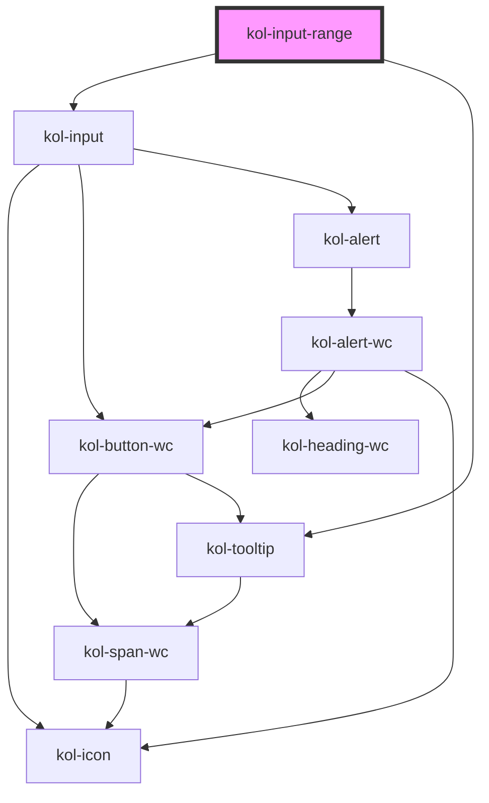

# InputRange

Der Input-Typ **Range** erzeugt ein interaktives Element, mit dem Werte durch Verschieben eines Reglers verändert werden können.

## Konstruktion

### Code

```html
<kol-input-range
	_id="meine_range"
	_name="meine_range"
	_min="100"
	_max="200"
	_value="100"
	_step="20"
	_icon='{ "left": "codicon codicon-arrow-small-down", "right": "codicon codicon-arrow-small-up"}'
	>Wertebereich</kol-input-range
>
```

### Beispiel

<kol-input-range _id="meine_range" _name="meine_range" _min="100" _max="200" _value="100" _step="20" _icon='{ "left": "codicon codicon-arrow-small-down", "right": "codicon codicon-arrow-small-up"}'>Wertebereich</kol-input-range>

## Verwendung

### Best practices

- Achten sie darauf `id` und `name` korrekt zu setzen, damit die Daten beim Formular Absenden mitgesendet werden.

## Barrierefreiheit

### Tastatursteuerung

| Taste          | Funktion                                 |
| -------------- | ---------------------------------------- |
| `Tab`          | Fokussiert das Eingabefeld.              |
| `Pfeil-Tasten` | Verändern den Wert der Range-Komponente. |

## Links und Referenzen

- https://medium.com/@gavyn/til-autofocus-inputs-are-an-accessibility-problem-32ced60c3109

<!-- Auto Generated Below -->

## Properties

| Property              | Attribute        | Description                                                                                                                                          | Type                                                                                                    | Default     |
| --------------------- | ---------------- | ---------------------------------------------------------------------------------------------------------------------------------------------------- | ------------------------------------------------------------------------------------------------------- | ----------- |
| `_accessKey`          | `_access-key`    | Gibt an, mit welcher Tastenkombination man das interaktive Element der Komponente auslösen oder fokussieren kann.                                    | `string \| undefined`                                                                                   | `undefined` |
| `_alert`              | `_alert`         | Gibt an, ob der Screenreader die Meldung aktiv vorlesen soll.                                                                                        | `boolean \| undefined`                                                                                  | `true`      |
| `_autoComplete`       | `_auto-complete` | Gibt an, ob das Eingabefeld autovervollständigt werden kann.                                                                                         | `"off" \| "on" \| undefined`                                                                            | `undefined` |
| `_disabled`           | `_disabled`      | Deaktiviert das interaktive Element in der Komponente und erlaubt keine Interaktion mehr damit.                                                      | `boolean \| undefined`                                                                                  | `undefined` |
| `_error`              | `_error`         | Gibt den Text für eine Fehlermeldung an.                                                                                                             | `string \| undefined`                                                                                   | `undefined` |
| `_hideLabel`          | `_hide-label`    | Blendet die Beschriftung (Label) aus und zeigt sie stattdessen mittels eines Tooltips an.                                                            | `boolean \| undefined`                                                                                  | `undefined` |
| `_hint`               | `_hint`          | Gibt den Hinweistext an.                                                                                                                             | `string \| undefined`                                                                                   | `''`        |
| `_icon`               | `_icon`          | Setzt die Iconklasse (z.B.: `_icon="codicon codicon-home`).                                                                                          | `string \| undefined \| { right?: IconOrIconClass \| undefined; left?: IconOrIconClass \| undefined; }` | `undefined` |
| `_id`                 | `_id`            | Gibt die interne ID des primären Elements in der Komponente an.                                                                                      | `string \| undefined`                                                                                   | `undefined` |
| `_label` _(required)_ | `_label`         | Setzt die sichtbare oder semantische Beschriftung der Komponente (z.B. Aria-Label, Label, Headline, Caption, Summary usw.).                          | `boolean \| string`                                                                                     | `undefined` |
| `_list`               | `_list`          | Gibt die Liste der Vorschlagswörter an.                                                                                                              | `Option<number>[] \| string \| undefined`                                                               | `undefined` |
| `_max`                | `_max`           | Gibt den größtmöglichen Eingabewert an.                                                                                                              | `number \| undefined`                                                                                   | `undefined` |
| `_min`                | `_min`           | Gibt den kleinstmöglichen Eingabewert an.                                                                                                            | `number \| undefined`                                                                                   | `undefined` |
| `_name`               | `_name`          | Gibt den technischen Namen des Eingabefeldes an.                                                                                                     | `string \| undefined`                                                                                   | `undefined` |
| `_on`                 | --               | Gibt die EventCallback-Funktionen für das Input-Event an.                                                                                            | `InputTypeOnBlur & InputTypeOnClick & InputTypeOnChange & InputTypeOnFocus \| undefined`                | `undefined` |
| `_step`               | `_step`          | Gibt die Schrittweite der Wertveränderung an.                                                                                                        | `number \| undefined`                                                                                   | `undefined` |
| `_tabIndex`           | `_tab-index`     | Gibt an, welchen Tab-Index das primäre Element in der Komponente hat. (https://developer.mozilla.org/en-US/docs/Web/HTML/Global_attributes/tabindex) | `number \| undefined`                                                                                   | `undefined` |
| `_tooltipAlign`       | `_tooltip-align` | Gibt an, ob der Tooltip bevorzugt entweder oben, rechts, unten oder links angezeigt werden soll.                                                     | `"bottom" \| "left" \| "right" \| "top" \| undefined`                                                   | `'top'`     |
| `_touched`            | `_touched`       | Gibt an, ob dieses Eingabefeld von Nutzer:innen einmal besucht/berührt wurde.                                                                        | `boolean \| undefined`                                                                                  | `false`     |
| `_value`              | `_value`         | Gibt den Wert des Eingabefeldes an.                                                                                                                  | `number \| undefined`                                                                                   | `undefined` |

## Slots

| Slot | Description                           |
| ---- | ------------------------------------- |
|      | Die Beschriftung des Eingabeelements. |

## Dependencies

### Depends on

- kol-input
- [kol-tooltip](../tooltip)

### Graph



---
