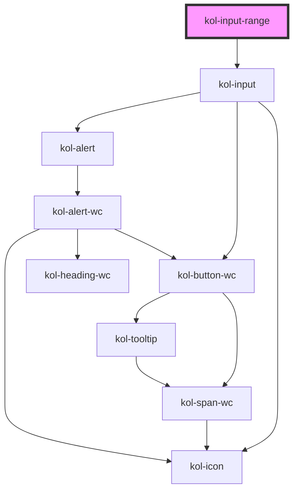

# InputRange

Der Input-Typ **Range** erzeugt ein interaktives Element, mit dem Werte durch Verschieben eines Reglers verändert werden können.

## Konstruktion

### Code

```html
<kol-input-range _id="meine_range" _name="meine_range" _min="100" _max="200" _value="100" _step="20">Wertebereich</kol-input-range>
```

### Beispiel

<kol-input-range _id="meine_range" _name="meine_range" _min="100" _max="200" _value="100" _step="20">Wertebereich</kol-input-range>

## Verwendung

### Best practices

- Achten sie darauf `id` und `name` korrekt zu setzen, damit die Daten beim Formular Absenden mitgesendet werden.

## Barrierefreiheit

### Tastatursteuerung

| Taste          | Funktion                                 |
| -------------- | ---------------------------------------- |
| `Tab`          | Fokussiert das Eingabefeld.              |
| `Pfeil-Tasten` | Verändern den Wert der Range-Komponente. |

## Links und Referenzen

- https://medium.com/@gavyn/til-autofocus-inputs-are-an-accessibility-problem-32ced60c3109

<!-- Auto Generated Below -->

## Properties

| Property        | Attribute        | Description                                                                          | Type                                                                                                    | Default     |
| --------------- | ---------------- | ------------------------------------------------------------------------------------ | ------------------------------------------------------------------------------------------------------- | ----------- |
| `_accessKey`    | `_access-key`    | Gibt an, mit welcher Tastenkombination man das Input auslösen oder fokussieren kann. | `string \| undefined`                                                                                   | `undefined` |
| `_alert`        | `_alert`         | Gibt an, ob die Fehlermeldung vorgelesen werden soll, wenn es eine gibt.             | `boolean \| undefined`                                                                                  | `true`      |
| `_autoComplete` | `_auto-complete` | Gibt an, ob das Eingabefeld autovervollständigt werden kann.                         | `"off" \| "on" \| undefined`                                                                            | `undefined` |
| `_disabled`     | `_disabled`      | Setzt das Feld in einen inaktiven Zustand, in dem es keine Interaktion erlaubt.      | `boolean \| undefined`                                                                                  | `undefined` |
| `_error`        | `_error`         | Gibt den Text für eine Fehlermeldung an.                                             | `string \| undefined`                                                                                   | `undefined` |
| `_hideLabel`    | `_hide-label`    | Versteckt das sichtbare Label des Elements.                                          | `boolean \| undefined`                                                                                  | `undefined` |
| `_hint`         | `_hint`          | Gibt den Hinweistext an.                                                             | `string \| undefined`                                                                                   | `''`        |
| `_icon`         | `_icon`          | Ermöglicht das Anzeigen von Icons links und/oder rechts am Rand des Eingabefeldes.   | `string \| undefined \| { right?: IconOrIconClass \| undefined; left?: IconOrIconClass \| undefined; }` | `undefined` |
| `_id`           | `_id`            | Gibt die technische ID des Eingabefeldes an.                                         | `string \| undefined`                                                                                   | `undefined` |
| `_list`         | `_list`          | Gibt die Liste der Vorschlagswörter an.                                              | `Option<number>[] \| string \| undefined`                                                               | `undefined` |
| `_max`          | `_max`           | Gibt den Maximalwert des Eingabefeldes an.                                           | `number \| undefined`                                                                                   | `undefined` |
| `_min`          | `_min`           | Gibt den Minimalwert des Eingabefeldes an.                                           | `number \| undefined`                                                                                   | `undefined` |
| `_name`         | `_name`          | Gibt den technischen Namen des Eingabefeldes an.                                     | `string \| undefined`                                                                                   | `undefined` |
| `_on`           | --               | Gibt die EventCallback-Funktionen für das Input-Event an.                            | `InputTypeOnBlur & InputTypeOnClick & InputTypeOnChange & InputTypeOnFocus \| undefined`                | `undefined` |
| `_step`         | `_step`          | Gibt die Schrittweite der Wertveränderung an.                                        | `number \| undefined`                                                                                   | `undefined` |
| `_tabIndex`     | `_tab-index`     | Gibt an, welchen Tab-Index dieses Input hat.                                         | `number \| undefined`                                                                                   | `undefined` |
| `_touched`      | `_touched`       | Gibt an, ob dieses Eingabefeld von Nutzer:innen einmal besucht/berührt wurde.        | `boolean \| undefined`                                                                                  | `false`     |
| `_value`        | `_value`         | Gibt den Wert des Eingabefeldes an.                                                  | `number \| undefined`                                                                                   | `undefined` |

## Dependencies

### Depends on

- kol-input

### Graph



---
