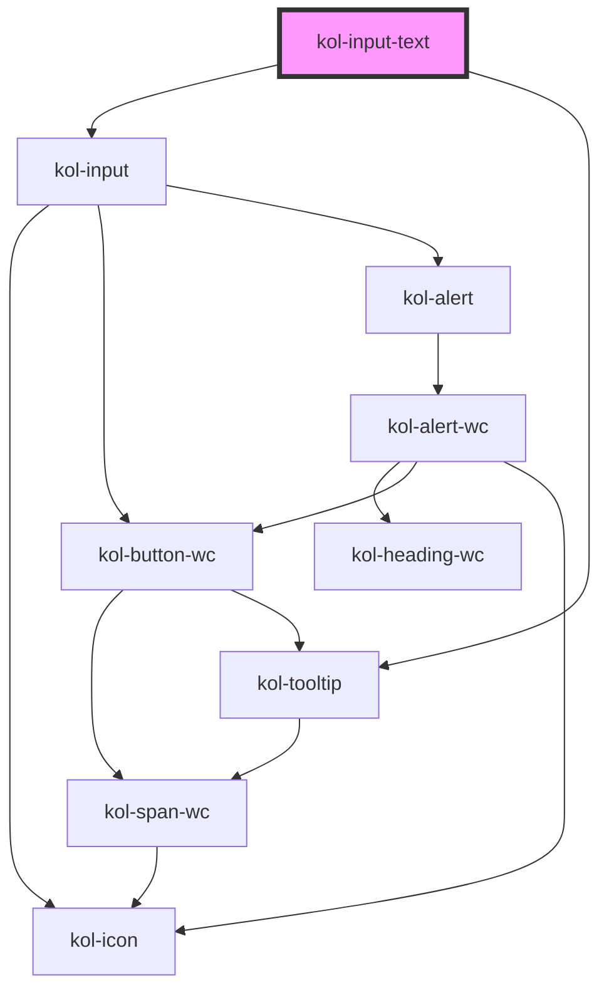

# InputText

Der Input-Typ **Text** erzeugt ein Eingabefeld für normalen Text, Suchbegriffe, URLs oder Telefonnummern.

## Konstruktion

### Code

```html
<kol-input-text
	_type="text"
	_id="mein_text"
	_name="mein_text"
	_icon="{ left: 'codicon codicon-arrow-left', right: { icon: 'codicon codicon-arrow-right', style: { 'font-size': '200%', }, }, }"
	>Texteingabe</kol-input-text
>
<kol-input-text _type="text" _id="deaktiviert" _name="deaktiviert" _disabled>Deaktiviert</kol-input-text>
<kol-input-text _type="text" _id="schreibgeschützt" _name="schreibgeschützt" _read-only>Schreibgeschützt</kol-input-text>
<kol-input-text
	_type="text"
	_id="loeschbar"
	_name="loeschbar"
	_smartButton="{ _icon: 'codicon codicon-chrome-close', _hideLabel: true, _label: 'Löschen', _on: { onClick: clearInput } }"
	>Löschbar</kol-input-text
>
```

### Beispiel

<kol-input-text _type="text" _id="mein_text" _name="mein_text" _icon="{ left: 'codicon codicon-arrow-left', right: { icon: 'codicon codicon-arrow-right', style: { 'font-size': '200%', }, }, }">Texteingabe</kol-input-text>
<kol-input-text _type="text" _id="deaktiviert" _name="deaktiviert" _disabled>Deaktiviert</kol-input-text>
<kol-input-text _type="text" _id="schreibgeschützt" _name="schreibgeschützt" _read-only>Schreibgeschützt</kol-input-text>
<kol-input-text _type="text" _id="loeschbar" _name="loeschbar">Löschbar</kol-input-text>

## Verwendung

### Best practices

- Achten sie darauf `id` und `name` korrekt zu setzen, damit die Daten beim Formular Absenden mitgesendet werden.

## Barrierefreiheit

### Tastatursteuerung

| Taste | Funktion                              |
| ----- | ------------------------------------- |
| `Tab` | Fokussiert das Eingabefeld.           |
| `ESC` | Löscht den Inhalt (nur Typ = Search). |

## Links und Referenzen

- <kol-link _href="https://medium.com/@gavyn/til-autofocus-inputs-are-an-accessibility-problem-32ced60c3109" _label="https://medium.com/@gavyn/til-autofocus-inputs-are-an-accessibility-problem-32ced60c3109" _target="_blank"></kol-link>
- <kol-link _href="https://www.jotform.com/blog/html5-datalists-what-you-need-to-know-78024/" _label="https://www.jotform.com/blog/html5-datalists-what-you-need-to-know-78024/" _target="_blank"></kol-link>

<!-- Auto Generated Below -->

## Properties

| Property              | Attribute        | Description                                                                                                                                          | Type                                                                                                                                                                                                                                                                                                                                                                                                                                                                                                                                                                                                                                                                                                                                                                                                                                                                                                                                                                                                                           | Default     |
| --------------------- | ---------------- | ---------------------------------------------------------------------------------------------------------------------------------------------------- | ------------------------------------------------------------------------------------------------------------------------------------------------------------------------------------------------------------------------------------------------------------------------------------------------------------------------------------------------------------------------------------------------------------------------------------------------------------------------------------------------------------------------------------------------------------------------------------------------------------------------------------------------------------------------------------------------------------------------------------------------------------------------------------------------------------------------------------------------------------------------------------------------------------------------------------------------------------------------------------------------------------------------------ | ----------- |
| `_accessKey`          | `_access-key`    | Gibt an, mit welcher Tastenkombination man das interaktive Element der Komponente auslösen oder fokussieren kann.                                    | `string \| undefined`                                                                                                                                                                                                                                                                                                                                                                                                                                                                                                                                                                                                                                                                                                                                                                                                                                                                                                                                                                                                          | `undefined` |
| `_alert`              | `_alert`         | Defines whether the screen-readers should read out the notification.                                                                                 | `boolean \| undefined`                                                                                                                                                                                                                                                                                                                                                                                                                                                                                                                                                                                                                                                                                                                                                                                                                                                                                                                                                                                                         | `true`      |
| `_autoComplete`       | `_auto-complete` | Gibt an, ob das Eingabefeld autovervollständigt werden kann.                                                                                         | `"off" \| "on" \| undefined`                                                                                                                                                                                                                                                                                                                                                                                                                                                                                                                                                                                                                                                                                                                                                                                                                                                                                                                                                                                                   | `undefined` |
| `_disabled`           | `_disabled`      | Deaktiviert das interaktive Element in der Komponente und erlaubt keine Interaktion mehr damit.                                                      | `boolean \| undefined`                                                                                                                                                                                                                                                                                                                                                                                                                                                                                                                                                                                                                                                                                                                                                                                                                                                                                                                                                                                                         | `undefined` |
| `_error`              | `_error`         | Gibt den Text für eine Fehlermeldung an.                                                                                                             | `string \| undefined`                                                                                                                                                                                                                                                                                                                                                                                                                                                                                                                                                                                                                                                                                                                                                                                                                                                                                                                                                                                                          | `undefined` |
| `_hasCounter`         | `_has-counter`   | Aktiviert den Zeichenanzahlzähler am unteren Rand des Eingabefeldes.                                                                                 | `boolean \| undefined`                                                                                                                                                                                                                                                                                                                                                                                                                                                                                                                                                                                                                                                                                                                                                                                                                                                                                                                                                                                                         | `undefined` |
| `_hideLabel`          | `_hide-label`    | Blendet die Beschriftung (Label) aus und zeigt sie stattdessen mittels eines Tooltips an.                                                            | `boolean \| undefined`                                                                                                                                                                                                                                                                                                                                                                                                                                                                                                                                                                                                                                                                                                                                                                                                                                                                                                                                                                                                         | `undefined` |
| `_hint`               | `_hint`          | Gibt den Hinweistext an.                                                                                                                             | `string \| undefined`                                                                                                                                                                                                                                                                                                                                                                                                                                                                                                                                                                                                                                                                                                                                                                                                                                                                                                                                                                                                          | `''`        |
| `_icon`               | `_icon`          | Setzt die Iconklasse (z.B.: `_icon="codicon codicon-home`).                                                                                          | `string \| undefined \| { right?: IconOrIconClass \| undefined; left?: IconOrIconClass \| undefined; }`                                                                                                                                                                                                                                                                                                                                                                                                                                                                                                                                                                                                                                                                                                                                                                                                                                                                                                                        | `undefined` |
| `_id`                 | `_id`            | Gibt die interne ID des primären Elements in der Komponente an.                                                                                      | `string \| undefined`                                                                                                                                                                                                                                                                                                                                                                                                                                                                                                                                                                                                                                                                                                                                                                                                                                                                                                                                                                                                          | `undefined` |
| `_label` _(required)_ | `_label`         | Setzt die sichtbare oder semantische Beschriftung der Komponente (z.B. Aria-Label, Label, Headline, Caption, Summary usw.).                          | `boolean \| string`                                                                                                                                                                                                                                                                                                                                                                                                                                                                                                                                                                                                                                                                                                                                                                                                                                                                                                                                                                                                            | `undefined` |
| `_list`               | `_list`          | <span style="color:red">**[DEPRECATED]**</span> Use \_suggestions.<br/><br/>Gibt die Liste der Vorschlagswörter an.                                  | `string \| string[] \| undefined`                                                                                                                                                                                                                                                                                                                                                                                                                                                                                                                                                                                                                                                                                                                                                                                                                                                                                                                                                                                              | `undefined` |
| `_maxLength`          | `_max-length`    | Gibt an, wie viele Zeichen maximal eingegeben werden können.                                                                                         | `number \| undefined`                                                                                                                                                                                                                                                                                                                                                                                                                                                                                                                                                                                                                                                                                                                                                                                                                                                                                                                                                                                                          | `undefined` |
| `_name`               | `_name`          | Gibt den technischen Namen des Eingabefeldes an.                                                                                                     | `string \| undefined`                                                                                                                                                                                                                                                                                                                                                                                                                                                                                                                                                                                                                                                                                                                                                                                                                                                                                                                                                                                                          | `undefined` |
| `_on`                 | --               | Gibt die EventCallback-Funktionen für das Input-Event an.                                                                                            | `InputTypeOnBlur & InputTypeOnClick & InputTypeOnChange & InputTypeOnFocus \| undefined`                                                                                                                                                                                                                                                                                                                                                                                                                                                                                                                                                                                                                                                                                                                                                                                                                                                                                                                                       | `undefined` |
| `_pattern`            | `_pattern`       | Gibt ein Prüfmuster (Pattern) für das Eingabefeld an.                                                                                                | `string \| undefined`                                                                                                                                                                                                                                                                                                                                                                                                                                                                                                                                                                                                                                                                                                                                                                                                                                                                                                                                                                                                          | `undefined` |
| `_placeholder`        | `_placeholder`   | Gibt den Platzhalter des Eingabefeldes an, wenn es leer ist.                                                                                         | `string \| undefined`                                                                                                                                                                                                                                                                                                                                                                                                                                                                                                                                                                                                                                                                                                                                                                                                                                                                                                                                                                                                          | `undefined` |
| `_readOnly`           | `_read-only`     | Setzt das Eingabefeld in den schreibgeschützten Modus.                                                                                               | `boolean \| undefined`                                                                                                                                                                                                                                                                                                                                                                                                                                                                                                                                                                                                                                                                                                                                                                                                                                                                                                                                                                                                         | `undefined` |
| `_required`           | `_required`      | Macht das Eingabeelement zu einem Pflichtfeld.                                                                                                       | `boolean \| undefined`                                                                                                                                                                                                                                                                                                                                                                                                                                                                                                                                                                                                                                                                                                                                                                                                                                                                                                                                                                                                         | `undefined` |
| `_size`               | `_size`          | Setzt die Breite des Eingabefeldes in Buchstabenbreiten.                                                                                             | `number \| undefined`                                                                                                                                                                                                                                                                                                                                                                                                                                                                                                                                                                                                                                                                                                                                                                                                                                                                                                                                                                                                          | `undefined` |
| `_smartButton`        | `_smart-button`  | Ermöglicht eine Schaltfläche in das Eingabefeld mit einer beliebigen Aktion zu einzufügen (ohne label).                                              | `string \| undefined \| { _label: LabelWithExpertSlotPropType; } & { _ariaControls?: string \| undefined; _ariaExpanded?: boolean \| undefined; _ariaSelected?: boolean \| undefined; _disabled?: boolean \| undefined; _icon?: Stringified<KoliBriIconProp> \| undefined; _iconAlign?: AlignPropType \| undefined; _iconOnly?: boolean \| undefined; _role?: AlternativButtonLinkRole \| undefined; _tabIndex?: number \| undefined; _tooltipAlign?: AlignPropType \| undefined; _ariaCurrent?: AriaCurrentPropType \| undefined; _ariaLabel?: string \| undefined; _hideLabel?: boolean \| undefined; _accessKey?: string \| undefined; _on?: KoliBriButtonCallbacks<StencilUnknown> \| undefined; _syncValueBySelector?: string \| undefined; _type?: KoliBriButtonType \| undefined; _value?: Stringified<StencilUnknown>; _id?: string \| undefined; _label?: LabelWithExpertSlotPropType \| undefined; _name?: string \| undefined; _variant?: KoliBriButtonVariant \| undefined; _customClass?: string \| undefined; }` | `undefined` |
| `_suggestions`        | `_suggestions`   | Suggestions to provide for the input.                                                                                                                | `W3CInputValue[] \| string \| undefined`                                                                                                                                                                                                                                                                                                                                                                                                                                                                                                                                                                                                                                                                                                                                                                                                                                                                                                                                                                                       | `undefined` |
| `_tabIndex`           | `_tab-index`     | Gibt an, welchen Tab-Index das primäre Element in der Komponente hat. (https://developer.mozilla.org/en-US/docs/Web/HTML/Global_attributes/tabindex) | `number \| undefined`                                                                                                                                                                                                                                                                                                                                                                                                                                                                                                                                                                                                                                                                                                                                                                                                                                                                                                                                                                                                          | `undefined` |
| `_tooltipAlign`       | `_tooltip-align` | Defines where to show the Tooltip preferably: top, right, bottom or left.                                                                            | `"bottom" \| "left" \| "right" \| "top" \| undefined`                                                                                                                                                                                                                                                                                                                                                                                                                                                                                                                                                                                                                                                                                                                                                                                                                                                                                                                                                                          | `'top'`     |
| `_touched`            | `_touched`       | Gibt an, ob dieses Eingabefeld von Nutzer:innen einmal besucht/berührt wurde.                                                                        | `boolean \| undefined`                                                                                                                                                                                                                                                                                                                                                                                                                                                                                                                                                                                                                                                                                                                                                                                                                                                                                                                                                                                                         | `false`     |
| `_type`               | `_type`          | Setzt den Typ der Komponente oder des interaktiven Elements in der Komponente an.                                                                    | `"search" \| "tel" \| "text" \| "url" \| undefined`                                                                                                                                                                                                                                                                                                                                                                                                                                                                                                                                                                                                                                                                                                                                                                                                                                                                                                                                                                            | `'text'`    |
| `_value`              | `_value`         | Gibt den Wert des Eingabefeldes an.                                                                                                                  | `string \| undefined`                                                                                                                                                                                                                                                                                                                                                                                                                                                                                                                                                                                                                                                                                                                                                                                                                                                                                                                                                                                                          | `undefined` |

## Slots

| Slot | Description                         |
| ---- | ----------------------------------- |
|      | Die Beschriftung des Eingabefeldes. |

## Dependencies

### Depends on

- kol-input
- [kol-tooltip](../tooltip)

### Graph



---
