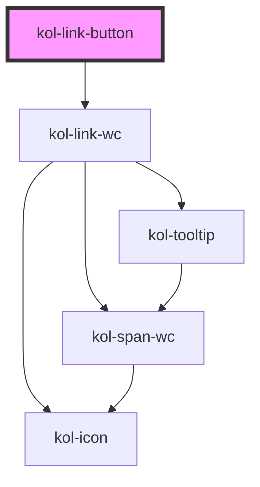

# LinkButton

Der LinkButton ist semantisch ein Link und hat das Design eines Buttons. Hierzu werden alle relevanten Properties der Link-Komponente übernommen und um die Design-bestimmenden Properties des Buttons erweitert.
Weitere Informationen zum Aussehen finden Sie auf der <kol-link _href="/docs/components/button" _label="Seite des Buttons"></kol-link>.

## Konstruktion

### Code

```html
<kol-link-button _href="#" _label="Primary" _variant="primary"></kol-link-button>
<kol-link-button _href="#" _label="Secondary" _variant="secondary"></kol-link-button>
<kol-link-button _href="#" _label="Normal" _variant="normal"></kol-link-button>
<kol-link-button _href="#" _label="Secondary" _variant="danger"></kol-link-button>
<kol-link-button _href="#" _label="Ghost" _variant="ghost"></kol-link-button>
```

### Beispiel

<div class="flex gap-2">
  <kol-link-button _href="#" _label="Primary" _variant="primary"></kol-link-button>
  <kol-link-button _href="#" _label="Secondary" _variant="secondary"></kol-link-button>
  <kol-link-button _href="#" _label="Normal" _variant="normal"></kol-link-button>
  <kol-link-button _href="#" _label="Danger" _variant="danger"></kol-link-button>
  <kol-link-button _href="#" _label="Ghost" _variant="ghost"></kol-link-button>
</div>

<!-- Auto Generated Below -->

## Properties

| Property              | Attribute             | Description                                                                                                                                                                                                                                                                          | Type                                                                                   | Default                             |
| --------------------- | --------------------- | ------------------------------------------------------------------------------------------------------------------------------------------------------------------------------------------------------------------------------------------------------------------------------------ | -------------------------------------------------------------------------------------- | ----------------------------------- |
| `_ariaControls`       | `_aria-controls`      | Gibt an, welche Elemente kontrolliert werden. (https://developer.mozilla.org/en-US/docs/Web/Accessibility/ARIA/Attributes/aria-controls)                                                                                                                                             | `string \| undefined`                                                                  | `undefined`                         |
| `_ariaCurrent`        | `_aria-current`       | Gibt an, welchen aktuellen Auswahlstatus der Link hat. (https://developer.mozilla.org/en-US/docs/Web/Accessibility/ARIA/Attributes/aria-current)                                                                                                                                     | `"date" \| "location" \| "page" \| "step" \| "time" \| boolean \| undefined`           | `undefined`                         |
| `_ariaExpanded`       | `_aria-expanded`      | Gibt an, ob durch den Link etwas aufgeklappt wurde. (https://developer.mozilla.org/en-US/docs/Web/Accessibility/ARIA/Attributes/aria-expanded)                                                                                                                                       | `boolean \| undefined`                                                                 | `undefined`                         |
| `_ariaLabel`          | `_aria-label`         | Gibt einen beschreibenden Text für den Screenreader an. Damit die Sprachsteuerung von interaktiven Elementen funktioniert, muss der Aria-Label-Text mit dem Label-Text des Buttons beginnen. - https://developer.mozilla.org/en-US/docs/Web/Accessibility/ARIA/Attributes/aria-label | `string \| undefined`                                                                  | `undefined`                         |
| `_ariaSelected`       | `_aria-selected`      | Gibt an, ob Element ausgewählt ist (role=tab). (https://developer.mozilla.org/en-US/docs/Web/Accessibility/ARIA/Attributes/aria-selected)                                                                                                                                            | `boolean \| undefined`                                                                 | `undefined`                         |
| `_customClass`        | `_custom-class`       | Gibt an, welche Custom-Class übergeben werden soll, wenn \_variant="custom" gesetzt ist.                                                                                                                                                                                             | `string \| undefined`                                                                  | `undefined`                         |
| `_disabled`           | `_disabled`           | Gibt an, ob der Link deaktiviert ist.                                                                                                                                                                                                                                                | `boolean \| undefined`                                                                 | `false`                             |
| `_download`           | `_download`           | Teilt dem Browser mit, dass sich hinter dem Link eine Datei befindet. Setzt optional den Dateinamen.                                                                                                                                                                                 | `boolean \| string \| undefined`                                                       | `false`                             |
| `_href` _(required)_  | `_href`               | Gibt die Ziel-Url des Links an.                                                                                                                                                                                                                                                      | `string`                                                                               | `undefined`                         |
| `_icon`               | `_icon`               | Iconklasse (z.B.: "codicon codicon-home")                                                                                                                                                                                                                                            | `KoliBriHorizontalIcon & KoliBriVerticalIcon \| string \| undefined`                   | `undefined`                         |
| `_iconOnly`           | `_icon-only`          | Gibt an, ob nur das Icon angezeigt wird.                                                                                                                                                                                                                                             | `boolean \| undefined`                                                                 | `false`                             |
| `_label` _(required)_ | `_label`              | Setzt den sichtbaren Text des Elements.                                                                                                                                                                                                                                              | `string`                                                                               | `undefined`                         |
| `_on`                 | --                    | <span style="color:red">**[DEPRECATED]**</span> <br/><br/>Gibt die EventCallback-Funktionen für den Link an.                                                                                                                                                                         | `undefined \| { onClick?: EventValueOrEventCallback<Event, string> \| undefined; }`    | `undefined`                         |
| `_role`               | `_role`               | Setzt die Role der Schaltfläche.                                                                                                                                                                                                                                                     | `"button" \| "link" \| "tab" \| undefined`                                             | `undefined`                         |
| `_tabIndex`           | `_tab-index`          | Gibt an, welchen Tab-Index der Button hat. (https://developer.mozilla.org/en-US/docs/Web/HTML/Global_attributes/tabindex)                                                                                                                                                            | `number \| undefined`                                                                  | `undefined`                         |
| `_target`             | `_target`             | Gibt an wo der Link geöffnet werden soll.                                                                                                                                                                                                                                            | `string \| undefined`                                                                  | `undefined`                         |
| `_targetDescription`  | `_target-description` | Gibt die Beschreibung an, wenn der Link in einem anderen Programm geöffnet wird.                                                                                                                                                                                                     | `string \| undefined`                                                                  | `translate('kol-open-link-in-tab')` |
| `_tooltipAlign`       | `_tooltip-align`      | Gibt an, ob der Tooltip entweder oben, rechts, unten oder links angezeigt werden soll.                                                                                                                                                                                               | `"bottom" \| "left" \| "right" \| "top" \| undefined`                                  | `'right'`                           |
| `_variant`            | `_variant`            | Gibt an, welche Ausprägung der Link-Button hat.                                                                                                                                                                                                                                      | `"custom" \| "danger" \| "ghost" \| "normal" \| "primary" \| "secondary" \| undefined` | `'normal'`                          |

## Dependencies

### Depends on

- kol-link-wc

### Graph



---
