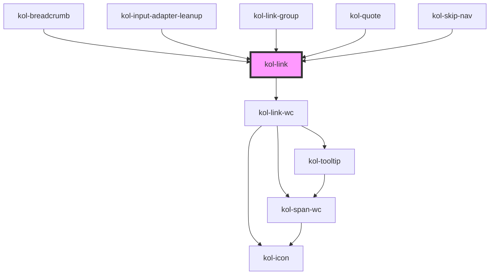

# Link

Die **Link**-Komponente rendert einen auf Barrierefreiheit optimierten Link, der als Text, als Icon oder auch in Kombination ausgegeben werden kann.

Beachten Sie, dass die Komponente automatisch ein Padding links und rechts zum umgebenden Text erzeugt. Sie kann daher im Fließtext ohne
Eingabe von Leerzeichen eingefügt werden. Zusätzliche Leerzeichen vergrößern den Abstand zum umgebenden Text.

## Konstruktion

### Code

```html
<p>
	In diesem Absatz wird ein Link gesetzt, der keine weiteren Attribute enthält.
	<kol-link _href="https://www.w3.org">Hier steht ein Link</kol-link>Er wird standardmäßig als
	<i>
		<b>inline-Element</b>
	</i>
	ausgegeben.
</p>
```

### Beispiel

<p>
   In diesem Absatz wird ein Link gesetzt, der keine weiteren Attribute enthält.
  <kol-link _href="https://www.w3.org">Hier steht ein Link</kol-link>Er wird standardmäßig als <i>
    <b>inline-Element</b>
    </i> ausgegeben.
</p>

## Verwendung

### Link innerhalb eines Fließtextes mit Icon und Text

  <p>
    <kol-link _icon="codicon codicon-home">Ich bin ein Link mit Icon links</kol-link><br/>
    <kol-link _icon="codicon codicon-home" _icon-align="right">
      Ich bin ein Link mit Icon rechts
    </kol-link>
    Lorem, ipsum dolor sit amet consectetur adipisicing elit. Ea optio deleniti fuga quos molestias, voluptate nobis
    nemo, incidunt excepturi facilis, amet ducimus minus quae corporis eligendi cum distinctio. Fugit, repellendus.
    <kol-link _icon="codicon codicon-home">Ich bin ein Link mit Icon links</kol-link>. Lorem, ipsum dolor sit amet consectetur adipisicing
    elit. Ea optio deleniti fuga quos molestias, voluptate nobis nemo, incidunt excepturi<kol-link
      _icon="codicon codicon-home"
      _icon-align="right"
    >
      Ich bin ein Link mit Icon rechts
    </kol-link>
    facilis, amet ducimus minus quae corporis eligendi cum distinctio. Fugit, repellendus.
  </p>

<!--### Best practices

### Anwendungsfälle-->

## Barrierefreiheit

### Tastatursteuerung

| Taste   | Funktion                        |
| ------- | ------------------------------- |
| `Tab`   | Fokussiert das Link-Element.    |
| `Enter` | Ruft den hinterlegten Link auf. |

<!--## Links und Referenzen

<!-- Auto Generated Below -->

## Properties

| Property              | Attribute             | Description                                                                                                                                                                           | Type                                                                                | Default                                        |
| --------------------- | --------------------- | ------------------------------------------------------------------------------------------------------------------------------------------------------------------------------------- | ----------------------------------------------------------------------------------- | ---------------------------------------------- |
| `_ariaControls`       | `_aria-controls`      | Gibt an, welche Elemente kontrolliert werden. (https://developer.mozilla.org/en-US/docs/Web/Accessibility/ARIA/Attributes/aria-controls)                                              | `string \| undefined`                                                               | `undefined`                                    |
| `_ariaCurrent`        | `_aria-current`       | Gibt an, welchen aktuellen Auswahlstatus der Link hat. (https://developer.mozilla.org/en-US/docs/Web/Accessibility/ARIA/Attributes/aria-current)                                      | `"date" \| "location" \| "page" \| "step" \| "time" \| boolean \| undefined`        | `undefined`                                    |
| `_ariaExpanded`       | `_aria-expanded`      | Gibt an, ob durch den Link etwas aufgeklappt wurde. (https://developer.mozilla.org/en-US/docs/Web/Accessibility/ARIA/Attributes/aria-expanded)                                        | `boolean \| undefined`                                                              | `undefined`                                    |
| `_ariaLabel`          | `_aria-label`         | Gibt einen beschreibenden Text des Links an. (https://developer.mozilla.org/en-US/docs/Web/Accessibility/ARIA/Attributes/aria-label)                                                  | `string \| undefined`                                                               | `undefined`                                    |
| `_ariaSelected`       | `_aria-selected`      | Gibt an, ob der Link gerade ausgewählt ist. (https://developer.mozilla.org/en-US/docs/Web/Accessibility/ARIA/Attributes/aria-selected)                                                | `boolean \| undefined`                                                              | `undefined`                                    |
| `_disabled`           | `_disabled`           | Gibt an, ob der Link deaktiviert ist.                                                                                                                                                 | `boolean \| undefined`                                                              | `false`                                        |
| `_download`           | `_download`           | Teilt dem Browser mit, dass sich hinter dem Link eine Datei befindet. Setzt optional den Dateinamen.                                                                                  | `boolean \| string \| undefined`                                                    | `false`                                        |
| `_href` _(required)_  | `_href`               | Gibt die Ziel-Url des Links an.                                                                                                                                                       | `string`                                                                            | `undefined`                                    |
| `_icon`               | `_icon`               | Iconklasse (z.B.: "codicon codicon-home")                                                                                                                                             | `KoliBriHorizontalIcon & KoliBriVerticalIcon \| string \| undefined`                | `undefined`                                    |
| `_iconAlign`          | `_icon-align`         | <span style="color:red">**[DEPRECATED]**</span> Wird durch das neue flexibleren Icon-Typ abgedeckt.<br/><br/>Gibt an, ob das Icon entweder links oder rechts dargestellt werden soll. | `"bottom" \| "left" \| "right" \| "top" \| undefined`                               | `undefined`                                    |
| `_iconOnly`           | `_icon-only`          | Gibt an, ob nur das Icon angezeigt wird.                                                                                                                                              | `boolean \| undefined`                                                              | `false`                                        |
| `_label` _(required)_ | `_label`              | Setzt den sichtbaren Text des Elements.                                                                                                                                               | `string`                                                                            | `undefined`                                    |
| `_on`                 | --                    | <span style="color:red">**[DEPRECATED]**</span> <br/><br/>Gibt die EventCallback-Funktionen für den Link an.                                                                          | `undefined \| { onClick?: EventValueOrEventCallback<Event, string> \| undefined; }` | `undefined`                                    |
| `_role`               | `_role`               | Gibt an, welche Rolle das Element hat.                                                                                                                                                | `"button" \| "link" \| "tab" \| undefined`                                          | `undefined`                                    |
| `_selector`           | `_selector`           | <span style="color:red">**[DEPRECATED]**</span> Das Styling sollte stets über CSS erfolgen.<br/><br/>Gibt die ID eines DOM-Elements, zu dem gesprungen werden soll, aus.              | `string \| undefined`                                                               | `undefined`                                    |
| `_stealth`            | `_stealth`            | <span style="color:red">**[DEPRECATED]**</span> Das Styling sollte stets über CSS erfolgen.<br/><br/>Gibt an, ob der Link nur beim Fokus sichtbar ist.                                | `boolean \| undefined`                                                              | `false`                                        |
| `_tabIndex`           | `_tab-index`          | Gibt an, welchen Tab-Index der Button hat. (https://developer.mozilla.org/en-US/docs/Web/HTML/Global_attributes/tabindex)                                                             | `number \| undefined`                                                               | `undefined`                                    |
| `_target`             | `_target`             | Gibt an wo der Link geöffnet werden soll.                                                                                                                                             | `string \| undefined`                                                               | `undefined`                                    |
| `_targetDescription`  | `_target-description` | Gibt die Beschreibung an, wenn der Link in einem anderen Programm geöffnet wird.                                                                                                      | `string \| undefined`                                                               | `'Der Link wird in einem neuen Tab geöffnet.'` |
| `_tooltipAlign`       | `_tooltip-align`      | Gibt an, ob der Tooltip entweder oben, rechts, unten oder links angezeigt werden soll.                                                                                                | `"bottom" \| "left" \| "right" \| "top" \| undefined`                               | `'right'`                                      |
| `_useCase`            | `_use-case`           | <span style="color:red">**[DEPRECATED]**</span> Das Styling sollte stets über CSS erfolgen.<br/><br/>Gibt den Verwendungsfall des Links an.                                           | `"image" \| "nav" \| "text" \| undefined`                                           | `'text'`                                       |

## Dependencies

### Used by

- [kol-breadcrumb](../breadcrumb)
- [kol-input-adapter-leanup](../input-adapter-leanup)
- [kol-link-group](../link-group)
- [kol-quote](../quote)
- [kol-skip-nav](../skip-nav)

### Depends on

- kol-link-wc

### Graph



---
