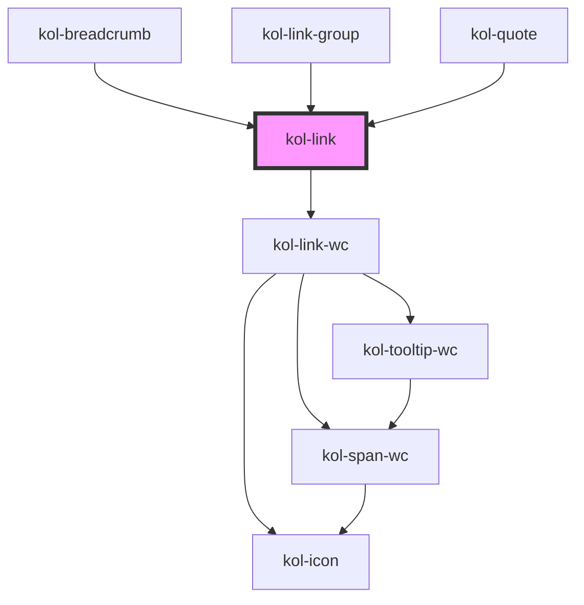

# Link

Die **Link**-Komponente rendert einen auf Barrierefreiheit optimierten Link, der als Text, als Icon oder auch in Kombination ausgegeben werden kann.

Beachten Sie, dass die Komponente automatisch ein Padding links und rechts zum umgebenden Text erzeugt. Sie kann daher im Fließtext ohne
Eingabe von Leerzeichen eingefügt werden. Zusätzliche Leerzeichen vergrößern den Abstand zum umgebenden Text.

## Konstruktion

### Code

```html
<p>
	In diesem Absatz wird ein Link gesetzt, der keine weiteren Attribute enthält.
	<kol-link _href="https://www.w3.org" _target="_blank">Hier steht ein Link</kol-link>Er wird standardmäßig als
	<i>
		<b>inline-Element</b>
	</i>
	ausgegeben.
</p>
```

### Beispiel

<p>
   In diesem Absatz wird ein Link gesetzt, der keine weiteren Attribute enthält.
  <kol-link _href="https://www.w3.org" _target="_blank">Hier steht ein Link</kol-link>Er wird standardmäßig als <i>
    <b>inline-Element</b>
    </i> ausgegeben.
</p>

## Verwendung

### Link innerhalb eines Fließtextes mit Icon und Text

  <p>
    <kol-link _icons="codicon codicon-home">Ich bin ein Link mit Icon links</kol-link><br/>
    <kol-link _icons="codicon codicon-home" _icon-align="right">
      Ich bin ein Link mit Icon rechts
    </kol-link>
    Lorem, ipsum dolor sit amet consectetur adipisicing elit. Ea optio deleniti fuga quos molestias, voluptate nobis
    nemo, incidunt excepturi facilis, amet ducimus minus quae corporis eligendi cum distinctio. Fugit, repellendus.
    <kol-link _icons="codicon codicon-home">Ich bin ein Link mit Icon links</kol-link>. Lorem, ipsum dolor sit amet consectetur adipisicing
    elit. Ea optio deleniti fuga quos molestias, voluptate nobis nemo, incidunt excepturi<kol-link
      _icons='{"right": "codicon codicon-home"}'
    >
      Ich bin ein Link mit Icon rechts
    </kol-link>
    facilis, amet ducimus minus quae corporis eligendi cum distinctio. Fugit, repellendus.
  </p>

<!--### Best practices

### Anwendungsfälle-->

## Barrierefreiheit

### Tastatursteuerung

| Taste   | Funktion                        |
| ------- | ------------------------------- |
| `Tab`   | Fokussiert das Link-Element.    |
| `Enter` | Ruft den hinterlegten Link auf. |

<!-- Auto Generated Below -->

## Properties

| Property             | Attribute              | Description                                                                                                                                                                                   | Type                                                                                | Default                                        |
| -------------------- | ---------------------- | --------------------------------------------------------------------------------------------------------------------------------------------------------------------------------------------- | ----------------------------------------------------------------------------------- | ---------------------------------------------- |
| `_download`          | `_download`            | Tells the browser that the link contains a file. Optionally sets the filename.                                                                                                                | `string \| undefined`                                                               | `undefined`                                    |
| `_hideLabel`         | `_hide-label`          | Hides the caption by default and displays the caption text with a tooltip when the interactive element is focused or the mouse is over it.                                                    | `boolean \| undefined`                                                              | `false`                                        |
| `_href` _(required)_ | `_href`                | Sets the target URI of the link or citation source.                                                                                                                                           | `string`                                                                            | `undefined`                                    |
| `_icons`             | `_icons`               | Defines the icon classnames (e.g. `_icons="fa-solid fa-user"`).                                                                                                                               | `KoliBriHorizontalIcons & KoliBriVerticalIcons \| string \| undefined`              | `undefined`                                    |
| `_label`             | `_label`               | Defines the visible or semantic label of the component (e.g. aria-label, label, headline, caption, summary, etc.). Set to `false` to enable the expert slot.                                  | `string \| undefined`                                                               | `undefined`                                    |
| `_listenAriaCurrent` | `_listen-aria-current` | Listen on an aria-current event with this value. If the value matches the current value and the href is the same as the current url, the aria-current attribute will be set to current value. | `"date" \| "location" \| "page" \| "step" \| "time" \| boolean \| undefined`        | `undefined`                                    |
| `_on`                | --                     | Defines the callback functions for links.                                                                                                                                                     | `undefined \| { onClick?: EventValueOrEventCallback<Event, string> \| undefined; }` | `undefined`                                    |
| `_role`              | `_role`                | Defines the role of the components primary element.                                                                                                                                           | `"button" \| "link" \| "tab" \| undefined`                                          | `undefined`                                    |
| `_tabIndex`          | `_tab-index`           | Defines which tab-index the primary element of the component has. (https://developer.mozilla.org/en-US/docs/Web/HTML/Global_attributes/tabindex)                                              | `number \| undefined`                                                               | `undefined`                                    |
| `_target`            | `_target`              | Defines where to open the link.                                                                                                                                                               | `string \| undefined`                                                               | `undefined`                                    |
| `_targetDescription` | `_target-description`  | Defines the description to use when the link is going to be opened in another application.                                                                                                    | `string \| undefined`                                                               | `'Der Link wird in einem neuen Tab geöffnet.'` |
| `_tooltipAlign`      | `_tooltip-align`       | Defines where to show the Tooltip preferably: top, right, bottom or left.                                                                                                                     | `"bottom" \| "left" \| "right" \| "top" \| undefined`                               | `'right'`                                      |

## Dependencies

### Used by

- [kol-breadcrumb](../breadcrumb)
- [kol-link-group](../link-group)
- [kol-quote](../quote)

### Depends on

- kol-link-wc

### Graph



---
