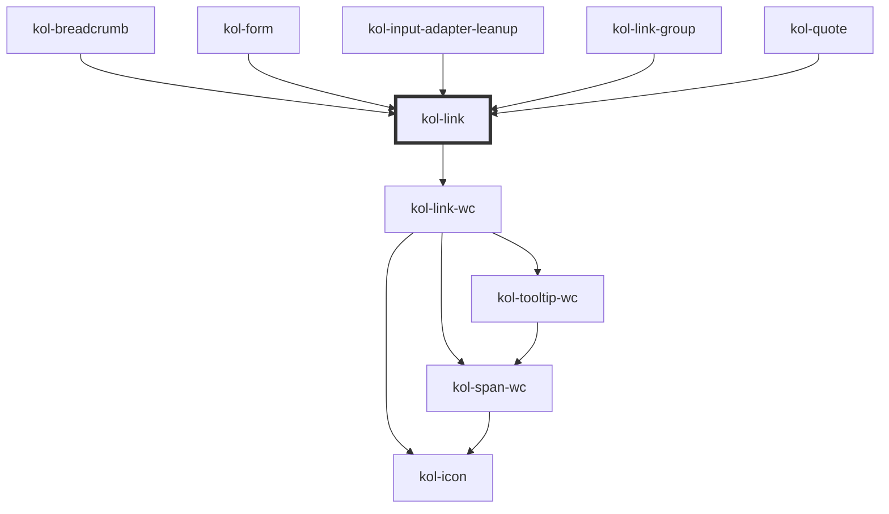

# Link

Die **Link**-Komponente rendert einen auf Barrierefreiheit optimierten Link, der als Text, als Icon oder auch in Kombination ausgegeben werden kann.

Beachten Sie, dass die Komponente automatisch ein Padding links und rechts zum umgebenden Text erzeugt. Sie kann daher im Fließtext ohne
Eingabe von Leerzeichen eingefügt werden. Zusätzliche Leerzeichen vergrößern den Abstand zum umgebenden Text.

## Konstruktion

### Code

```html
<p>
	In diesem Absatz wird ein Link gesetzt, der keine weiteren Attribute enthält.
	<kol-link _href="https://www.w3.org" _label="https://www.w3.org" _target="_blank">Hier steht ein Link</kol-link>Er wird standardmäßig als
	<i>
		<b>inline-Element</b>
	</i>
	ausgegeben.
</p>
```

### Beispiel

<p>
   In diesem Absatz wird ein Link gesetzt, der keine weiteren Attribute enthält.
  <kol-link _href="https://www.w3.org" _label="https://www.w3.org" _target="_blank">Hier steht ein Link</kol-link>Er wird standardmäßig als <i>
    <b>inline-Element</b>
    </i> ausgegeben.
</p>

## Verwendung

### Link innerhalb eines Fließtextes mit Icon und Text

<p>
  <kol-link _icons="codicon codicon-home">Ich bin ein Link mit Icon links</kol-link><br/>
  <kol-link _icons="codicon codicon-home">
    Ich bin ein Link mit Icon rechts
  </kol-link>
  Lorem, ipsum dolor sit amet consectetur adipisicing elit. Ea optio deleniti fuga quos molestias, voluptate nobis
  nemo, incidunt excepturi facilis, amet ducimus minus quae corporis eligendi cum distinctio. Fugit, repellendus.
  <kol-link _icons="codicon codicon-home">Ich bin ein Link mit Icon links</kol-link>. Lorem, ipsum dolor sit amet consectetur adipisicing
  elit. Ea optio deleniti fuga quos molestias, voluptate nobis nemo, incidunt excepturi
  <kol-link _icons="codicon codicon-home">Ich bin ein Link mit Icon rechts</kol-link>
  facilis, amet ducimus minus quae corporis eligendi cum distinctio. Fugit, repellendus.
</p>

<!--### Best practices

### Anwendungsfälle-->

## Barrierefreiheit

### Tastatursteuerung

| Taste   | Funktion                        |
| ------- | ------------------------------- |
| `Tab`   | Fokussiert das Link-Element.    |
| `Enter` | Ruft den hinterlegten Link auf. |

<!-- Auto Generated Below -->

## Properties

| Property             | Attribute              | Description                                                                                                                                                                                                                                                                                                                                                   | Type                                                                                | Default     |
| -------------------- | ---------------------- | ------------------------------------------------------------------------------------------------------------------------------------------------------------------------------------------------------------------------------------------------------------------------------------------------------------------------------------------------------------- | ----------------------------------------------------------------------------------- | ----------- |
| `_ariaControls`      | `_aria-controls`       | <span style="color:red">**[DEPRECATED]**</span> will be removed in v2<br/><br/>Deprecated: Defines which elements are controlled by this component. (https://developer.mozilla.org/en-US/docs/Web/Accessibility/ARIA/Attributes/aria-controls)                                                                                                                | `string \| undefined`                                                               | `undefined` |
| `_ariaCurrent`       | `_aria-current`        | <span style="color:red">**[DEPRECATED]**</span> use \_listen-aria-current instead<br/><br/>Deprecated: Marks the element as the selected in a group of related elements. Can be one of the following: `date` \| `location` \| `page` \| `step` \| `time` \| `true`. (https://developer.mozilla.org/en-US/docs/Web/Accessibility/ARIA/Attributes/aria-current) | `"date" \| "location" \| "page" \| "step" \| "time" \| boolean \| undefined`        | `undefined` |
| `_ariaExpanded`      | `_aria-expanded`       | <span style="color:red">**[DEPRECATED]**</span> will be removed in v2<br/><br/>Deprecated: Defines whether the interactive element of the component expanded something. (https://developer.mozilla.org/en-US/docs/Web/Accessibility/ARIA/Attributes/aria-expanded)                                                                                            | `boolean \| undefined`                                                              | `undefined` |
| `_ariaLabel`         | `_aria-label`          | <span style="color:red">**[DEPRECATED]**</span> use \_label instead<br/><br/>Deprecated: Setzt die semantische Beschriftung der Komponente.                                                                                                                                                                                                                   | `string \| undefined`                                                               | `undefined` |
| `_ariaSelected`      | `_aria-selected`       | <span style="color:red">**[DEPRECATED]**</span> will be removed in v2<br/><br/>Deprecated: Defines whether the interactive element of the component is selected (e.g. role=tab). (https://developer.mozilla.org/en-US/docs/Web/Accessibility/ARIA/Attributes/aria-selected)                                                                                   | `boolean \| undefined`                                                              | `undefined` |
| `_disabled`          | `_disabled`            | <span style="color:red">**[DEPRECATED]**</span> Ein Link kann nicht deaktiviert werden, nutzen Sie den Button-Link stattdessen.<br/><br/>Deprecated: Makes the element not focusable and ignore all events.                                                                                                                                                   | `boolean \| undefined`                                                              | `false`     |
| `_download`          | `_download`            | Tells the browser that the link contains a file. Optionally sets the filename.                                                                                                                                                                                                                                                                                | `string \| undefined`                                                               | `undefined` |
| `_hideLabel`         | `_hide-label`          | Hides the caption by default and displays the caption text with a tooltip when the interactive element is focused or the mouse is over it.                                                                                                                                                                                                                    | `boolean \| undefined`                                                              | `false`     |
| `_href` _(required)_ | `_href`                | Sets the target URI of the link or citation source.                                                                                                                                                                                                                                                                                                           | `string`                                                                            | `undefined` |
| `_icon`              | `_icon`                | <span style="color:red">**[DEPRECATED]**</span> Use \_icons.<br/><br/>                                                                                                                                                                                                                                                                                        | `KoliBriHorizontalIcons & KoliBriVerticalIcons \| string \| undefined`              | `undefined` |
| `_iconAlign`         | `_icon-align`          | <span style="color:red">**[DEPRECATED]**</span> Wird durch das neue flexibleren Icon-Typ abgedeckt.<br/><br/>Deprecated: Defines where to show the Tooltip preferably: top, right, bottom or left.                                                                                                                                                            | `"bottom" \| "left" \| "right" \| "top" \| undefined`                               | `undefined` |
| `_iconOnly`          | `_icon-only`           | <span style="color:red">**[DEPRECATED]**</span> use \_hide-label<br/><br/>Deprecated: Hides the label and shows the description in a Tooltip instead.                                                                                                                                                                                                         | `boolean \| undefined`                                                              | `undefined` |
| `_icons`             | `_icons`               | Defines the icon classnames (e.g. `_icons="fa-solid fa-user"`).                                                                                                                                                                                                                                                                                               | `KoliBriHorizontalIcons & KoliBriVerticalIcons \| string \| undefined`              | `undefined` |
| `_label`             | `_label`               | Defines the visible or semantic label of the component (e.g. aria-label, label, headline, caption, summary, etc.). Set to `false` to enable the expert slot.                                                                                                                                                                                                  | `string \| undefined`                                                               | `undefined` |
| `_listenAriaCurrent` | `_listen-aria-current` | Listen on a aria-current event with this value. If the value matches the current value and the href is the same as the current url, the aria-current attribute will be set to current value.                                                                                                                                                                  | `"date" \| "location" \| "page" \| "step" \| "time" \| boolean \| undefined`        | `undefined` |
| `_on`                | --                     | Defines the callback functions for links.                                                                                                                                                                                                                                                                                                                     | `undefined \| { onClick?: EventValueOrEventCallback<Event, string> \| undefined; }` | `undefined` |
| `_role`              | `_role`                | Defines the role of the components primary element.                                                                                                                                                                                                                                                                                                           | `"button" \| "link" \| "tab" \| undefined`                                          | `undefined` |
| `_selector`          | `_selector`            | <span style="color:red">**[DEPRECATED]**</span> will be removed in v2<br/><br/>Deprecated: Gibt die ID eines DOM-Elements, zu dem gesprungen werden soll, aus.                                                                                                                                                                                                | `string \| undefined`                                                               | `undefined` |
| `_stealth`           | `_stealth`             | <span style="color:red">**[DEPRECATED]**</span> will be removed in v2<br/><br/>Deprecated: Gibt an, ob der Link nur beim Fokus sichtbar ist.                                                                                                                                                                                                                  | `boolean \| undefined`                                                              | `false`     |
| `_tabIndex`          | `_tab-index`           | Defines which tab-index the primary element of the component has. (https://developer.mozilla.org/en-US/docs/Web/HTML/Global_attributes/tabindex)                                                                                                                                                                                                              | `number \| undefined`                                                               | `undefined` |
| `_target`            | `_target`              | Defines where to open the link.                                                                                                                                                                                                                                                                                                                               | `string \| undefined`                                                               | `undefined` |
| `_tooltipAlign`      | `_tooltip-align`       | Defines where to show the Tooltip preferably: top, right, bottom or left.                                                                                                                                                                                                                                                                                     | `"bottom" \| "left" \| "right" \| "top" \| undefined`                               | `'right'`   |
| `_useCase`           | `_use-case`            | <span style="color:red">**[DEPRECATED]**</span> will be removed in v2<br/><br/>Deprecated: Gibt den Verwendungsfall des Links an.                                                                                                                                                                                                                             | `"image" \| "nav" \| "text" \| undefined`                                           | `'text'`    |

## Dependencies

### Used by

- [kol-breadcrumb](../breadcrumb)
- [kol-form](../form)
- [kol-input-adapter-leanup](../input-adapter-leanup)
- [kol-link-group](../link-group)
- [kol-quote](../quote)

### Depends on

- kol-link-wc

### Graph



---
