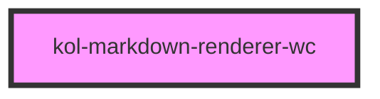

# Span

<kol-alert _type="warning">Die **Markdown-Renderer**-Komponente wird innerhalb von KoliBri verwendet und ist nicht dafür vorgesehen in der Anwendungsentwicklung direkt verwendet zu werden. Denn die Komponente ist nur dann wirklich barrierefrei, wenn es in Kombination mit den vorgesehenen Komponenten verwendet wird.</kol-alert>

Die **Markdown-Renderer**-Komponente dient dazu innerhalb einiger KoliBri-Komponenten, wie z. B. Tooltips und Badges, den Text formatieren zu können.

## Konstruktion

### Code

```html
<kol-markdown-renderer-wc _label="**Fetter Text** _Unterstrichen_ [Github](https://github.com/public-ui/kolibri/issues/5025)" />
```

### Beispiel

<kol-markdown-renderer-wc _label="**Fetter Text** _Unterstrichen_ [Github](https://github.com/public-ui/kolibri/issues/5025)" />

<!-- Auto Generated Below -->

## Properties

| Property              | Attribute | Description                                                                                                        | Type      | Default |
| --------------------- | --------- | ------------------------------------------------------------------------------------------------------------------ | --------- | ------- |
| `_label` _(required)_ | `_label`  | Defines the visible or semantic label of the component (e.g. aria-label, label, headline, caption, summary, etc.). | `boolean` | ``      |

## Dependencies

### Depends on

Keine Abhängigkeiten vorhanden

### Graph



---
