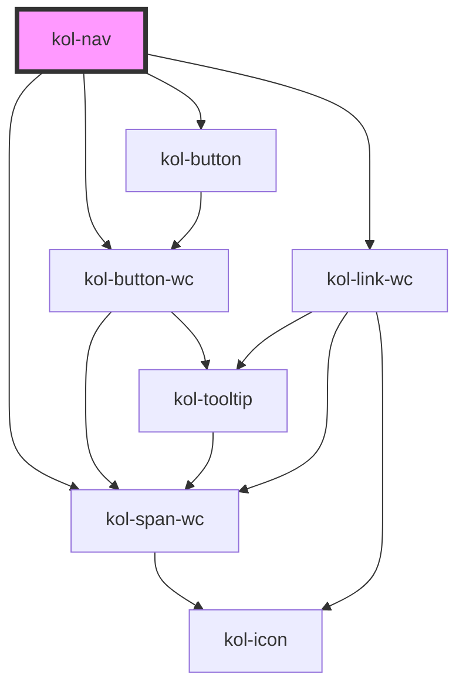

# Nav

Eine **Navigationsleiste** ist eine Gruppe von verwandten Links oder Navigationselementen, die durch Anklicken eine Aktion ausführen oder Inhalte anzeigen. Sie navigiert Nutzer:innen direkt zu bestimmten Inhalten der aktuellen Seite oder zu externen Seiten. Außerdem dient sie Nutzer:innen (ähnlich wie Registerkarten) als Steuerelement, um Inhalte anzuzeigen, auszublenden und zwischen ihnen zu wechseln.

**KoliBri** stellt eine umfangreich konfigurierbare, vertikale oder horizontale **Navigationsleiste** zur Verfügung, die mehrere Ebenen darstellen und in der Breite variiert werden kann.
Übergeordnete Menüpunkte die Untermenüpunkte enthalten, werden mit einem **Plus-Icon** am rechten Rand angezeigt. Wird der übergeordnete Menüpunkt mit dem Plus-Icon geöffnet, ändert sich das Plus-Icon automatisch zu einem **Minus-Icon**, mit dem der Menüpunkt wieder geschlossen werden kann.

Aktive Menüpunkte werden mit einer farbigen Markierung dargestellt.

Über eine optionale Schaltfläche unterhalb der Navigation kann die Breite der **Nav**-Komponente verändert werden. In der kleinsten Breite werden die Menütitel ausgeblendet und nur
noch die Icons ausgegeben.

## Konstruktion

### Code

```html
<kol-nav
	_ariaLabel="Navigation"
	_links="[
	{
		_href: 'startseite',
		_icon: 'codicon codicon-home',
		_label: 'Startseite',
		_children: [
			{ _href: 'startseite/1-untermenuepunkt', _icon: 'codicon codicon-home', _label: '1. Untermenüpunkt' },
			{ _href: 'startseite/2-untermenuepunkt', _icon: 'codicon codicon-home', _label: '2. Untermenüpunkt' },
		],
	},
	{ _href: 'unterseite', _icon: 'codicon codicon-home', _label: '2. Menüpunkt' },
]"
	_has-compact-button
></kol-nav>
```

### Beispiel

<kol-nav _ariaLabel="Navigation" _links="[{'_href': 'startseite','_icon': 'codicon codicon-home','_label': 'Startseite',_children: [{ '_href': 'startseite/1-untermenuepunkt', '_icon': 'codicon codicon-home', '_label': '1. Untermenüpunkt' },{ '_href': 'startseite/2-untermenuepunkt', '_icon': 'codicon codicon-home', '_label': '2. Untermenüpunkt' },],},{'_href': 'unterseite', '_icon': 'codicon codicon-home', '_label': '2. Menüpunkt' }]" _has-compact-button></kol-nav>

## Verwendung

### Links in der Navigationsleiste definieren

Die Navigationsstruktur wird als Objekt oder JSON-String an das Attribut **`_links`** übergeben. Die Struktur ist als Wert/Parameter-Paar aufgebaut:
Um Untermenüpunkte zu erzeugen, erweitern Sie die JSON-Struktur um das zusätzliche Attribut **`_children`** im übergeordneten Element.

```js
[
	{
		_href: 'startseite',
		_icon: 'codicon codicon-home',
		_label: 'Startseite',
		_children: [
			{ _href: 'startseite/1-untermenuepunkt', _icon: 'codicon codicon-home', _label: '1. Untermenüpunkt' },
			{ _href: 'startseite/2-untermenuepunkt', _icon: 'codicon codicon-home', _label: '2. Untermenüpunkt' },
		],
	},
	{ _href: 'unterseite', _icon: 'codicon codicon-home', _label: '2. Menüpunkt' },
];
```

### Kompakte Navigationsleiste anzeigen

Um die Navigationsleiste in der kompakten Darstellung auszugeben, setzen Sie das Attribut **`_compact`**.

### Umschalter normale/kompakte Darstellung

Um eine Schaltfläche einzublenden, die die kompakte Darstellung an/aus schaltet, setzen Sie das Attribut **`_hasCompact-button`**.
Diese Schaltfläche erscheint unterhalb der Navigation und wird nur bei vertikaler Ausrichtung angezeigt.

### Umschaltung horizontale/vertikale Ausrichtung

Die Ausrichtung der Navigationsleiste kann mit dem Attribut **`_orientation`** umgeschaltet werden. Mögliche Werte sind:

- `horizontal`
- `vertical`

### Best practices

- Verwenden Sie **Navigationsleisten**, um **Navigation** oder navigationsähnliche Aktionen darzustellen (z. B. interne oder externe Links, Abmelden, Kontrolle der Sichtbarkeit auf der Seite).
- Verwenden Sie das Label, um eine klare und präzise Beschreibung des Inhalts zu diesem bestimmten Navigationselement bereitzustellen.
- Verwenden Sie keine **Navigationsleisten** für Aktionen, die besser als Schaltflächen dargestellt werden (z. B. „Speichern“, „Löschen“, „Artikel in den Warenkorb legen“).
- Stapeln Sie nicht mehrere **Navigationsleisten** direkt nebeneinander.
- Verwenden Sie keine **Navigationsleisten** zum Vergleichen von Inhalten (z. B. unterschiedliche Leistungen).
- Berücksichtigen Sie die Anzahl der Navigationselemente, die Sie in die **Navigationsleiste** einfügen. Wenn Sie das Gefühl haben, dass die Zahl zu groß wird, ziehen Sie alternative Ansätze zur Präsentation des Inhalts in Betracht oder verwenden Sie ein anderes Navigationsmuster/eine andere Komponente.

### Anwendungsfälle

- Verwenden Sie **Navigationsleisten** als In-Page-Navigation auf einer Landingpage.
- Verwenden Sie **Navigationsleisten**, um verwandte Informationen auf einer Landingpage zu organisieren.
- Nutzen Sie **Navigationsleisten**, um Angebote oder Vorteile in verschiedene Kategorien einzuordnen (z.B. Formulare).
- Verwenden Sie **Navigationsleisten**, um FAQs in verschiedene Kategorien zu unterteilen.

## Barrierefreiheit

### Tastatursteuerung

| Taste   | Funktion                                                                                                                                                                                                                   |
| ------- | -------------------------------------------------------------------------------------------------------------------------------------------------------------------------------------------------------------------------- |
| `Tab`   | Fokussiert den ersten Menüpunkt in der Navigation. Nachfolgend kann mit der Tab-Taste jeder Menüpunkt angesprungen werden. Wenn der Has-compact-Button aktiviert wurde, ist dieser ebenfalls mit der Tab-Taste erreichbar. |
| `Enter` | Klappt Unterpunkte auf/zu, sofern eine Ausklappschaltfläche fokussiert ist, aktiviert die Schaltfläche oder öffnet den Link anderenfalls.                                                                                  |

<!--## Links und Referenzen

<!-- Auto Generated Below -->

## Properties

| Property                  | Attribute             | Description                                                                                                                                                                                     | Type                                                            | Default      |
| ------------------------- | --------------------- | ----------------------------------------------------------------------------------------------------------------------------------------------------------------------------------------------- | --------------------------------------------------------------- | ------------ |
| `_ariaCurrentValue`       | `_aria-current-value` | Gibt den Wert von aria-current an, der bei dem aktuellen Kontext innerhalb der Navigation verwendet werden soll.                                                                                | `"date" \| "location" \| "page" \| "step" \| "time" \| boolean` | `false`      |
| `_ariaLabel` _(required)_ | `_aria-label`         | Gibt den Text an, der die Navigation von anderen Navigationen differenziert.                                                                                                                    | `string`                                                        | `undefined`  |
| `_collapsible`            | `_collapsible`        | Gibt an, ob Knoten in der Navigation zusammengeklappt werden können. Ist standardmäßig aktiv.                                                                                                   | `boolean \| undefined`                                          | `true`       |
| `_compact`                | `_compact`            | Gibt an, ob die Navigation kompakt angezeigt wird.                                                                                                                                              | `boolean \| undefined`                                          | `false`      |
| `_hasCompactButton`       | `_has-compact-button` | <span style="color:red">**[DEPRECATED]**</span> Version 2<br/><br/>Gibt an, ob die Navigation eine zusätzliche Schaltfläche zum Aus- und Einklappen der Navigation anzeigen soll.               | `boolean \| undefined`                                          | `false`      |
| `_links` _(required)_     | `_links`              | Gibt die geordnete Liste der Seitenhierarchie an.                                                                                                                                               | `ButtonOrLinkOrTextWithChildrenProps[] \| string`               | `undefined`  |
| `_orientation`            | `_orientation`        | Gibt die Ausrichtung der Navigation an.                                                                                                                                                         | `"horizontal" \| "vertical" \| undefined`                       | `'vertical'` |
| `_variant`                | `_variant`            | <span style="color:red">**[DEPRECATED]**</span> This property is deprecated and will be removed in the next major version.<br/><br/>Stellt verschiedene Varianten der Navigation zur Verfügung. | `"primary" \| "secondary" \| undefined`                         | `'primary'`  |

## Dependencies

### Depends on

- kol-button-wc
- kol-span-wc
- kol-link-wc
- [kol-button](../button)

### Graph



---
