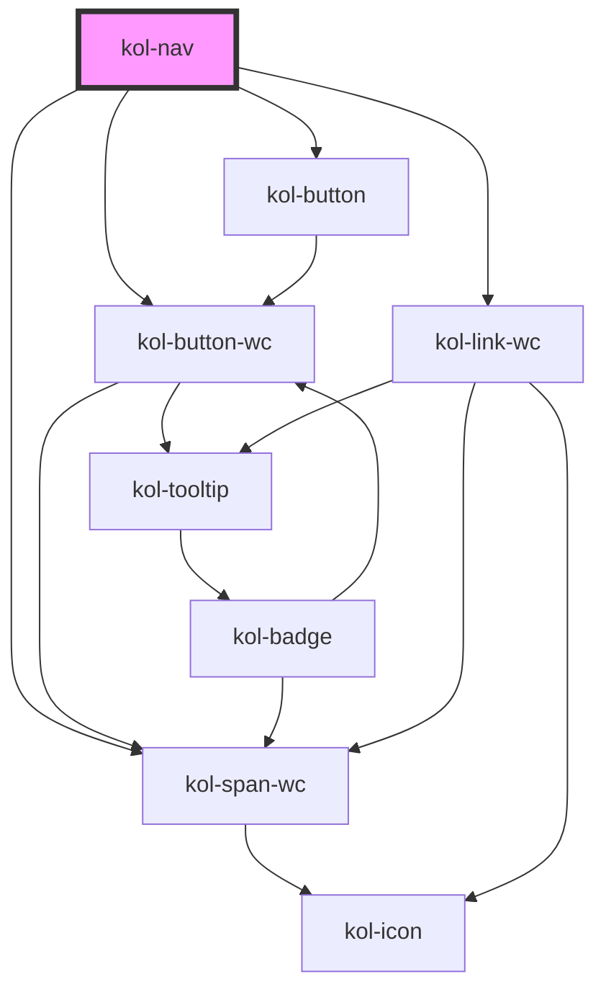

# Nav

Eine **Navigationsleiste** ist eine Gruppe von verwandten Links oder „Navigationselementen“, die durch Anklicken eine Aktion ausführen oder Inhalte anzeigen. Sie navigiert Nutzer:innen direkt zu bestimmten Inhalten der aktuellen Seite oder zu externen Seiten. Außerdem dient sie Nutzer:innen (ähnlich wie Registerkarten) als Steuerelement, um Inhalte anzuzeigen, auszublenden und zwischen ihnen zu wechseln. Dabei werden häufig animierte Übergänge verwendet.

Die **Nav**-Komponente stellt eine vollwertige vertikale , bzw. horizontale **Navigationsleiste** bereit. Sie kann mehrere Ebenen enthalten und in verschiedenen Breiten ausgegeben werden. Die **Nav**-Komponente repräsentiert die Struktur der Webseite und hat so eine fundamentale Bedeutung sowohl für Nutzer:innen, als auch für Suchmaschinen.

**KoliBri** stellt eine umfangreich konfigurierbare, vertikale oder horizontale **Navigationsleiste** zur Verfügung, die mehrere Ebenen darstellen und in der Breite variiert werden kann.
Menüpunkte der obersten Ebene, wie z.B. die Startseite, werden stets über die ganze Breite der **Navigation** gestreckt. Nachfolgende Ebenen, als direkte Kindelemente, werden auf der linken Seite
etwas eingerückt ausgegeben. Übergeordnete Menüpunkte die Untermenüpunkte enthalten, werden mit einem **Plus-Icon** am linken Rand angezeigt. Wird der übergeordnete Menüpunkt mit dem Plus-Icon geöffnet, ändert sich
das Plus-Icon automatisch zu einem **Minus-Icon**, mit dem der Menüpunkt wieder geschlossen werden kann.

Aktive Menüpunkte werden mit einer farbigen Markierung dargestellt.

Über ein **Doppelpfeil-Icon** unterhalb der Navigation kann die Breite der **Nav**-Komponente verändert werden. In der kleinsten Breite werden die Menütitel ausgeblendet und nur
noch die Icons ausgegeben.

## Konstruktion

### Code

```html
<kol-nav
	_links='[{"_label":"Startseite", "_href":"startseite"},{"_label":"Unterseite von Startseite", "_href":"unterseite"}]'
	_has-compact-button="true"
></kol-nav>
```

### Beispiel

<kol-nav _ariaLabel="Navigation" _links='[{"_label":"Startseite","_href":"startseite", "_children":[{"_label":"1. Untermenüpunkt","_href":"startseite/1-untermenuepunkt"},{"_label":"2. Untermenüpunkt","_href":"startseite/2-untermenuepunkt"}]},{"_label":"2. Menüpunkt","_href":"unterseite"}]' _has-compact-button></kol-nav>

## Verwendung

### Links in der Navigationsleiste definieren

Die Navigationsstruktur wird als JSON-Struktur an das Attribut `_links_` übergeben. Die Struktur ist als Wert/Parameter-Paar aufgebaut:

```html
[ {"_label":"Startseite", "_href":"startseite"}, {"_label":"Unterseite 1":"_href":"unterseite1"}, {"_label":"Unterseite 2":"_href":"unterseite2"} ]
```

Um Untermenüpunkte zu erzeugen, erweitern Sie die JSON-Struktur um das zusätzliche Attribut `_children` im übergeordneten Element.

```html
[ { _label: 'Startseite', _href: 'startseite', _children: [ { _label: '1. Untermenüpunkt', _href: 'startseite/1-untermenuepunkt' }, { _label: '2.
Untermenüpunkt', _href: 'startseite/2-untermenuepunkt' }, ], }, { _label: '2. Menüpunkt', _href: 'unterseite' }, ];
```

### Kompakte Navigationsleiste anzeigen

Um die Navigationsleiste in der kompakten Darstellung auszugeben, setzen Sie das Attribut `_compact="true"`.

### Umschalter normale/kompakte Darstellung

Um zwischen beiden Darstellungen umschalten zu können, kann über das Attribut `_hasCompactButton="true"`
ein Link unterhalb der Navigationsleiste angezeigt werden.

### Umschaltung horizontale/vertikale Ausrichtung

Die Navigationsleiste kann mit dem Attribut `_orientation` zwischen horizontaler und vertikaler Ausrichtung umgeschaltet werden. Mögliche Werte sind:<br/>

- `horizontal`
- `vertical`

### Best practices

- Verwenden Sie **Navigationsleisten**, um **Navigation** oder navigationsähnliche Aktionen darzustellen (z. B. interne oder externe Links, Abmelden, Kontrolle der Sichtbarkeit auf der Seite).
- Verwenden Sie das Label, um eine klare und präzise Beschreibung des Inhalts zu diesem bestimmten Navigationselement bereitzustellen.
- Verwenden Sie keine **Navigationsleisten** für Aktionen, die besser als Schaltflächen dargestellt werden (z. B. „Speichern“, „Löschen“, „Artikel in den Warenkorb legen“).
- Stapeln Sie nicht mehrere **Navigationsleisten** direkt nebeneinander.
- Verwenden Sie keine **Navigationsleisten** zum Vergleichen von Inhalten (z. B. unterschiedliche Leistungen).
- Berücksichtigen Sie die Anzahl der Navigationselemente, die Sie in die **Navigationsleiste** einfügen. Wenn Sie das Gefühl haben, dass die Zahl zu groß wird, ziehen Sie alternative Ansätze zur Präsentation des Inhalts in Betracht oder verwenden Sie ein anderes Navigationsmuster/eine andere Komponente.
- Wenn ein Menüpunkt Kindelemente besitzt, bewirkt die Enter-Taste das Öffnen des nächsten Kindelements. Es ist in diesem Fall nicht möglich den Link im Elternelement mit der Enter-Taste auszuführen.

### Anwendungsfälle

- Verwenden Sie **Navigationsleisten** als In-Page-Navigation auf einer Landingpage.
- Verwenden Sie **Navigationsleisten**, um verwandte Informationen auf einer Landingpage zu organisieren.
- Nutzen Sie **Navigationsleisten**, um Angebote oder Vorteile in verschiedene Kategorien einzuordnen (z.B. Formulare).
- Verwenden Sie **Navigationsleisten**, um FAQs in verschiedene Kategorien zu unterteilen.

## Barrierefreiheit

### Tastatursteuerung

| Taste   | Funktion                                                                                                                                                                                                                   |
| ------- | -------------------------------------------------------------------------------------------------------------------------------------------------------------------------------------------------------------------------- |
| `Tab`   | Fokussiert den ersten Menüpunkt in der Navigation. Nachfolgend kann mit der Tab-Taste jeder Menüpunkt angesprungen werden. Wenn der Has-compact-Button aktiviert wurde, ist dieser ebenfalls mit der Tab-Taste erreichbar. |
| `Enter` | Öffnet bzw.schließt den fokussierten Menüpunkt. Besitzt der fokussierte Menüpunkt kein weiteres Kindelement, wird mit der Enter-Taste der eigentliche Link Aufgerufen.                                                     |

<!--## Links und Referenzen

<!-- Auto Generated Below -->

## Properties

| Property                  | Attribute             | Description                                                                                                                                                                    | Type                                                            | Default      |
| ------------------------- | --------------------- | ------------------------------------------------------------------------------------------------------------------------------------------------------------------------------ | --------------------------------------------------------------- | ------------ |
| `_ariaCurrentValue`       | `_aria-current-value` | Gibt den Wert von aria-current an, der bei dem aktuellen Kontext innerhalb der Navigation verwendet werden soll.                                                               | `"date" \| "location" \| "page" \| "step" \| "time" \| boolean` | `false`      |
| `_ariaLabel` _(required)_ | `_aria-label`         | Gibt den Text an, der die Navigation von anderen Navigationen differenziert.                                                                                                   | `string`                                                        | `undefined`  |
| `_collapsible`            | `_collapsible`        | Gibt an, ob Knoten in der Navigation zusammengeklappt werden können. Ist standardmäßig aktiv.                                                                                  | `boolean \| undefined`                                          | `true`       |
| `_compact`                | `_compact`            | Gibt an, ob die Navigation kompakt angezeigt wird.                                                                                                                             | `boolean \| undefined`                                          | `false`      |
| `_hasCompactButton`       | `_has-compact-button` | Gibt an, ob die Navigation eine zusätzliche Schaltfläche zum Aus- und Einklappen der Navigation anzeigen soll.                                                                 | `boolean \| undefined`                                          | `false`      |
| `_links` _(required)_     | `_links`              | Gibt die geordnete Liste der Seitenhierarchie an.                                                                                                                              | `ButtonOrLinkOrTextWithChildrenProps[] \| string`               | `undefined`  |
| `_orientation`            | `_orientation`        | Gibt die Ausrichtung der Navigation an.                                                                                                                                        | `"horizontal" \| "vertical" \| undefined`                       | `'vertical'` |
| `_variant`                | `_variant`            | <span style="color:red">**[DEPRECATED]**</span> This property is deprecated and will be removed in the next major version.<br/><br/>Gibt an, welche Ausprägung der Button hat. | `"primary" \| "secondary" \| undefined`                         | `'primary'`  |

## Dependencies

### Depends on

- kol-button-wc
- kol-span-wc
- kol-link-wc
- [kol-button](../button)

### Graph



---
