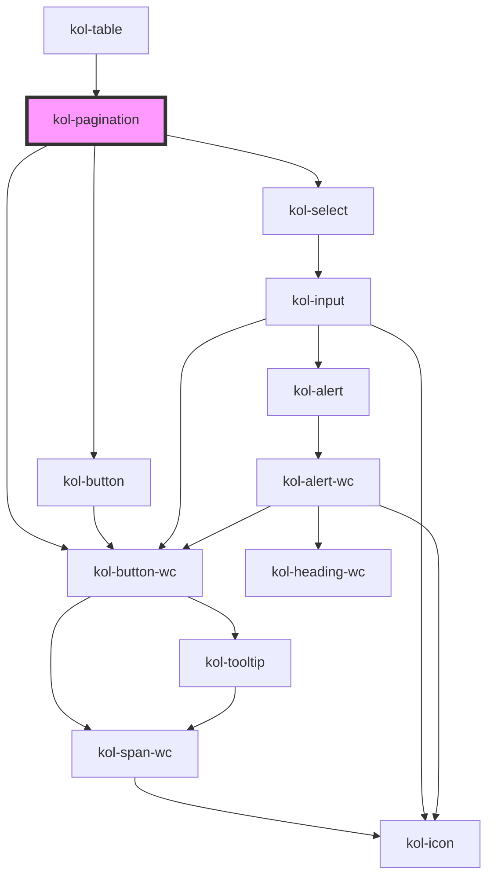

# Pagination

Mit Hilfe der **Paginierung**-Komponente lassen sich umfangreiche, aufgeteilte Inhalte, wie zum Beispiel Suchergebnisse, der Reihe nach durchlaufen.

## Konstruktion

### Code

```html
<div>
	<kol-pagination _total="100" _page="6"></kol-pagination>
	<kol-pagination _total="100" _page="6" _sibling-count="2"></kol-pagination>
	<kol-pagination _total="100" _page="6" _sibling-count="0" _boundary-count="2"></kol-pagination>
</div>
```

### Beispiel

<div class="grid gap-2">
  <kol-heading _level="3" _label="Standardausgabe nur mit aktuellem Element"></kol-heading>
  <kol-pagination _total="100" _page="6" _has-buttons="false"></kol-pagination>
  <kol-heading _level="3" _label="Ausgabe 2 Elemente links und rechts dem aktuellen Element (_sibling)"></kol-heading>
  <kol-pagination _total="100" _page="6" _sibling-count="2"></kol-pagination>
  <kol-heading _level="3" _label="Ausgabe 2 Elemente links und rechts (_boundary-count)"></kol-heading>
  <kol-pagination _total="100" _page="6" _sibling-count="0" _boundary-count="2"></kol-pagination>
</div>

## Verwendung

Die **Paginierung**-Komponente kann über Ihre Properties konfiguriert werden.

- Das Attribut **`_total`** bestimmt die Gesamtanzahl der Elemente.
- Über das Attribut **`boundary-count`** wird die Anzahl von Elementen bestimmt, die in der **Paginierung**-Komponente rechts und links angezeigt werden, während die übrigen Elemente
- Das Attribut **`_page`** legt das gerade aktive Element fest. Dieses wird farblich hervorgehoben dargestellt.
- Über das Attribut **`_sibling-count`** kann festgelegt werden, wie viele Elemente jeweils links und rechts des Aktuellen angezeigt werden sollen.

<!-- ### Best practices -->

### Anwendungsfälle

Die **Paginierung**-Komponente kann auf vielfältige Art eingesetzt werden. Insbesondere dort, wo auf einer Inhaltsseite umfangreiche Inhalte dargestellt werden sollen, trägt sie zur Verbesserung der Struktur und Übersichtlichkeit bei.
Klassische Anwendungsbereiche einer Paginierung sind z.B. Blog-ähnliche Inhalte, Listen und Tabellen. Auch für bestimmte Navigationsaufgaben innerhalb einer Seite kann die Paginierung gut verwendet werden.

<!-- ## Barrierefreiheit -->

<!-- ## Links und Referenzen -->

<!-- Auto Generated Below -->


## Properties

| Property              | Attribute            | Description                                                                                    | Type                                                                                                                                                                                                                   | Default     |
| --------------------- | -------------------- | ---------------------------------------------------------------------------------------------- | ---------------------------------------------------------------------------------------------------------------------------------------------------------------------------------------------------------------------- | ----------- |
| `_boundaryCount`      | `_boundary-count`    | Gibt an, wie viele Seiten neben den am Rand liegenden Pfeil-Schaltern angezeigt werden sollen. | `number \| undefined`                                                                                                                                                                                                  | `1`         |
| `_customClass`        | `_custom-class`      | Gibt an, welche Custom-Class übergeben werden soll, wenn _variant="custom" gesetzt ist.        | `string \| undefined`                                                                                                                                                                                                  | `undefined` |
| `_hasButtons`         | `_has-buttons`       | Setzt die Sichtbarkeit der Anfang/zurück/weiter/Ende-Schaltflächen.                            | `boolean \| string \| undefined \| { first: boolean; last: boolean; next: boolean; previous: boolean; }`                                                                                                               | `true`      |
| `_on` _(required)_    | --                   | Gibt an, auf welche Callback-Events reagiert werden.                                           | `{ onChangePage?: EventValueOrEventCallback<Event, number> \| undefined; onChangePageSize?: EventValueOrEventCallback<Event, number> \| undefined; onClick?: EventValueOrEventCallback<Event, number> \| undefined; }` | `undefined` |
| `_page` _(required)_  | `_page`              | Gibt an, welche Seite aktuell ausgewählt ist.                                                  | `number`                                                                                                                                                                                                               | `undefined` |
| `_pageSize`           | `_page-size`         | Gibt an, wie viele Einträge pro Seite angezeigt werden.                                        | `number`                                                                                                                                                                                                               | `1`         |
| `_pageSizeOptions`    | `_page-size-options` | Setzt die Optionen für das Seitenlängenselect.                                                 | `number[] \| string`                                                                                                                                                                                                   | `[]`        |
| `_siblingCount`       | `_sibling-count`     | Gibt an, wie viele Seiten neben der aktuell Ausgewählten angezeigt werden.                     | `number \| undefined`                                                                                                                                                                                                  | `1`         |
| `_tooltipAlign`       | `_tooltip-align`     | Gibt an, ob der Tooltip oben, rechts, unten oder links angezeigt werden.                       | `"bottom" \| "left" \| "right" \| "top" \| undefined`                                                                                                                                                                  | `'top'`     |
| `_total` _(required)_ | `_total`             | Setzt die Gesamtanzahl der Seiten.                                                             | `number`                                                                                                                                                                                                               | `undefined` |
| `_variant`            | `_variant`           | Gibt an, welche Button-Variante verwendet werden soll.                                         | `"custom" \| "danger" \| "ghost" \| "normal" \| "primary" \| "secondary" \| undefined`                                                                                                                                 | `'normal'`  |


## Dependencies

### Used by

 - [kol-table](../table)

### Depends on

- [kol-button](../button)
- [kol-select](../select)
- kol-button-wc

### Graph


----------------------------------------------


