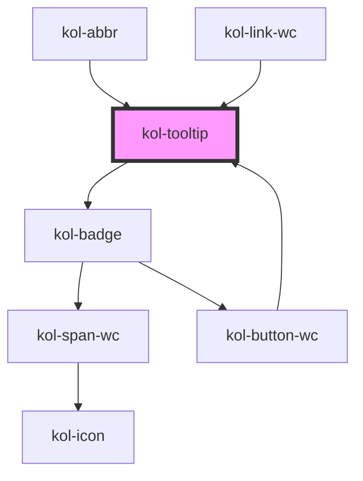

# Tooltip

## Barrierefreiheit

## Links und Referenzen

<!-- Auto Generated Below -->

## Properties

| Property              | Attribute | Description                                                                                            | Type                                                  | Default     |
| --------------------- | --------- | ------------------------------------------------------------------------------------------------------ | ----------------------------------------------------- | ----------- |
| `_align`              | `_align`  | Gibt an, ob der Tooltip oben, rechts, unten oder links angezeigt werden soll.                          | `"bottom" \| "left" \| "right" \| "top" \| undefined` | `'top'`     |
| `_id` _(required)_    | `_id`     | Gibt die ID an, wenn z.B. Aria-Labelledby (Link) verwendet wird.                                       | `string`                                              | `undefined` |
| `_label` _(required)_ | `_label`  | Das Label gibt an, welcher Text in dem Tooltip beim Fokussieren oder Maus-drüberfahren angezeigt wird. | `string`                                              | `undefined` |

## Dependencies

### Used by

- [kol-abbr](../abbr)
- kol-button-wc
- kol-link-wc

### Depends on

- [kol-badge](../badge)

### Graph

---
