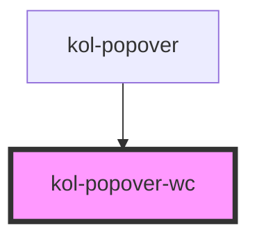

# Popover

Die **Popover**-Komponente stellt eine Möglichkeit dar zusätzliche Inhalte in ein temporäres Element zu setzen, das, ähnlich wie <kol-link _href="" _label="Tooltip"></kol-link>, um sein Triggerelement angeordnet ist.
Das Triggerelement ist immer das im HTML vorangehende Element (previousSibling).

<!-- Auto Generated Below -->

## Properties

| Property          | Attribute    | Description                                                        | Type                                                  | Default     |
| ----------------- | ------------ | ------------------------------------------------------------------ | ----------------------------------------------------- | ----------- |
| `_alignment`      | `_alignment` | Setzt die Ausrichtung des Popovers in Relation zum Triggerelement. | `"bottom" \| "left" \| "right" \| "top" \| undefined` | `'top'`     |
| `_host`           | --           |                                                                    | `HTMLElement \| undefined`                            | `undefined` |
| `_show`           | `_show`      | Öffnet/schließt das Popover.                                       | `boolean \| undefined`                                | `false`     |
| `_triggerElement` | --           |                                                                    | `HTMLElement \| undefined`                            | `undefined` |

## Dependencies

### Used by

 - [kol-popover](.)

### Graph

----------------------------------------------

