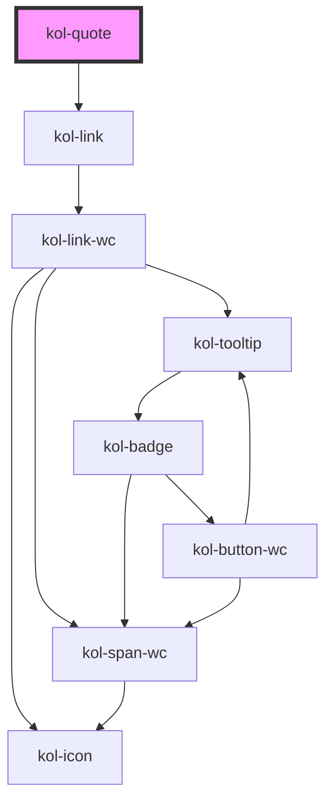

# Quote

The quote component is implemented in two variants. The first variant is the default `short` variant as inline quote with quotation marks. The second variant is the indented `long` variant. The indented variant is used to highlight a text passage or information visually.

Both variants can be extended with a `cite` element. The `cite` element is used to identify the source of a quotation and will be displayed below the quote as a link.

## References

- https://developer.mozilla.org/en-US/docs/Web/HTML/Element/quote
- https://developer.mozilla.org/en-US/docs/Web/HTML/Element/cite
- https://www.mediaevent.de/html/quote.html
- https://www.mediaevent.de/html/cite.html
- https://accessibleweb.com/question-answer/what-is-a-block-quote-and-when-should-i-use-it/

<!-- Auto Generated Below -->

## Properties

| Property              | Attribute  | Description                                                                                | Type                               | Default     |
| --------------------- | ---------- | ------------------------------------------------------------------------------------------ | ---------------------------------- | ----------- |
| `_caption`            | `_caption` | The caption of the quote.                                                                  | `string \| undefined`              | `undefined` |
| `_href` _(required)_  | `_href`    | The href is a URL that designates a source document or message for the information quoted. | `string`                           | `undefined` |
| `_quote` _(required)_ | `_quote`   | The text of the quote.                                                                     | `string`                           | `undefined` |
| `_variant`            | `_variant` | The variant of the quote.                                                                  | `"block" \| "inline" \| undefined` | `'inline'`  |

## Dependencies

### Depends on

- [kol-link](../link)

### Graph

---
