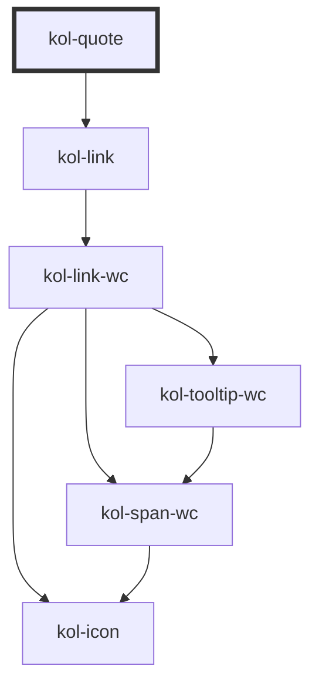

# Quote

> <kol-badge _label="untested"></kol-badge> Diese neue Komponente wird als ungetestet markiert, da der vollständige Barrierefreiheitstest noch aussteht. Der vollständige Test kann bei neuen Komponenten und Funktionalitäten auch erst nach einem abgeschlossenen Release erfolgen.

Die **Quote**-Komponente verfügt über zwei Varianten, eine kurze Fließtext-(`inline`) und eine eingerückte(`block`) Variante. Beide Varianten enthalten einen Link auf die Quelle des Zitates.

## Konstruktion

### Code

```html
<kol-quote
	_label="RFC 1149"
	_href="https://datatracker.ietf.org/doc/html/rfc1149"
	_quote="Avian carriers can provide high delay, low throughput, and low altitude
								service. The connection topology is limited to a single point-to-point path
								for each carrier, used with standard carriers, but many carriers can be used
								without significant interference with each other, outside early spring.
								This is because of the 3D ether space available to the carriers, in contrast
								to the 1D ether used by IEEE802.3. The carriers have an intrinsic collision
								avoidance system, which increases availability."
	_variant="block"
>
</kol-quote>
<kol-quote
	_label="RFC 1149"
	_href="https://datatracker.ietf.org/doc/html/rfc1149"
	_quote="Avian carriers can provide high delay."
	_variant="inline"
></kol-quote>
```

### Beispiele

<kol-quote
	_label="RFC 1149"
	_href="https://datatracker.ietf.org/doc/html/rfc1149"
	_quote="Avian carriers can provide high delay, low throughput, and low altitude
					service. The connection topology is limited to a single point-to-point path
					for each carrier, used with standard carriers, but many carriers can be used
					without significant interference with each other, outside early spring.
					This is because of the 3D ether space available to the carriers, in contrast
					to the 1D ether used by IEEE802.3. The carriers have an intrinsic collision
					avoidance system, which increases availability."
	_variant="block"></kol-quote>
<kol-quote
	_label="RFC 1149"
	_href="https://datatracker.ietf.org/doc/html/rfc1149"
	_quote="Avian carriers can provide high delay."
	_variant="inline"></kol-quote>

## Verwendung

Mittels **`_label`** kann eine Überschrift gesetzt werden, während **`_quote`** das eigentliche Zitat enthält. Der Ursprung wird über **`_href`** gesetzt.
Die `inline`-Variante ist Standard, sofern die Eingerückte gewünscht ist, kann **`_variant`** auf `block` gesetzt werden.

## References

- <kol-link _href="https://developer.mozilla.org/en-US/docs/Web/HTML/Element/quote" _label="https://developer.mozilla.org/en-US/docs/Web/HTML/Element/quote" _target="_blank"></kol-link>
- <kol-link _href="https://developer.mozilla.org/en-US/docs/Web/HTML/Element/cite" _label="https://developer.mozilla.org/en-US/docs/Web/HTML/Element/cite" _target="_blank"></kol-link>
- <kol-link _href="https://www.mediaevent.de/html/quote.html" _label="https://www.mediaevent.de/html/quote.html" _target="_blank"></kol-link>
- <kol-link _href="https://www.mediaevent.de/html/cite.html" _label="https://www.mediaevent.de/html/cite.html" _target="_blank"></kol-link>
- <kol-link _href="https://accessibleweb.com/question-answer/what-is-a-block-quote-and-when-should-i-use-it/" _label="https://accessibleweb.com/question-answer/what-is-a-block-quote-and-when-should-i-use-it/" _target="_blank"></kol-link>

<!-- Auto Generated Below -->

## Properties

| Property              | Attribute  | Description                                                                                                                     | Type                               | Default     |
| --------------------- | ---------- | ------------------------------------------------------------------------------------------------------------------------------- | ---------------------------------- | ----------- |
| `_caption`            | `_caption` | <span style="color:red">**[DEPRECATED]**</span> Use \_label.<br/><br/>Deprecated: Defines the visible caption of the component. | `string \| undefined`              | `undefined` |
| `_href` _(required)_  | `_href`    | Sets the target URI of the link or citation source.                                                                             | `string`                           | `undefined` |
| `_label`              | `_label`   | Defines the visible or semantic label of the component (e.g. aria-label, label, headline, caption, summary, etc.).              | `string \| undefined`              | `undefined` |
| `_quote` _(required)_ | `_quote`   | Defines the text of the quote.                                                                                                  | `string`                           | `undefined` |
| `_variant`            | `_variant` | Defines which variant should be used for presentation.                                                                          | `"block" \| "inline" \| undefined` | `'inline'`  |

## Dependencies

### Depends on

- [kol-link](../link)

### Graph



---
