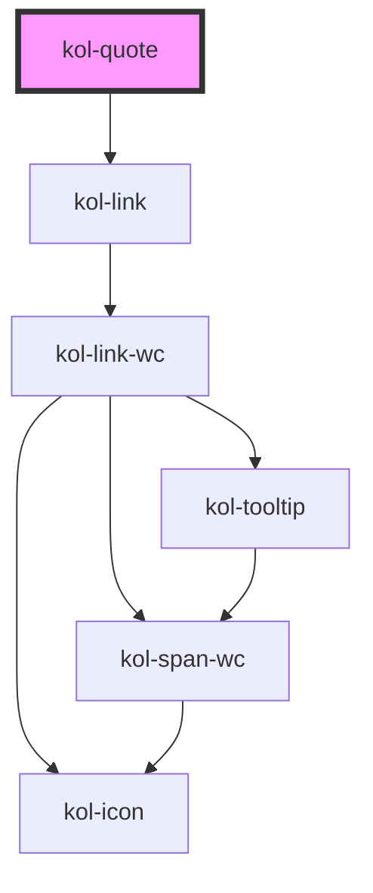

# Quote

> <kol-badge _label="untested"></kol-badge> Diese neue Komponente wird als ungetestet markiert, da der vollständige Barrierefreiheitstest noch aussteht. Der vollständige Test kann bei neuen Komponenten und Funktionalitäten auch erst nach einem abgeschlossenen Release erfolgen.

Die **Quote**-Komponente verfügt über zwei Varianten, eine kurze Fließtext-(`inline`) und eine eingerückte(`block`) Variante. Beide Varianten enthalten einen Link auf die Quelle des Zitates.

## Verwendung

Mittels **`_caption`** kann eine Überschrift gesetzt werden, während **`_quote`** das eigentliche Zitat enthält. Der Ursprung wird über **`_href`** gesetzt.
Die `inline`-Variante ist Standard, sofern die Eingerückte gewünscht ist, kann **`_variant`** auf `block` gesetzt werden.

## References

- https://developer.mozilla.org/en-US/docs/Web/HTML/Element/quote
- https://developer.mozilla.org/en-US/docs/Web/HTML/Element/cite
- https://www.mediaevent.de/html/quote.html
- https://www.mediaevent.de/html/cite.html
- https://accessibleweb.com/question-answer/what-is-a-block-quote-and-when-should-i-use-it/

<!-- Auto Generated Below -->

## Properties

| Property              | Attribute  | Description                            | Type                               | Default     |
| --------------------- | ---------- | -------------------------------------- | ---------------------------------- | ----------- |
| `_caption`            | `_caption` | Setzt die Überschrift.                 | `string \| undefined`              | `undefined` |
| `_href` _(required)_  | `_href`    | Link auf die Quelle des Zitates.       | `string`                           | `undefined` |
| `_quote` _(required)_ | `_quote`   | Setzt den Text, also das Zitat selbst. | `string`                           | `undefined` |
| `_variant`            | `_variant` | Setzt die Variante des Zitats.         | `"block" \| "inline" \| undefined` | `'inline'`  |

## Dependencies

### Depends on

- [kol-link](../link)

### Graph

---
