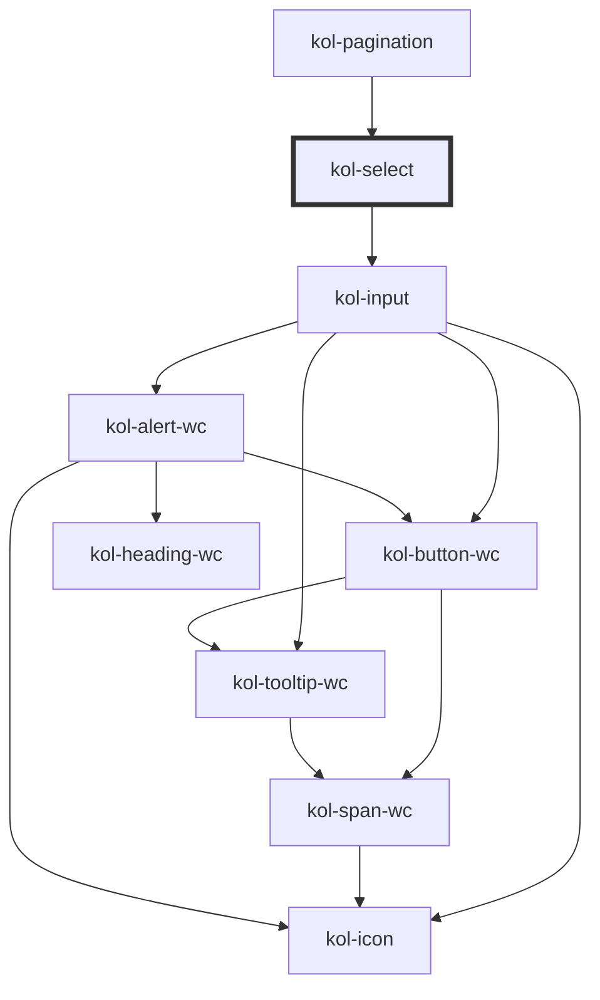

# Select

Die **Select**-Komponente erzeugt eine Auswahlliste, aus der eine oder mehrere vorgegebene Möglichkeiten ausgewählt werden können.

## Konstruktion

### Code

```html
<kol-select _options="[{'label':'Herr','value':0},{'label':'Frau','value':1},{'label':'Firma','value':2}]" _value="[1]"> Auswahlfeld </kol-select>
<kol-select _options="[{'label':'Herr','value':0},{'label':'Frau','value':1},{'label':'Firma','value':2}]" _multiple _value="[0,2]">
	Auswahlfeld (Mehrfachauswahl)
</kol-select>
<kol-select
	_options="[{'label':'Herr','value':0},{'label':'Frau','value':1},{'label':'Firma','value':2},{'label':'Herr','value':3},{'label':'Frau','value':4},{'label':'Firma','value':5}]"
	_rows="4"
	_value="[1]"
>
	Auswahlfeld mit _rows
</kol-select>
```

### Beispiel

<kol-select _options="[{'label':'Herr','value':0},{'label':'Frau','value':1},{'label':'Firma','value':2}]" _value="[1]"> Auswahlfeld </kol-select>
<kol-select _options="[{'label':'Herr','value':0},{'label':'Frau','value':1},{'label':'Firma','value':2}]" _multiple _value="[0,2]">
Auswahlfeld (Mehrfachauswahl)
</kol-select>
<kol-select _options="[{'label':'Herr','value':0},{'label':'Frau','value':1},{'label':'Firma','value':2},{'label':'Herr','value':3},{'label':'Frau','value':4},{'label':'Firma','value':5}]" _rows="4" _value="[1]">Auswahlfeld mit rows</kol-select>

## Verwendung

Die Auswahlmöglichkeiten werden über das Attribut **`_options`** als Objekt oder JSON-String an die Komponente übergeben. Je Option müssen die Werte **`label`** und **`value`** angegeben werden.

Beispiel für die Konstruktion des JSON-Objektes:

```json
[
	{ "label": "Herr", "value": 0 },
	{ "label": "Frau", "value": 1 },
	{ "label": "Firma", "value": 2 }
]
```

### Individuelle Höhe angeben

Über das Attribut **`_rows`** kann von einem Auswahlmenü auf ein Auswahlfeld (wie bei **`_multiple`**) gewechselt werden und dessen Höhe gesetzt werden.

<!--### Best practices-->

<!-- ## Barrierefreiheit -->

### Tastatursteuerung

| Taste                         | Funktion                                                                                                                                                                                                                      |
| ----------------------------- | ----------------------------------------------------------------------------------------------------------------------------------------------------------------------------------------------------------------------------- |
| `Tab`                         | Fokussiert das Auswahlfeld.                                                                                                                                                                                                   |
| `Enter`                       | Öffnet bzw.schließt die Auswahlliste.                                                                                                                                                                                         |
| `Pfeil-Tasten (oben / unten)` | Wechselt in der Auswahlliste das aktivierte Element. Diese Funktion ist auch bei eingeklappter Auswahlliste aktiv. Bei Mehrfachauswahl muss zur Auswahl mehrerer Einträge zusätzlich die Shift-Taste gedrück gehalten werden. |

### `Single-Select-Filter` für Select-Komponente

Die Select-Komponente liefert bei Auswahl eines Wertes eine Liste (Array) mit genau einem
Wert zurück (im Single-Modus). Das kann bei der weiteren Verarbeitung zu unnötigem Aufwand führen. Einfacher ist es hier, den Wert der Select-Komponente über einen <b>SingeSelectFormatter</b> zu Filtern. Fügen Sie hierzu im Formular nachfolgende Klasse ein:

```html
class SingleSelectFormatter extends AbstractFormatter { public format(value: unknown): unknown { return [value]; } public parse(value: unknown): unknown { if
(Array.isArray(value) && value.length > 0) { return value[0]; } return value; } }
```

Fügen Sie den Formatter anschließend der Select-Komponente hinzu:

```html
const singleSelectFormatHandler = new FormatHandler(); singleSelectFormatHandler.formatters.add([new SingleSelectFormatter()]); (this.getInput('kategorie') as
InputControl).setFormatHandler(singleSelectFormatHandler);
```

Beachten Sie, dass der FormatHandler zunächst in die Form importiert wird.

```html
import { xxx..., xxx..., FormatHandler, } from '@leanup/form';
```

## Links und Referenzen

- https://medium.com/@gavyn/til-autofocus-inputs-are-an-accessibility-problem-32ced60c3109

<!-- Auto Generated Below -->

## Properties

| Property              | Attribute        | Description                                                                                                                                                  | Type                                                                                                    | Default     |
| --------------------- | ---------------- | ------------------------------------------------------------------------------------------------------------------------------------------------------------ | ------------------------------------------------------------------------------------------------------- | ----------- |
| `_accessKey`          | `_access-key`    | Defines which key combination can be used to trigger or focus the interactive element of the component.                                                      | `string \| undefined`                                                                                   | `undefined` |
| `_alert`              | `_alert`         | Defines whether the screen-readers should read out the notification.                                                                                         | `boolean \| undefined`                                                                                  | `true`      |
| `_disabled`           | `_disabled`      | Makes the element not focusable and ignore all events.                                                                                                       | `boolean \| undefined`                                                                                  | `false`     |
| `_error`              | `_error`         | Defines the error message text.                                                                                                                              | `string \| undefined`                                                                                   | `undefined` |
| `_hideError`          | `_hide-error`    | Hides the error message but leaves it in the DOM for the input's aria-describedby.                                                                           | `boolean \| undefined`                                                                                  | `false`     |
| `_hideLabel`          | `_hide-label`    | Hides the caption by default and displays the caption text with a tooltip when the interactive element is focused or the mouse is over it.                   | `boolean \| undefined`                                                                                  | `false`     |
| `_hint`               | `_hint`          | Defines the hint text.                                                                                                                                       | `string \| undefined`                                                                                   | `''`        |
| `_icons`              | `_icons`         | Defines the icon classnames (e.g. `_icons="fa-solid fa-user"`).                                                                                              | `string \| undefined \| { right?: IconOrIconClass \| undefined; left?: IconOrIconClass \| undefined; }` | `undefined` |
| `_id`                 | `_id`            | Defines the internal ID of the primary component element.                                                                                                    | `string \| undefined`                                                                                   | `undefined` |
| `_label` _(required)_ | `_label`         | Defines the visible or semantic label of the component (e.g. aria-label, label, headline, caption, summary, etc.). Set to `false` to enable the expert slot. | `string`                                                                                                | `undefined` |
| `_multiple`           | `_multiple`      | Makes the input accept multiple inputs.                                                                                                                      | `boolean \| undefined`                                                                                  | `false`     |
| `_name`               | `_name`          | Defines the technical name of an input field.                                                                                                                | `string \| undefined`                                                                                   | `undefined` |
| `_on`                 | --               | Gibt die EventCallback-Funktionen für das Input-Event an.                                                                                                    | `InputTypeOnBlur & InputTypeOnClick & InputTypeOnChange & InputTypeOnFocus \| undefined`                | `undefined` |
| `_options`            | `_options`       | Options the user can choose from, also supporting Optgroup.                                                                                                  | `(Option<W3CInputValue> \| Optgroup<W3CInputValue>)[] \| string \| undefined`                           | `undefined` |
| `_required`           | `_required`      | Makes the input element required.                                                                                                                            | `boolean \| undefined`                                                                                  | `false`     |
| `_rows`               | `_rows`          | Defines how many rows of options should be visible at the same time.                                                                                         | `number \| undefined`                                                                                   | `undefined` |
| `_tabIndex`           | `_tab-index`     | Defines which tab-index the primary element of the component has. (https://developer.mozilla.org/en-US/docs/Web/HTML/Global_attributes/tabindex)             | `number \| undefined`                                                                                   | `undefined` |
| `_tooltipAlign`       | `_tooltip-align` | Defines where to show the Tooltip preferably: top, right, bottom or left.                                                                                    | `"bottom" \| "left" \| "right" \| "top" \| undefined`                                                   | `'top'`     |
| `_touched`            | `_touched`       | Shows if the input was touched by a user.                                                                                                                    | `boolean \| undefined`                                                                                  | `false`     |
| `_value`              | `_value`         | Defines the value of the input.                                                                                                                              | `W3CInputValue[] \| string \| undefined`                                                                | `undefined` |

## Methods

### `getValue() => Promise<Stringified<W3CInputValue[]> | undefined>`

#### Returns

Type: `Promise<Stringified<W3CInputValue[]> | undefined>`

## Slots

| Slot | Description                         |
| ---- | ----------------------------------- |
|      | Die Beschriftung des Eingabefeldes. |

## Dependencies

### Used by

- [kol-pagination](../pagination)

### Depends on

- kol-input

### Graph



---
