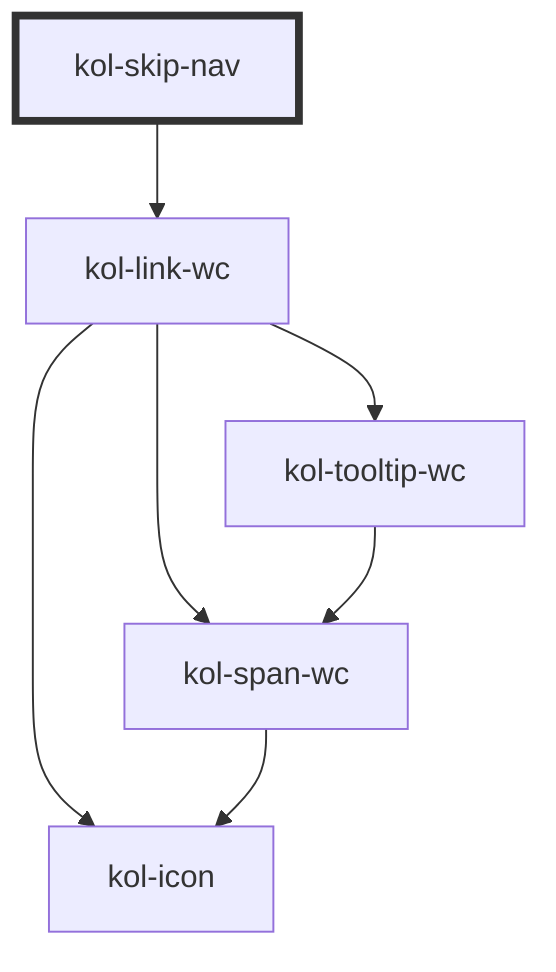

# SkipNav

Mit Hilfe der **SkipNav**-Komponente kann eine versteckte Navigation erzeugt werden. Sie dient dazu, Sehbehinderten das Überspringen von Seitenbereichen zu ermöglichen. Sie wird nur nach Anspringen durch die **Tab-Taste** sichtbar.

## Konstruktion

### Code

```html
<kol-skip-nav
	_label="Ein versteckter Link"
	_links="[{'_label':'Navigation','_href':'#nav'},{'_label':'Inhalt','_href':'#main'},{'_label':'Kontakt','_href':'#kontakt'},{'_label':'Links','_href':'#links'}]"
></kol-skip-nav>
```

### Beispiel

Um die **SkipNav** sehen zu können, klicken Sie auf diesen Text und gehen dann mit der Tab-Taste einen Schritt weiter.

<kol-skip-nav _label="Ein versteckter Link" _links="[{'_label':'Navigation','_href':'#nav'},{'_label':'Inhalt','_href':'#main'},{'_label':'Kontakt','_href':'#kontakt'},{'_label':'Links','_href':'#links'}]"></kol-skip-nav>

## Verwendung

Die **SkipNav** wird durch Übergabe eines JSON-Objekts erzeugt, das für das Rendern der versteckten Links zuständig ist.

```js
[
	{ _label: 'Navigation', _href: '#nav' },
	{ _label: 'Inhalt', _href: '#main' },
	{ _label: 'Kontakt', _href: '#kontakt' },
	{ _label: 'Links', _href: '#links' },
];
```

<!--### Best practices

### Anwendungsfälle-->

<!-- ## Barrierefreiheit -->

### Tastatursteuerung

| Taste   | Funktion                                                              |
| ------- | --------------------------------------------------------------------- |
| `Tab`   | Fokussiert die SkipNav und ermöglicht das Durchlaufen der Menüpunkte. |
| `Enter` | Ruft den Link des fokussierten Menüpunkts auf.                        |

## Links und Referenzen

- <kol-link _href="https://webaim.org/techniques/skipnav/" _label="https://webaim.org/techniques/skipnav/" _target="_blank"></kol-link>

<!-- Auto Generated Below -->

## Properties

| Property              | Attribute     | Description                                                                                                                                 | Type                    | Default     |
| --------------------- | ------------- | ------------------------------------------------------------------------------------------------------------------------------------------- | ----------------------- | ----------- |
| `_ariaLabel`          | `_aria-label` | <span style="color:red">**[DEPRECATED]**</span> use \_label instead<br/><br/>Deprecated: Setzt die semantische Beschriftung der Komponente. | `string \| undefined`   | `undefined` |
| `_label`              | `_label`      | Defines the visible or semantic label of the component (e.g. aria-label, label, headline, caption, summary, etc.).                          | `string \| undefined`   | `undefined` |
| `_links` _(required)_ | `_links`      | Defines the list of links combined with their labels to render.                                                                             | `LinkProps[] \| string` | `undefined` |

## Dependencies

### Depends on

- kol-link-wc

### Graph



---
