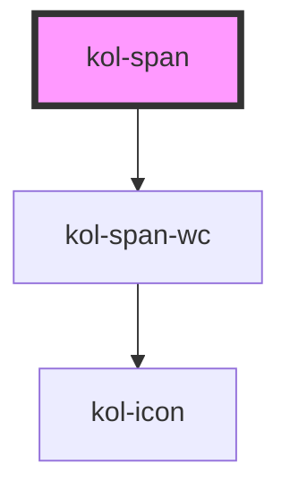

# Span

<kol-alert _type="warning">Die **Span**-Komponente wird innerhalb von KoliBri verwendet und ist nicht dafür vorgesehen in der Anwendungsentwicklung direkt verwendet zu werden. Denn der Span ist nur dann wirklich barrierefrei, wenn es in Kombination mit dem Tooltip verwendet wird.</kol-alert>

Die **Span**-Komponente dient dazu innerhalb zahlreicher KoliBri-Komponenten die Text-Icon-Kombination und das Expert-Slot-Konzept einheitlich umzusetzen.

## Konstruktion

### Code

```html
<kol-span _icon="fa-solid fa-house" _icon-only="false" _label="Text inside the span."></kol-span>
```

### Beispiel

<kol-span _icon="fa-solid fa-house" _icon-only="false" _label="Text inside the span."></kol-span>

<!-- Auto Generated Below -->

## Properties

| Property              | Attribute    | Description                                                                                    | Type                                                                                                                                                                                                                                                                                                                                                                                                                                                                                                                                                                                                                                                                                                                                                                                                              | Default     |
| --------------------- | ------------ | ---------------------------------------------------------------------------------------------- | ----------------------------------------------------------------------------------------------------------------------------------------------------------------------------------------------------------------------------------------------------------------------------------------------------------------------------------------------------------------------------------------------------------------------------------------------------------------------------------------------------------------------------------------------------------------------------------------------------------------------------------------------------------------------------------------------------------------------------------------------------------------------------------------------------------------- | ----------- |
| `_icon`               | `_icon`      | Gibt den Class-Identifier eines Icons eine eingebunden Icofont an. (z.B. https://icofont.com/) | `string \| undefined \| { top: string \| KoliBriCustomIcon; right?: string \| KoliBriCustomIcon \| undefined; bottom?: string \| KoliBriCustomIcon \| undefined; left?: string \| KoliBriCustomIcon \| undefined; } \| { top?: string \| KoliBriCustomIcon \| undefined; right: string \| KoliBriCustomIcon; bottom?: string \| KoliBriCustomIcon \| undefined; left?: string \| KoliBriCustomIcon \| undefined; } \| { top?: string \| KoliBriCustomIcon \| undefined; right?: string \| KoliBriCustomIcon \| undefined; bottom: string \| KoliBriCustomIcon; left?: string \| KoliBriCustomIcon \| undefined; } \| { top?: string \| KoliBriCustomIcon \| undefined; right?: string \| KoliBriCustomIcon \| undefined; bottom?: string \| KoliBriCustomIcon \| undefined; left: string \| KoliBriCustomIcon; }` | `undefined` |
| `_iconOnly`           | `_icon-only` | Gibt an, ob nur das Icon angezeigt wird.                                                       | `boolean \| undefined`                                                                                                                                                                                                                                                                                                                                                                                                                                                                                                                                                                                                                                                                                                                                                                                            | `false`     |
| `_label` _(required)_ | `_label`     | Gibt einen beschreibenden Text für das Text-Element an.                                        | `string`                                                                                                                                                                                                                                                                                                                                                                                                                                                                                                                                                                                                                                                                                                                                                                                                          | `undefined` |

## CSS Custom Properties

| Name                        | Description                     |
| --------------------------- | ------------------------------- |
| `--kolibri-border-color`    | Default color of the border.    |
| `--kolibri-border-radius`   | Default radius of the border.   |
| `--kolibri-border-width`    | Default width of the border.    |
| `--kolibri-color-danger`    | Default color of the danger.    |
| `--kolibri-color-disabled`  | Default color of the disabled.  |
| `--kolibri-color-error`     | Default color of the error.     |
| `--kolibri-color-ghost`     | Default color of the ghost.     |
| `--kolibri-color-info`      | Default color of the info.      |
| `--kolibri-color-normal`    | Default color of the normal.    |
| `--kolibri-color-primary`   | Default color of the primary.   |
| `--kolibri-color-secondary` | Default color of the secondary. |
| `--kolibri-color-success`   | Default color of the success.   |
| `--kolibri-color-text`      | Default color of the text.      |
| `--kolibri-color-visited`   | Default color of the visited.   |
| `--kolibri-color-warning`   | Default color of the warning.   |
| `--kolibri-font-family`     | Default font family.            |
| `--kolibri-font-size`       | Default font size.              |

## Dependencies

### Depends on

- kol-span-wc

### Graph



---
