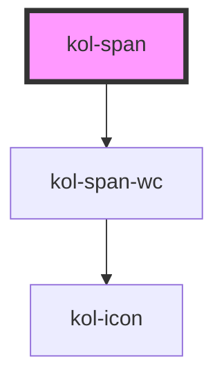

# Span

<kol-alert _type="warning">Die **Span**-Komponente wird innerhalb von KoliBri verwendet und ist nicht dafür vorgesehen in der Anwendungsentwicklung direkt verwendet zu werden. Denn der Span ist nur dann wirklich barrierefrei, wenn es in Kombination mit dem Tooltip verwendet wird.</kol-alert>

Die **Span**-Komponente dient dazu innerhalb zahlreicher KoliBri-Komponenten die Text-Icon-Kombination und das Expert-Slot-Konzept einheitlich umzusetzen.

## Konstruktion

### Code

```html
<kol-span _icon="codicon codicon-home" _icon-only="false" _label="Text inside the span."></kol-span>
```

### Beispiel

<kol-span _icon="codicon codicon-home" _icon-only="false" _label="Text inside the span."></kol-span>

<!-- Auto Generated Below -->


## Properties

| Property              | Attribute    | Description                               | Type                                                                 | Default     |
| --------------------- | ------------ | ----------------------------------------- | -------------------------------------------------------------------- | ----------- |
| `_icon`               | `_icon`      | Iconklasse (z.B.: "codicon codicon-home") | `KoliBriHorizontalIcon & KoliBriVerticalIcon \| string \| undefined` | `undefined` |
| `_iconOnly`           | `_icon-only` | Gibt an, ob nur das Icon angezeigt wird.  | `boolean \| undefined`                                               | `false`     |
| `_label` _(required)_ | `_label`     | Setzt den sichtbaren Text des Elements.   | `string`                                                             | `undefined` |


## Dependencies

### Depends on

- kol-span-wc

### Graph


----------------------------------------------


