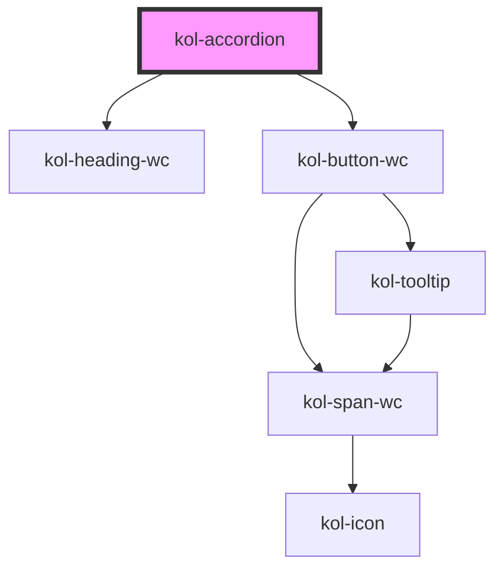

# SplitButton


## Konstruktion

### Code

```html

```

### Beispiel


## Verwendung

### Best practices

### Tastatursteuerung

| Taste   | Funktion                                             |
| ------- | ---------------------------------------------------- |
| `Tab`   | ??             																			 |
| `Enter` | ?? 																									 |

## Links und Referenzen

- https://www.w3.org/TR/wai-aria-practices/#accordion

<!-- Auto Generated Below -->

## Properties

| Property                | Attribute  | Description                                      | Type                                                                                 | Default     |
| ----------------------- | ---------- | ------------------------------------------------ | ------------------------------------------------------------------------------------ | ----------- |
| `_heading` _(required)_ | `_heading` | Gibt die Überschrift des Accordions an.          | `string`                                                                             | `undefined` |
| `_level`                | `_level`   | Setzt den H-Level, von 1 bis 6, der Überschrift. | `0 \| 1 \| 2 \| 3 \| 4 \| 5 \| 6 \| undefined`                                       | `1`         |
| `_on`                   | --         | Gibt die EventCallback-Funktionen an.            | `undefined \| { onClick?: EventValueOrEventCallback<Event, boolean> \| undefined; }` | `undefined` |
| `_open`                 | `_open`    | Gibt an, ob das Accordion geöffnet ist.          | `boolean \| undefined`                                                               | `false`     |

## Slots

| Slot        | Description                                                                     |
| ----------- | ------------------------------------------------------------------------------- |
| `"content"` | Ermöglicht das Einfügen beliebigen HTML's in den Inhaltsbereich des Accordions. |
| `"header"`  | Ermöglicht das Einfügen beliebigen HTML's in den Kopfbereich des Accordions.    |

## Dependencies

### Depends on

- [kol-heading-wc](../heading)
- kol-button-wc

### Graph



---
