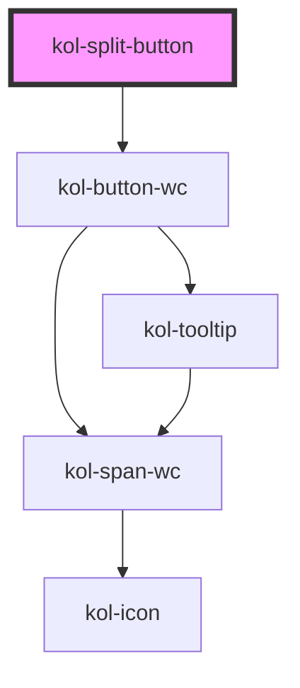

# SplitButton

> <kol-badge _label="untested"></kol-badge> Diese neue Komponente wird als ungetestet markiert, da der vollständige Barrierefreiheitstest noch aussteht. Der vollständige Test kann bei neuen Komponenten und Funktionalitäten auch erst nach einem abgeschlossenen Release erfolgen.

## Konstruktion

### Code

```html

```

### Beispiel

## Verwendung

### Best practices

### Tastatursteuerung

| Taste   | Funktion |
| ------- | -------- |
| `Tab`   | ??       |
| `Enter` | ??       |

## Links und Referenzen

- https://www.w3.org/TR/wai-aria-practices/#accordion

<!-- Auto Generated Below -->

## Properties

| Property              | Attribute        | Description                                                                                                                                                                                      | Type                                                                                                 | Default     |
| --------------------- | ---------------- | ------------------------------------------------------------------------------------------------------------------------------------------------------------------------------------------------ | ---------------------------------------------------------------------------------------------------- | ----------- |
| `_accessKey`          | `_access-key`    | Gibt an, mit welcher Tastenkombination man das interaktive Element der Komponente auslösen oder fokussieren kann.                                                                                | `string \| undefined`                                                                                | `undefined` |
| `_ariaControls`       | `_aria-controls` | Gibt an, welche Elemente kontrolliert werden. (https://developer.mozilla.org/en-US/docs/Web/Accessibility/ARIA/Attributes/aria-controls)                                                         | `string \| undefined`                                                                                | `undefined` |
| `_ariaCurrent`        | `_aria-current`  | Gibt an, welchen aktuellen Auswahlstatus das interaktive Element der Komponente hat. (https://developer.mozilla.org/en-US/docs/Web/Accessibility/ARIA/Attributes/aria-current)                   | `"date" \| "location" \| "page" \| "step" \| "time" \| boolean \| undefined`                         | `undefined` |
| `_ariaExpanded`       | `_aria-expanded` | Gibt an, ob durch das interaktive Element in der Komponente etwas aufgeklappt wurde. (https://developer.mozilla.org/en-US/docs/Web/Accessibility/ARIA/Attributes/aria-expanded)                  | `boolean \| undefined`                                                                               | `undefined` |
| `_ariaLabel`          | `_aria-label`    | <span style="color:red">**[DEPRECATED]**</span> use \_label<br/><br/>Setzt die sichtbare oder semantische Beschriftung der Komponente (z.B. Aria-Label, Label, Headline, Caption, Summary usw.). | `string \| undefined`                                                                                | `undefined` |
| `_ariaSelected`       | `_aria-selected` | Gibt an, ob interaktive Element in der Komponente ausgewählt ist (z.B. role=tab). (https://developer.mozilla.org/en-US/docs/Web/Accessibility/ARIA/Attributes/aria-selected)                     | `boolean \| undefined`                                                                               | `undefined` |
| `_customClass`        | `_custom-class`  | Gibt an, welche Custom-Class übergeben werden soll, wenn \_variant="custom" gesetzt ist.                                                                                                         | `string \| undefined`                                                                                | `undefined` |
| `_disabled`           | `_disabled`      | Deaktiviert das interaktive Element in der Komponente und erlaubt keine Interaktion mehr damit.                                                                                                  | `boolean \| undefined`                                                                               | `false`     |
| `_hideLabel`          | `_hide-label`    | Blendet die Beschriftung (Label) aus und zeigt sie stattdessen mittels eines Tooltips an.                                                                                                        | `boolean \| undefined`                                                                               | `false`     |
| `_icon`               | `_icon`          | Setzt die Iconklasse (z.B.: `_icon="codicon codicon-home`).                                                                                                                                      | `string \| undefined`                                                                                | `undefined` |
| `_iconOnly`           | `_icon-only`     | <span style="color:red">**[DEPRECATED]**</span> use \_hide-label<br/><br/>Blendet die Beschriftung (Label) aus und zeigt sie stattdessen mittels eines Tooltips an.                              | `boolean \| undefined`                                                                               | `undefined` |
| `_label` _(required)_ | `_label`         | Setzt die sichtbare oder semantische Beschriftung der Komponente (z.B. Aria-Label, Label, Headline, Caption, Summary usw.).                                                                      | `string`                                                                                             | `undefined` |
| `_on`                 | --               | Gibt die EventCallback-Funktionen für die Button-Events an.                                                                                                                                      | `undefined \| { onClick: KoliBriSplitButtonCallback; }`                                              | `undefined` |
| `_role`               | `_role`          | Gibt die Rolle des primären Elements in der Komponente an.                                                                                                                                       | `"button" \| "link" \| "tab" \| undefined`                                                           | `undefined` |
| `_showDropdown`       | `_show-dropdown` | Gibt die Rolle des primären Elements in der Komponente an.                                                                                                                                       | `boolean \| undefined`                                                                               | `false`     |
| `_tabIndex`           | `_tab-index`     | Gibt an, welchen Tab-Index das primäre Element in der Komponente hat. (https://developer.mozilla.org/en-US/docs/Web/HTML/Global_attributes/tabindex)                                             | `number \| undefined`                                                                                | `undefined` |
| `_tooltipAlign`       | `_tooltip-align` | Gibt an, ob der Tooltip bevorzugt entweder oben, rechts, unten oder links angezeigt werden soll.                                                                                                 | `"bottom" \| "left" \| "right" \| "top" \| undefined`                                                | `'top'`     |
| `_type`               | `_type`          | Setzt den Typ der Komponente oder des interaktiven Elements in der Komponente an.                                                                                                                | `"button" \| "reset" \| "submit" \| undefined`                                                       | `'button'`  |
| `_value`              | --               | Gibt einen Wert an, den der Schalter bei einem Klick zurückgibt.                                                                                                                                 | `unknown`                                                                                            | `undefined` |
| `_variant`            | `_variant`       | Gibt an, welche Variante der Darstellung genutzt werden soll.                                                                                                                                    | `"custom" \| "danger" \| "ghost" \| "normal" \| "primary" \| "secondary" \| "tertiary" \| undefined` | `'normal'`  |

## Slots

| Slot | Description                                                |
| ---- | ---------------------------------------------------------- |
|      | Ermöglicht das Einfügen beliebigen HTML's in das dropdown. |

## Dependencies

### Depends on

- kol-button-wc

### Graph



---
