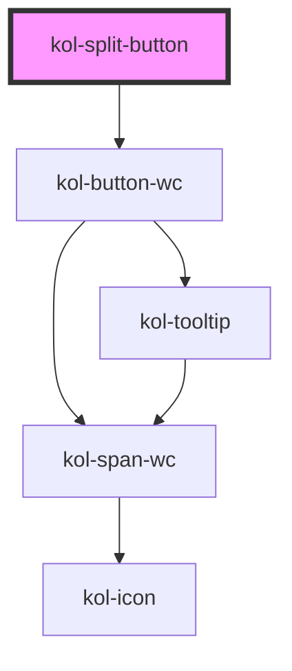

# SplitButton

> <kol-badge _label="untested"></kol-badge> Diese neue Komponente wird als ungetestet markiert, da der vollständige Barrierefreiheitstest noch aussteht. Der vollständige Test kann bei neuen Komponenten und Funktionalitäten auch erst nach einem abgeschlossenen Release erfolgen.

## Konstruktion

### Code

```html

```

### Beispiel

## Verwendung

### Best practices

### Tastatursteuerung

| Taste   | Funktion |
| ------- | -------- |
| `Tab`   | ??       |
| `Enter` | ??       |

## Links und Referenzen

- https://www.w3.org/TR/wai-aria-practices/#accordion

<!-- Auto Generated Below -->

## Properties

| Property              | Attribute        | Description                                                                                                                                                                                                                                                                          | Type                                                                                   | Default     |
| --------------------- | ---------------- | ------------------------------------------------------------------------------------------------------------------------------------------------------------------------------------------------------------------------------------------------------------------------------------ | -------------------------------------------------------------------------------------- | ----------- |
| `_accessKey`          | `_access-key`    | Gibt an, mit welcher Tastenkombination man den Button auslösen oder fokussieren kann.                                                                                                                                                                                                | `string \| undefined`                                                                  | `undefined` |
| `_ariaControls`       | `_aria-controls` | Gibt an, welche Elemente kontrolliert werden. (https://developer.mozilla.org/en-US/docs/Web/Accessibility/ARIA/Attributes/aria-controls)                                                                                                                                             | `string \| undefined`                                                                  | `undefined` |
| `_ariaCurrent`        | `_aria-current`  | Gibt an, welchen aktuellen Auswahlstatus der Button hat. (https://developer.mozilla.org/en-US/docs/Web/Accessibility/ARIA/Attributes/aria-current)                                                                                                                                   | `"date" \| "location" \| "page" \| "step" \| "time" \| boolean \| undefined`           | `undefined` |
| `_ariaExpanded`       | `_aria-expanded` | Gibt an, ob durch den Button etwas aufgeklappt wurde. (https://developer.mozilla.org/en-US/docs/Web/Accessibility/ARIA/Attributes/aria-expanded)                                                                                                                                     | `boolean \| undefined`                                                                 | `undefined` |
| `_ariaLabel`          | `_aria-label`    | Gibt einen beschreibenden Text für den Screenreader an. Damit die Sprachsteuerung von interaktiven Elementen funktioniert, muss der Aria-Label-Text mit dem Label-Text des Buttons beginnen. - https://developer.mozilla.org/en-US/docs/Web/Accessibility/ARIA/Attributes/aria-label | `string \| undefined`                                                                  | `undefined` |
| `_ariaSelected`       | `_aria-selected` | Gibt an, ob Element ausgewählt ist (role=tab). (https://developer.mozilla.org/en-US/docs/Web/Accessibility/ARIA/Attributes/aria-selected)                                                                                                                                            | `boolean \| undefined`                                                                 | `undefined` |
| `_customClass`        | `_custom-class`  | Gibt an, welche Custom-Class übergeben werden soll, wenn \_variant="custom" gesetzt ist.                                                                                                                                                                                             | `string \| undefined`                                                                  | `undefined` |
| `_disabled`           | `_disabled`      | Gibt an, ob der Button deaktiviert ist.                                                                                                                                                                                                                                              | `boolean \| undefined`                                                                 | `false`     |
| `_hideLabel`          | `_hide-label`    | Blendet den Text aus und zeigt nur das gewählte Icon an, der Text wird in den Tooltip verschoben.                                                                                                                                                                                    | `boolean \| undefined`                                                                 | `false`     |
| `_icon`               | `_icon`          | Iconklasse (z.B.: "codicon codicon-home")                                                                                                                                                                                                                                            | `string \| undefined`                                                                  | `undefined` |
| `_iconOnly`           | `_icon-only`     | <span style="color:red">**[DEPRECATED]**</span> use \_hide-label<br/><br/>Blendet den Text aus und zeigt nur das gewählte Icon an, der Text wird in den Tooltip verschoben.                                                                                                          | `boolean \| undefined`                                                                 | `false`     |
| `_label` _(required)_ | `_label`         | Setzt den sichtbaren Text des Elements.                                                                                                                                                                                                                                              | `string`                                                                               | `undefined` |
| `_onClick`            | --               | Gibt die EventCallback-Funktionen für die Button-Events an.                                                                                                                                                                                                                          | `((e: Event) => void) \| undefined`                                                    | `undefined` |
| `_role`               | `_role`          | Gibt an, welche Rolle der Schalter hat.                                                                                                                                                                                                                                              | `"button" \| "link" \| "tab" \| undefined`                                             | `undefined` |
| `_showDropdown`       | `_show-dropdown` | Gibt an, welche Rolle der Schalter hat.                                                                                                                                                                                                                                              | `boolean \| undefined`                                                                 | `false`     |
| `_tabIndex`           | `_tab-index`     | Gibt an, welchen Tab-Index der Button hat. (https://developer.mozilla.org/en-US/docs/Web/HTML/Global_attributes/tabindex)                                                                                                                                                            | `number \| undefined`                                                                  | `undefined` |
| `_tooltipAlign`       | `_tooltip-align` | Setzt die gewünschte Ausrichtung des Tooltips (`_icon-only`).                                                                                                                                                                                                                        | `"bottom" \| "left" \| "right" \| "top" \| undefined`                                  | `'top'`     |
| `_type`               | `_type`          | Setzt den Typ der Schaltfläche.                                                                                                                                                                                                                                                      | `"button" \| "reset" \| "submit" \| undefined`                                         | `'button'`  |
| `_value`              | --               | Gibt einen Wert an, den der Schalter bei einem Klick zurückgibt.                                                                                                                                                                                                                     | `unknown`                                                                              | `undefined` |
| `_variant`            | `_variant`       | Gibt an, welche Ausprägung der Button hat.                                                                                                                                                                                                                                           | `"custom" \| "danger" \| "ghost" \| "normal" \| "primary" \| "secondary" \| undefined` | `'normal'`  |

## Slots

| Slot        | Description                                                |
| ----------- | ---------------------------------------------------------- |
| `"popover"` | Ermöglicht das Einfügen beliebigen HTML's in das dropdown. |

## Dependencies

### Depends on

- kol-button-wc

### Graph



---
