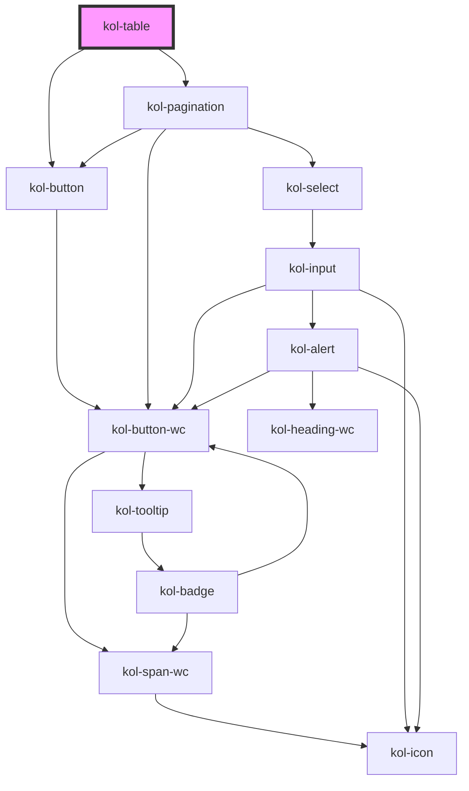

k# Table

Die **Table**-Komponente dient primär der übersichtlichen Darstellung von Datenmengen. Dabei ist sie so ausgelegt, dass sie alle von den Daten abhängige Werte automatisch ermittelt und die Tabelle entsprechend darstellt. Hierzu gehören beispielsweise die optionalen Funktionalitäten Spaltensortierung oder Pagination.

<kol-indented-text _summary="Backend-seitige Pagination">
	Bei sehr großen Datenmengen ist auch eine manuelle Nutzung der Table-Komponente möglich. Das bedeutet, dass die Tabelle seitenweise "manuell" befüllt wird. Hierzu kann einfach anstatt der Table-Pagination eine "eigene" Pagination unter der Tabelle mittels der Pagination-Komponente verwendet werden.
</kol-indented-text>

## Konstruktion

Die Table-Komponente ist so konstruiert, dass nicht der gesamte Tabellenaufbau im Markup selbst beschrieben werden muss. Wie genau die Tabelle Markup-spezifisch aufgebaut werden muss, um barrierefrei zu sein, übernimmt die Komponente selbst.

Dadurch, dass die Table-Komponente das valide und barrierefreie Markup dynamisch zusammenbaut, kann die komplexe Auszeichnung für die assistive Systeme dem/der Entwickler:in abgenommen werden.

### Funktionalitäten

Die Table-Komponente unterstützt folgende Funktionalitäten:

- Tabellenbeschreibung durch ein **`caption`**-Attribut.
- Mehrzeilige Spaltenüberschriften in horizontaler oder vertikaler Richtung.
- Sortierfunktion für entweder horizontale und vertikale Ausrichtung.
- Unterschiedliche Render-Funktion für die Zellen.
- Pagination für die Tabelle.

Die Table-Komponente unterstützt folgende Funktionalitäten **nicht**:

- Das Filtern der Tabelle ist aktuell nicht innerhalb der Tabelle vorgesehen.
- Das Auswählen von Zeilen ist aktuell in der Tabelle nicht vorgesehen.

> Beides könnte jedoch mittels der Render-Funktion umgesetzt werden.

### Pagination

Über das Attribut **`_pagination`** kann optional eine Vielzahl zusätzlicher Properties zur Steuerung der Pagination übergeben werden. Die genaue Beschreibung der Optionen ist auf der Seite <kol-link _href="/docs/components/pagination" _label="Pagination"></kol-link> zu finden.

#### KoliBriTableHeaders

```ts
{
  horizontal: [
    [
      {
        label: string,
        key?: string,
        colsSpan?: number,
        rowSpan?: number,
        useTdInsteadOfTh?: boolean,
        render?: (data) => string,
        sort?: (data) => data,
      },
      …
    ],
    …
  ],
  vertical: [
    [
      {
        label: string,
        key?: string,
        colsSpan?: number,
        rowSpan?: number,
        useTdInsteadOfTh?: boolean,
        render?: (data) => string,
        sort?: (data) => data,
      },
      …
    ],
    …
  ],
};
```

### Code

```html
<kol-table _caption="Tabellenbeschreibung" _headers="{'horizontal': [[{'label':'Montag','key':'montag'}]]}" _pagination="[{'page':2}]"></kol-table>
```

### Beispiel

<kol-table _caption="Nur Vertikal Header, Daten Vertikal, Pagination" _headers="{'horizontal':[[{'label':'Montag','key':'montag'}]]}" _data="[{'montag':'Zelle1'},{'montag':'Zelle2'}]" _pagination="{'page':2}"></kol-table>

## Verwendung

### Sortierung

- Zu jedem Header kann man eine Sortierfunktion definieren.
- Es ist exakt eine oder keine Sortierfunktion aktiviert.
- Aktuell wird nicht unterstützt, dass bei zweidimensionalen Headern, die Header der jeweils anderen Header-Seite mit sortiert werden. Bei der Anforderung der Sortierung empfehlen wir die Verwendung nur einer Header-Dimension (entweder horizontal oder vertikal).

<!--### Best practices

### Anwendungsfälle-->

## Barrierefreiheit

Bei der Table-Komponente werden zahlreiche Attribut-Definitionen dem Tabellen-Markup hinzugefügt, um die Screenreader bestmöglich zu unterstützen.

Aktuell werden folgende Attribute von der Komponente verwaltet: `role`, `scope` und `aria-\*`.

Das heißt beispielsweise, dass bei den Spaltenüberschriften automatisch entweder die Rolle `colheader` oder `rowheader` gesetzt wird. Darüber hinaus wird der Scope entweder auf `col`/`colgroup` oder `row`/`rowgroup` gesetzt. Ähnlich dieser Automatismen werden auch die `aria-\*`-Attribute je nach Relevanz gesetzt.

Warum die Tabelle einen **Tabindex** hat, wird auf der folgenden Webseite beschrieben: https://dequeuniversity.com/rules/axe/3.5/scrollable-region-focusable

## Links und Referenzen

- https://www.w3.org/WAI/tutorials/tables/
- https://www.barrierefreies-webdesign.de/knowhow/datentabellen/scope.html
- https://developer.mozilla.org/de/docs/Web/Accessibility/ARIA/ARIA_Live_Regions
- https://tollwerk.de/projekte/tipps-techniken-inklusiv-barrierefrei/aria-live-regionen
- https://www.barrierefreies-webdesign.de/knowhow/live-regions/attribute.html
- https://www.digitala11y.com/aria-sort-properties/
- https://dequeuniversity.com/library/aria/table-sortable
- https://www.maxability.co.in/2016/06/07/aria-sort-property/
- https://developer.mozilla.org/en-US/docs/Web/API/Element/ariaSort
- https://tollwerk.de/projekte/tipps-techniken-inklusiv-barrierefrei/aria-live-regionen
- https://stackoverflow.com/questions/1312236/
- https://dequeuniversity.com/rules/axe/3.5/scrollable-region-focusable

<!-- Auto Generated Below -->

## Properties

| Property                | Attribute     | Description                                                             | Type                                                                                                                                                                                                                                                                                                                                                                                                                                                                                                                                              | Default     |
| ----------------------- | ------------- | ----------------------------------------------------------------------- | ------------------------------------------------------------------------------------------------------------------------------------------------------------------------------------------------------------------------------------------------------------------------------------------------------------------------------------------------------------------------------------------------------------------------------------------------------------------------------------------------------------------------------------------------- | ----------- |
| `_caption` _(required)_ | `_caption`    | Gibt den Titel oder eine Legende mit Erklärungen zur Tabelle an.        | `string`                                                                                                                                                                                                                                                                                                                                                                                                                                                                                                                                          | `undefined` |
| `_data` _(required)_    | `_data`       | Gibt die Daten an, die für die Erstellung der Tabelle verwendet werden. | `KoliBriDataType[] \| string`                                                                                                                                                                                                                                                                                                                                                                                                                                                                                                                     | `undefined` |
| `_headers` _(required)_ | `_headers`    | Gibt die horizontalen und vertikalen Header für die Tabelle an.         | `string \| { horizontal?: KoliBriTableHeaderCell[][] \| undefined; vertical?: KoliBriTableHeaderCell[][] \| undefined; }`                                                                                                                                                                                                                                                                                                                                                                                                                         | `undefined` |
| `_minWidth`             | `_min-width`  | Gibt an, die minimale Breite der Tabelle an.                            | `string \| undefined`                                                                                                                                                                                                                                                                                                                                                                                                                                                                                                                             | `undefined` |
| `_pagination`           | `_pagination` | Gibt an, ob die Daten geteilt in Seiten angezeigt wird.                 | `boolean \| string \| undefined \| { _page: number; } & { _on?: KoliBriPaginationButtonCallbacks \| undefined; _page?: number \| undefined; _total?: number \| undefined; _customClass?: string \| undefined; _variant?: KoliBriButtonVariant \| undefined; _boundaryCount?: number \| undefined; _hasButtons?: boolean \| Stringified<PaginationHasButton> \| undefined; _pageSize?: number \| undefined; _pageSizeOptions?: Stringified<number[]> \| undefined; _siblingCount?: number \| undefined; _tooltipAlign?: Alignment \| undefined; }` | `undefined` |

## Dependencies

### Depends on

- [kol-button](../button)
- [kol-pagination](../pagination)

### Graph



---
