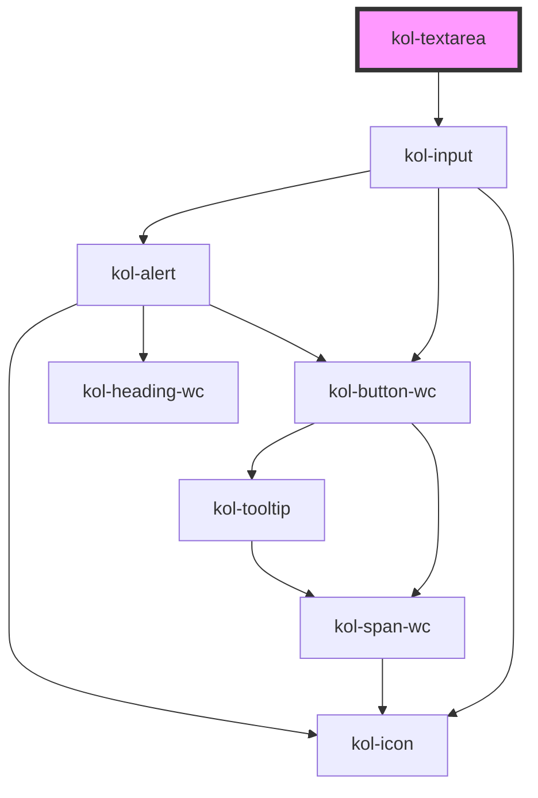

# Textarea

Die Komponente **Textarea** stellt ein größeres Eingabefeld für Inhalte zur Verfügung. Im Gegensatz zum <kol-link _href="/docs/components/input-text" _label="InputText"></kol-link> können hier auch umfangreiche Inhalte eingegeben werden, die auch mit Zeilenumbrüchen versehen sein können.

## Konstruktion

### Code

```html
<kol-textarea
	_resize="none"
	_rows="5"
	_value="
  Lorem ipsum dolor sit amet, consetetur sadipscing elitr, sed diam nonumy eirmod tempor invidunt ut labore et dolore
  magna aliquyam erat, sed diam voluptua. At vero eos et accusam et justo duo dolores et ea rebum. Stet clita kasd
  gubergren, no sea takimata sanctus est Lorem ipsum dolor sit amet. Lorem ipsum dolor sit amet, consetetur sadipscing
  elitr, sed diam nonumy eirmod tempor invidunt ut labore et dolore magna aliquyam erat, sed diam voluptua. At vero eos
  et accusam et justo duo dolores et ea rebum. Stet clita kasd gubergren, no sea takimata sanctus est Lorem ipsum dolor
  sit amet."
></kol-textarea>
```

### Beispiel

<kol-textarea _resize="none" _rows="5" _value="Lorem ipsum dolor sit amet, consetetur sadipscing elitr, sed diam nonumy eirmod tempor invidunt ut labore et dolore magna aliquyam erat, sed diam voluptua. At vero eos et accusam et justo duo dolores et ea rebum. Stet clita kasd gubergren, no sea takimata sanctus est Lorem ipsum dolor sit amet. Lorem ipsum dolor sit amet, consetetur sadipscing elitr, sed diam nonumy eirmod tempor invidunt ut labore et dolore magna aliquyam erat, sed diam voluptua. At vero eos et accusam et justo duo dolores et ea rebum. Stet clita kasd gubergren, no sea takimata sanctus est Lorem ipsum dolor sit amet.">
</kol-textarea>

## Verwendung

Verwenden Sie die **Textarea**-Komponente wenn die Eingabe von größeren Textmengen erforderlich ist, z.B. bei der Erfassung eines Anliegens innerhalb eines Formulars.
Mit Hilfe des Attributs **`_rows`** kann die Höhe der Textarea in Zeilen bestimmt werden.
Über das Attribut **`_resize`** kann zusätzlich festgelegt werden ob und in welche Richtung die Textarea vergrößert werden kann. Der Wert **`none`** sperrt die Textarea gegen Größenänderungen.

<!--### Best practices

### Anwendungsfälle-->

## Barrierefreiheit

### Tastatursteuerung

| Taste          | Funktion                                                                        |
| -------------- | ------------------------------------------------------------------------------- |
| `Tab`          | Fokussiert die Textarea.                                                        |
| `Pfeil-Tasten` | Können für die Navigation im Inhalt der fokussierten Textarea verwendet werden. |

## Links und Referenzen

- https://medium.com/@gavyn/til-autofocus-inputs-are-an-accessibility-problem-32ced60c3109

<!-- Auto Generated Below -->

## Properties

| Property        | Attribute        | Description                                                                                                                           | Type                                                                                     | Default      |
| --------------- | ---------------- | ------------------------------------------------------------------------------------------------------------------------------------- | ---------------------------------------------------------------------------------------- | ------------ |
| `_accessKey`    | `_access-key`    | Gibt an, mit welcher Tastenkombination man das Input auslösen oder fokussieren kann.                                                  | `string \| undefined`                                                                    | `undefined`  |
| `_adjustHeight` | `_adjust-height` | Passt die Höhe des Eingabefeldes automatisch an den Füllstand an.                                                                     | `boolean \| undefined`                                                                   | `false`      |
| `_alert`        | `_alert`         | Gibt an, ob die Fehlermeldung vorgelesen werden soll, wenn es eine gibt.                                                              | `boolean \| undefined`                                                                   | `true`       |
| `_disabled`     | `_disabled`      | Setzt das Feld in einen inaktiven Zustand, in dem es keine Interaktion erlaubt.                                                       | `boolean \| undefined`                                                                   | `undefined`  |
| `_error`        | `_error`         | Gibt den Text für eine Fehlermeldung an.                                                                                              | `string \| undefined`                                                                    | `undefined`  |
| `_hasCounter`   | `_has-counter`   | Aktiviert den Zeichenanzahlzähler am unteren Rand des Eingabefeldes.                                                                  | `boolean \| undefined`                                                                   | `undefined`  |
| `_hideLabel`    | `_hide-label`    | Versteckt das sichtbare Label des Elements.                                                                                           | `boolean \| undefined`                                                                   | `undefined`  |
| `_hint`         | `_hint`          | Gibt den Hinweistext an.                                                                                                              | `string \| undefined`                                                                    | `''`         |
| `_id`           | `_id`            | Gibt die technische ID des Eingabefeldes an.                                                                                          | `string \| undefined`                                                                    | `undefined`  |
| `_maxLength`    | `_max-length`    | Setzt die maximale Zeichenanzahl.                                                                                                     | `number \| undefined`                                                                    | `undefined`  |
| `_name`         | `_name`          | Gibt den technischen Namen des Eingabefeldes an.                                                                                      | `string \| undefined`                                                                    | `undefined`  |
| `_on`           | --               | Gibt die EventCallback-Funktionen für das Input-Event an.                                                                             | `InputTypeOnBlur & InputTypeOnClick & InputTypeOnChange & InputTypeOnFocus \| undefined` | `undefined`  |
| `_placeholder`  | `_placeholder`   | Gibt den Platzhalter des Eingabefeldes an, wenn es leer ist.                                                                          | `string \| undefined`                                                                    | `undefined`  |
| `_readOnly`     | `_read-only`     | Setzt das Eingabefeld in den schreibgeschützten Modus.                                                                                | `boolean \| undefined`                                                                   | `undefined`  |
| `_required`     | `_required`      | Macht das Eingabeelement zu einem Pflichtfeld.                                                                                        | `boolean \| undefined`                                                                   | `undefined`  |
| `_resize`       | `_resize`        | Gibt an, ob die Größe des Eingabefeldes von Nutzer:innen geändert werden kann. (https://developer.mozilla.org/de/docs/Web/CSS/resize) | `"both" \| "horizontal" \| "none" \| "vertical" \| undefined`                            | `'vertical'` |
| `_rows`         | `_rows`          | Gibt die Anzahl der anzuzeigenden Zeilen des Eingabefeldes an.                                                                        | `number \| undefined`                                                                    | `undefined`  |
| `_tabIndex`     | `_tab-index`     | Gibt an, welchen Tab-Index dieses Input hat.                                                                                          | `number \| undefined`                                                                    | `undefined`  |
| `_touched`      | `_touched`       | Gibt an, ob dieses Eingabefeld von Nutzer:innen einmal besucht/berührt wurde.                                                         | `boolean \| undefined`                                                                   | `false`      |
| `_value`        | `_value`         | Gibt den Wert des Eingabefeldes an.                                                                                                   | `string \| undefined`                                                                    | `undefined`  |

## Dependencies

### Depends on

- kol-input

### Graph



---
