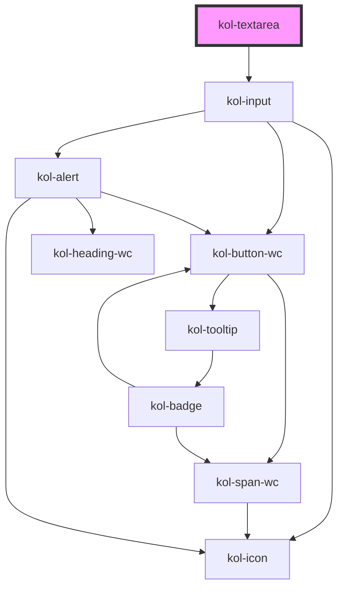

# Textarea

Die Komponente **Textarea** stellt ein größeres Eingabefeld für Inhalte zur Verfügung. Im Gegensatz zum
InputText können hier auch umfangreiche Inhalte eingegeben werden, die auch mit Zeilenumbrüchen versehen sein können.

## Konstruktion

### Code

```html
<kol-textarea
	_resize="none"
	_rows="5"
	_value="
  Lorem ipsum dolor sit amet, consetetur sadipscing elitr, sed diam nonumy eirmod tempor invidunt ut labore et dolore
  magna aliquyam erat, sed diam voluptua. At vero eos et accusam et justo duo dolores et ea rebum. Stet clita kasd
  gubergren, no sea takimata sanctus est Lorem ipsum dolor sit amet. Lorem ipsum dolor sit amet, consetetur sadipscing
  elitr, sed diam nonumy eirmod tempor invidunt ut labore et dolore magna aliquyam erat, sed diam voluptua. At vero eos
  et accusam et justo duo dolores et ea rebum. Stet clita kasd gubergren, no sea takimata sanctus est Lorem ipsum dolor
  sit amet."
></kol-textarea>
```

### Beispiel

<kol-textarea _resize="none" _rows="5" _value="Lorem ipsum dolor sit amet, consetetur sadipscing elitr, sed diam nonumy eirmod tempor invidunt ut labore et dolore magna aliquyam erat, sed diam voluptua. At vero eos et accusam et justo duo dolores et ea rebum. Stet clita kasd gubergren, no sea takimata sanctus est Lorem ipsum dolor sit amet. Lorem ipsum dolor sit amet, consetetur sadipscing elitr, sed diam nonumy eirmod tempor invidunt ut labore et dolore magna aliquyam erat, sed diam voluptua. At vero eos et accusam et justo duo dolores et ea rebum. Stet clita kasd gubergren, no sea takimata sanctus est Lorem ipsum dolor sit amet.">
</kol-textarea>

## Verwendung

Verwenden Sie die **Textarea**-Komponente wenn die Eingabe von größeren Textmengen erforderlich ist, z.B. bei der Erfassung eines Anliegens innerhalb eines Formulars.<br/>
Mit Hilfe der Property **`_rows`** kann die Höhe der Textarea in Zeilen bestimmt werden.<br/>
Über die Property **`_resize`** kann zusätzlich festgelegt werden ob und in welche Richtung die Textarea vergrößert werden kann. Der Wert **`none`** sperrt die Textarea gegen Größenänderungen.

<!--### Best practices

### Anwendungsfälle-->

## Barrierefreiheit

### Tastatursteuerung

| Taste          | Funktion                                                                        |
| -------------- | ------------------------------------------------------------------------------- | --- |
| `Tab`          | Fokussiert die Textarea.                                                        |
| `Pfeil-Tasten` | Können für die Navigation im Inhalt der fokussierten Textarea verwendet werden. |     |

## Links und Referenzen

- https://medium.com/@gavyn/til-autofocus-inputs-are-an-accessibility-problem-32ced60c3109

<!-- Auto Generated Below -->

## Properties

| Property           | Attribute        | Description                                                                                                          | Type                                                                                     | Default      |
| ------------------ | ---------------- | -------------------------------------------------------------------------------------------------------------------- | ---------------------------------------------------------------------------------------- | ------------ |
| `_accessKey`       | `_access-key`    | Gibt an, mit welcher Tastenkombination man das Input auslösen oder fokussieren kann.                                 | `string \| undefined`                                                                    | `undefined`  |
| `_adjustHeight`    | `_adjust-height` | Passt die Höhe des Eingabefeldes automatisch an den Füllstand an.                                                    | `boolean \| undefined`                                                                   | `false`      |
| `_alert`           | `_alert`         | Gibt an, ob die Fehlermeldung vorgelesen werden soll, wenn es eine gibt.                                             | `boolean \| undefined`                                                                   | `true`       |
| `_disabled`        | `_disabled`      | Gibt an, ob das Eingabefeld aktiviert oder deaktiviert ist.                                                          | `boolean \| undefined`                                                                   | `undefined`  |
| `_error`           | `_error`         | Gibt den Text für eine Fehlermeldung an.                                                                             | `string \| undefined`                                                                    | `undefined`  |
| `_hasCounter`      | `_has-counter`   | Gibt an, ob am unteren Rand des Eingabefeldes die Anzahl der Zeichen angezeigt werden soll.                          | `boolean \| undefined`                                                                   | `undefined`  |
| `_hideLabel`       | `_hide-label`    | Gibt an, ob das Eingabefeld kein sichtbares Label haben soll.                                                        | `boolean \| undefined`                                                                   | `undefined`  |
| `_hint`            | `_hint`          | Gibt den Text für eine Hinweistext an.                                                                               | `string \| undefined`                                                                    | `''`         |
| `_id` _(required)_ | `_id`            | Gibt die technische ID des Eingabefeldes an.                                                                         | `string`                                                                                 | `undefined`  |
| `_maxLength`       | `_max-length`    | Gibt an, wie viele Zeichen man maximal eingeben kann.                                                                | `number \| undefined`                                                                    | `undefined`  |
| `_name`            | `_name`          | Gibt den technischen Namen des Eingabefeldes an.                                                                     | `string \| undefined`                                                                    | `undefined`  |
| `_on`              | --               | Gibt die EventCallback-Funktionen für das Input-Event an.                                                            | `InputTypeOnBlur & InputTypeOnClick & InputTypeOnChange & InputTypeOnFocus \| undefined` | `undefined`  |
| `_placeholder`     | `_placeholder`   | Gibt den Platzhalter des Eingabefeldes an, wenn es leer ist.                                                         | `string \| undefined`                                                                    | `undefined`  |
| `_readOnly`        | `_read-only`     | Gibt an, ob das Eingabefeld nur lesend ist.                                                                          | `boolean \| undefined`                                                                   | `undefined`  |
| `_required`        | `_required`      | Gibt an, ob das Eingabefeld ein Pflichtfeld ist.                                                                     | `boolean \| undefined`                                                                   | `undefined`  |
| `_resize`          | `_resize`        | Gibt an, ob die Größe des Eingabefeldes geändert werden kann. (https://developer.mozilla.org/de/docs/Web/CSS/resize) | `"both" \| "horizontal" \| "none" \| "vertical" \| undefined`                            | `'vertical'` |
| `_rows`            | `_rows`          | Gibt die Anzahl der anzuzeigenden Zeilen des Eingabefeldes an.                                                       | `number \| undefined`                                                                    | `undefined`  |
| `_tabIndex`        | `_tab-index`     | Gibt an, welchen Tab-Index dieses Input hat.                                                                         | `number \| undefined`                                                                    | `undefined`  |
| `_touched`         | `_touched`       | Gibt an, ob dieses Eingabefeld von Nutzer:innen einmal besucht/berührt wurde.                                        | `boolean \| undefined`                                                                   | `false`      |
| `_value`           | `_value`         | Gibt den Wert des Eingabefeldes an.                                                                                  | `string \| undefined`                                                                    | `undefined`  |

## CSS Custom Properties

| Name                        | Description                     |
| --------------------------- | ------------------------------- |
| `--kolibri-border-color`    | Default color of the border.    |
| `--kolibri-border-radius`   | Default radius of the border.   |
| `--kolibri-border-width`    | Default width of the border.    |
| `--kolibri-color-black`     | Default color of black (dark).  |
| `--kolibri-color-danger`    | Default color of the danger.    |
| `--kolibri-color-disabled`  | Default color of the disabled.  |
| `--kolibri-color-error`     | Default color of the error.     |
| `--kolibri-color-ghost`     | Default color of the ghost.     |
| `--kolibri-color-info`      | Default color of the info.      |
| `--kolibri-color-normal`    | Default color of the normal.    |
| `--kolibri-color-primary`   | Default color of the primary.   |
| `--kolibri-color-secondary` | Default color of the secondary. |
| `--kolibri-color-success`   | Default color of the success.   |
| `--kolibri-color-text`      | Default color of the text.      |
| `--kolibri-color-visited`   | Default color of the visited.   |
| `--kolibri-color-warning`   | Default color of the warning.   |
| `--kolibri-color-white`     | Default color of white (light). |
| `--kolibri-font-family`     | Default font family.            |
| `--kolibri-font-size`       | Default font size.              |

## Dependencies

### Depends on

- kol-input

### Graph



---
