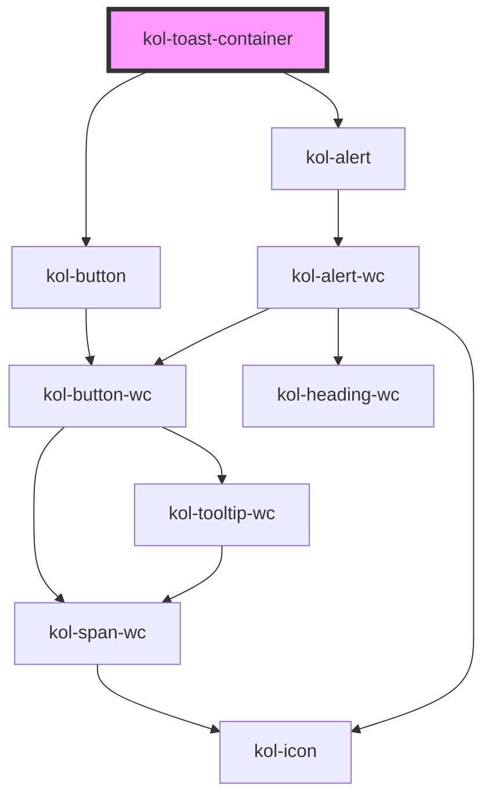

Siehe [Toast](/docs/components/toast).

<!-- Auto Generated Below -->

## Methods

### `enqueue(toast: Toast) => Promise<void>`

#### Returns

Type: `Promise<void>`

## Dependencies

### Depends on

- [kol-button](../button)
- [kol-alert](../alert)

### Graph

---
