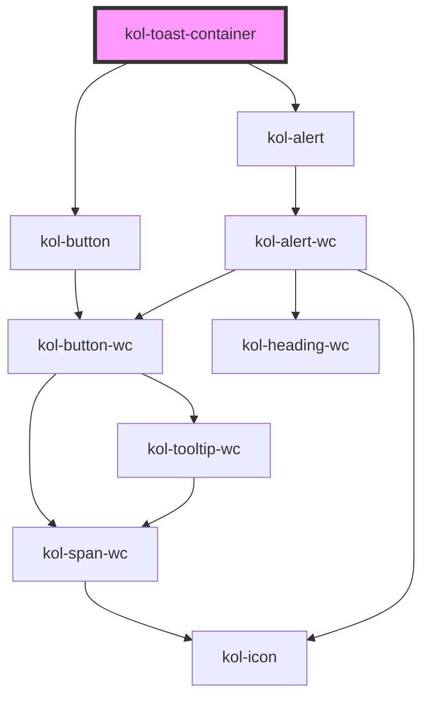

# Toast

Mit dem **Toast**-Service geben Sie ein optisches Feedback an die Nutzer:innen. Sie wird am Kopf des Browserfenster
angezeigt, bis sie geschlossen wird. Werden mehrere Toasts geöffnet, ohne das die bisherigen geschlossen wurden, so werden diese untereinander angezeigt.

## Konstruktion

Die Toast-Komponenten werden nicht direkt verwendet, sondern immer über den ToasterService konstruiert.

### Code

```js
import { ToasterService } from '@public-ui/components';

// Get the toaster instance for the current HTML document.
const toaster = ToasterService.getInstance(document);

// Enqueue a new toast to the toaster to display:
toaster.enqueue({
	label: 'This is the title',
	description: 'Magna eu sit adipisicing cillum amet esse in aute quis in dolore.',
	type: 'info',
});
```

## Verwendung

### Überschrift

Verwenden Sie das Attribut **`_label`**, um die Überschrift des Toasts zu bestimmen.

### Inhalt

Verwenden Sie das Attribut **`_description`**, um den Text-Inhalt des Toasts zu bestimmen.

### Anzeigetyp des Toast

Verwenden Sie das Attribut **`_type`**, um den Typ des Toasts festzulegen. Mögliche Werte sind:

- `default`
- `error`
- `info`
- `success`
- `warning`

<!-- Auto Generated Below -->

## Methods

### `enqueue(toast: Toast) => Promise<void>`

#### Returns

Type: `Promise<void>`

## Dependencies

### Depends on

- [kol-button](../button)
- [kol-alert](../alert)

### Graph



---
