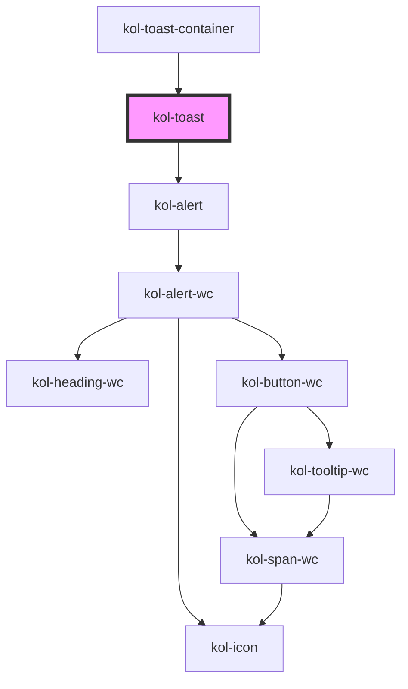

# Toast

Mit der **Toast**-Komponente geben Sie ein optisches Feedback an die Nutzer:innen. Sie wird am Kopf des Browserfenster
angezeigt, bis sie geschlossen wird. Werden mehrere Toasts geöffnet, ohne das die bisherigen geschlossen wurden, so werden diese untereinander angezeigt.

## Konstruktion

Die Toast-Komponente wird nicht direkt verwendet, sondern immer über den ToasterService konstruiert.

### Code

```js
import { ToasterService } from '@public-ui/components';

// Get the toaster instance for the current HTML document.
const toaster = ToasterService.getInstance(document);

// Enqueue a new toast to the toaster to display:
toaster.enqueue({
	label: 'This is the title',
	description: 'Magna eu sit adipisicing cillum amet esse in aute quis in dolore.',
	type: 'info',
});
```

## Verwendung

### Überschrift

Verwenden Sie das Attribut **`_label`**, um die Überschrift des Toasts zu bestimmen.

### Inhalt

Verwenden Sie das Attribut **`_description`**, um den Text-Inhalt des Toasts zu bestimmen.

### Anzeigetyp des Toast

Verwenden Sie das Attribut **`_type`**, um den Typ des Toasts festzulegen. Mögliche Werte sind:

- `default`
- `error`
- `info`
- `success`
- `warning`

<!-- Auto Generated Below -->

## Properties

| Property               | Attribute | Description                                                                                                        | Type                                                                    | Default     |
| ---------------------- | --------- | ------------------------------------------------------------------------------------------------------------------ | ----------------------------------------------------------------------- | ----------- |
| `_label` _(required)_  | `_label`  | Defines the visible or semantic label of the component (e.g. aria-label, label, headline, caption, summary, etc.). | `string`                                                                | `undefined` |
| `_on`                  | --        | Defines the event callback functions for the component.                                                            | `undefined \| { onClose?: EventCallback<Event> \| undefined; }`         | `undefined` |
| `_status` _(required)_ | `_status` | Defines the current toast status.                                                                                  | `"adding" \| "removing" \| "settled"`                                   | `undefined` |
| `_type`                | `_type`   | Defines either the type of the component or of the components interactive element.                                 | `"default" \| "error" \| "info" \| "success" \| "warning" \| undefined` | `'default'` |

## Slots

| Slot | Description             |
| ---- | ----------------------- |
|      | Der Inhalt der Meldung. |

## Dependencies

### Used by

- [kol-toast-container](../toast-container)

### Depends on

- [kol-alert](../alert)

### Graph



---
