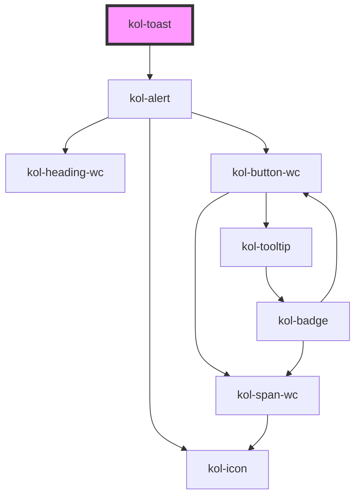

# Toast

Mit der **Toast**-Komponente geben Sie ein optisches Feedback an die Nutzer:innen. Sie wird nur für einen kurzen Zeitraum am Kopf des Browserfenster angezeigt und verschwindet danach automatisch.

Ein **Toast** wird nach dem Laden der Webseite am oberen Rand des Browserfenster für fünf Sekunden angezeigt. Mit Ausblenden des **Toasts** wird dieser automatisch aus dem DOM entfernt. Wird er erneut benötigt, muss er z.B. über eine JavaScript-Funktion nachgeladen werden.

## Konstruktion

### Code

```html
<kol-toast _heading="Überschrift" _type="success"> Web Component </kol-toast>
```

### Beispiel

<div class="d-grid gap-2">
  <kol-alert _heading="Erfolg" _type="success">Hier wird der Erfolg näher beschrieben.</kol-alert>
  <kol-alert _type="success" _show="false">Hier wird der Erfolg näher beschrieben.</kol-alert>
</div>

## Verwendung

### Überschrift

Verwenden Sie das Attribut `_heading`, um die Überschrift des Toasts zu bestimmen.

### Größe der Überschrift

Verwenden Sie das Attribut `_level`, um die Größe der Überschrift zu bestimmen. Möglich sind die Werte 1 - 6.

### Anzeigen des Toasts

Verwenden Sie das Attribut `_show`, um den Toast manuell anzuzeigen.

### Anzeigedauer des Toast

Verwenden Sie das Attribut `_showDuration`, um die Anzeigedauer des Toasts festzulegen.

### Anzeigetyp des Toast

Verwenden Sie das Attribut `_type`, um den Typ des Toasts festzulegen.

<!--### Best practices

### Anwendungsfälle-->

## Barrierefreiheit

<!--## Links und Referenzen

<!-- Auto Generated Below -->

## Properties

| Property        | Attribute        | Description                                                                       | Type                                                                    | Default     |
| --------------- | ---------------- | --------------------------------------------------------------------------------- | ----------------------------------------------------------------------- | ----------- |
| `_alert`        | `_alert`         | Gibt an, ob der Screenreader die Meldung vorlesen soll.                           | `boolean \| undefined`                                                  | `true`      |
| `_hasCloser`    | `_has-closer`    | Gibt an, ob der Toast ein Schließen-Icon hat.                                     | `boolean \| undefined`                                                  | `false`     |
| `_heading`      | `_heading`       | Gibt den Titel der Meldung an.                                                    | `string \| undefined`                                                   | `''`        |
| `_level`        | `_level`         | Gibt an, welchen H-Level von 1 bis 6 die Überschrift hat.                         | `0 \| 1 \| 2 \| 3 \| 4 \| 5 \| 6 \| undefined`                          | `1`         |
| `_on`           | --               | Gibt die EventCallback-Function für das Schließen des Toasts an.                  | `undefined \| { onClose?: EventCallback<Event> \| undefined; }`         | `undefined` |
| `_show`         | `_show`          | Gibt an, ob der Toast eingeblendet wird.                                          | `boolean \| undefined`                                                  | `true`      |
| `_showDuration` | `_show-duration` | Gibt an, wie viele Millisekunden der Toast eingeblendet werden soll.              | `number \| undefined`                                                   | `10000`     |
| `_type`         | `_type`          | Gibt an, ob es sich um eine Erfolgs-, Info-, Warnung- oder Fehlermeldung handelt. | `"default" \| "error" \| "info" \| "success" \| "warning" \| undefined` | `'default'` |

## Dependencies

### Depends on

- [kol-alert](../alert)

### Graph



---
