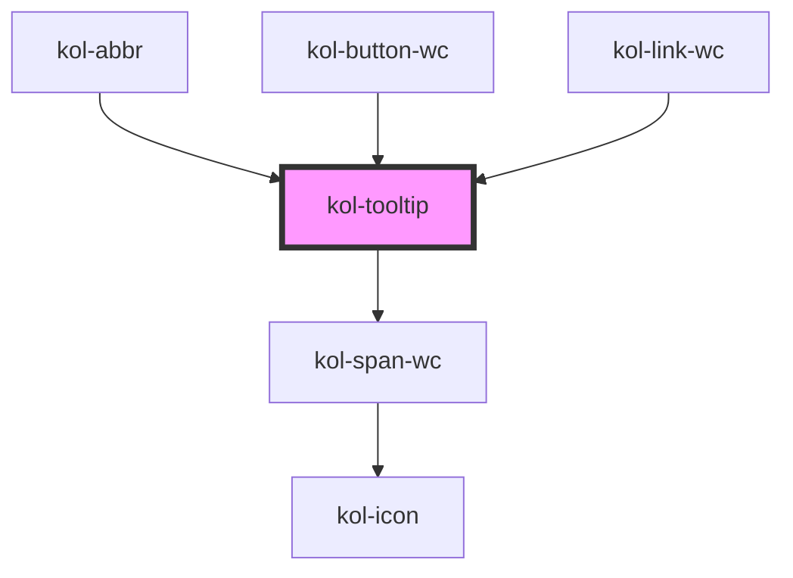

# Tooltip

<kol-alert _type="warning">Die **Tooltip**-Komponente wird innerhalb von KoliBri verwendet und ist nicht dafür vorgesehen in der Anwendungsentwicklung verwendet zu werden. Denn der Tooltip ist nur dann wirklich barrierefrei, wenn von einem Referenzelement auf das Tooltip verwiesen wird.</kol-alert>

Die **Tooltip**-Komponente implementiert das Gegenstück zum `Aria-Label`. Es ist also explizit nur dafür vorgesehen, dem/der Nutzer:in ohne Screenreader die Beschriftung eines Elementes anzuzeigen.

Ein geöffneter Tooltip lässt sich mit der `Escape`-Taste schließen, um ggf. überlagerte Seiteninformationen wieder sichtbar zu machen.

**Hinweis:** Damit der Tooltip korrekt ausgerichtet wird, darf das Referenz-Element nicht `display: inline` haben.

## Barrierefreiheit

Die Tooltip-Komponente wird bei Fokus oder bei Bewegen der Maus über dem Referenzelement angezeigt und dient ausschließlich dem/der sehenden Nutzer:in ohne Screenreader die Beschriftung (Aria-Label) lesen zu können. Der Text des Tooltips ist selbst nicht mit der Tastatur erreichbar und zudem mittels Aria-Hidden für die Screenreader versteckt.

<kol-alert _type="info">
Aus Sicht des Barrierefreiheitstests können Tooltips ignoriert werden, solange zudem von der Entwicklung sichergestellt wurde, dass der Tooltip-Text auch in gleicher Weise vom Screenreader vorgelesen wird.
</kol-alert>

## Links und Referenzen

- https://tollwerk.de/projekte/tipps-techniken-inklusiv-barrierefrei/titel-tooltips-toggletips

<!-- Auto Generated Below -->

## Properties

| Property              | Attribute | Description                                                                           | Type                                                  | Default     |
| --------------------- | --------- | ------------------------------------------------------------------------------------- | ----------------------------------------------------- | ----------- |
| `_align`              | `_align`  | Setzt die Ausrichtung des Tooltips in Relation zum Elternelement.                     | `"bottom" \| "left" \| "right" \| "top" \| undefined` | `'top'`     |
| `_id` _(required)_    | `_id`     | Gibt die ID an, wenn z.B. Aria-Labelledby (Link) verwendet wird.                      | `string`                                              | `undefined` |
| `_label` _(required)_ | `_label`  | Setzt den Text in dem Tooltip beim Fokussieren oder Maus-drüberfahren angezeigt wird. | `string`                                              | `undefined` |

## Dependencies

### Used by

- [kol-abbr](../abbr)
- kol-button-wc
- kol-link-wc

### Depends on

- kol-span-wc

### Graph

---
