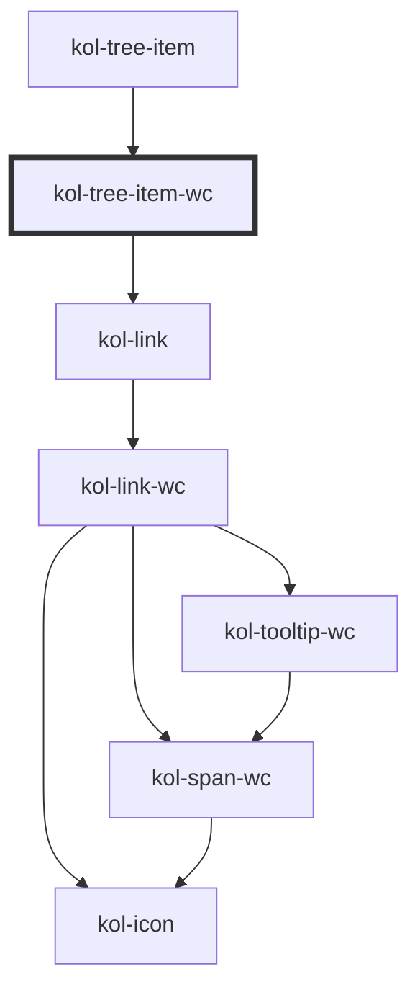

# kol-tree-item

<!-- Auto Generated Below -->

## Properties

| Property              | Attribute | Description                                                                      | Type                   | Default     |
| --------------------- | --------- | -------------------------------------------------------------------------------- | ---------------------- | ----------- |
| `_active`             | `_active` | If set (to true) the tree item is the active one.                                | `boolean \| undefined` | `undefined` |
| `_href` _(required)_  | `_href`   | This property is used for a link from a reference to the target URL.             | `string`               | `undefined` |
| `_label` _(required)_ | `_label`  | Defines the label of the link.                                                   | `string`               | `undefined` |
| `_open`               | `_open`   | If set (to true) opens/expands the element, closes if not set (or set to false). | `boolean \| undefined` | `undefined` |

## Methods

### `collapse() => Promise<void>`

#### Returns

Type: `Promise<void>`

### `expand() => Promise<void>`

#### Returns

Type: `Promise<void>`

### `focusLink() => Promise<void>`

#### Returns

Type: `Promise<void>`

### `isOpen() => Promise<boolean>`

#### Returns

Type: `Promise<boolean>`

## Dependencies

### Used by

- [kol-tree-item](.)

### Depends on

- [kol-link](../link)

### Graph

---
