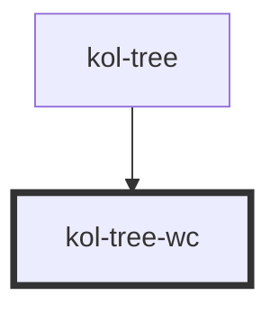

# Tree

<kol-alert _type="warning">
  Komponente ist ein Entwurf - Vorläufig nicht in Produktion verwenden.
</kol-alert>

<!-- Auto Generated Below -->

## Properties

| Property              | Attribute | Description                    | Type     | Default     |
| --------------------- | --------- | ------------------------------ | -------- | ----------- |
| `_label` _(required)_ | `_label`  | Defines the label of the tree. | `string` | `undefined` |

## Dependencies

### Used by

- [kol-tree](.)

### Graph

---
