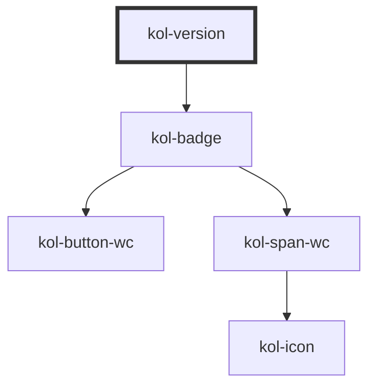

# Version

Die **Version**-Komponente stellt kurze Inhalte auf einem farbigen Hintergrund dar. Die **Version**-Komponente ist mit der **Tag**-Komponente eng verwandt, bietet aber nur ein Attribut zur Konfiguration. Sie ist optimiert für die Angabe z.B. von Versionen einer Seite.

## Konstruktion

### Code

```html
<div>
	<kol-version _label="1.44.0"></kol-version>
</div>
```

### Beispiel

<kol-version _label="1.44.0"></kol-version>

## Verwendung

Für die Konfiguration steht das Attribut **`_label`** zur Verfügung und nimmt einen beliebigen Text auf, dem in der Komponente ein `v` vorgestellt wird.

Die **Version** wird standardmäßig als **_Inline-Element_** ausgegeben.

<!-- Auto Generated Below -->

## Properties

| Property              | Attribute | Description                                                                                                        | Type     | Default     |
| --------------------- | --------- | ------------------------------------------------------------------------------------------------------------------ | -------- | ----------- |
| `_label` _(required)_ | `_label`  | Defines the visible or semantic label of the component (e.g. aria-label, label, headline, caption, summary, etc.). | `string` | `undefined` |

## Dependencies

### Depends on

- [kol-badge](../badge)

### Graph



---
