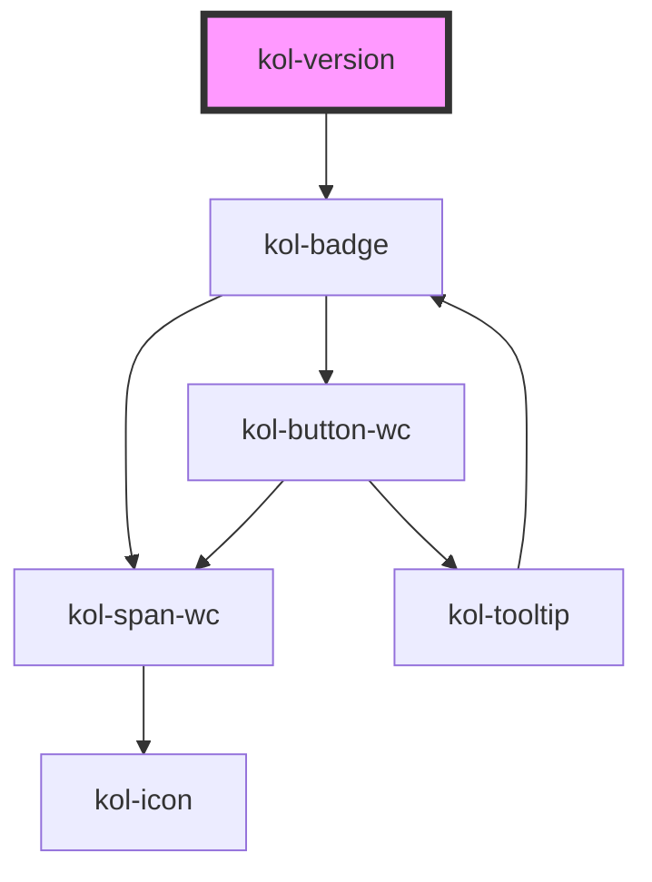

# Version

Die **Version**-Komponente stellt kurze Inhalte auf einem farbigen Hintergrund dar. Die **Version**-Komponente ist mit der **Tag**-Komponente eng verwandt, bietet aber nur ein Attribut zur Konfiguration. Sie ist optimiert für die
Angabe z.B. von Versionen einer Seite.

## Konstruktion

### Code

```html
<div>
	<kol-version _version="1.0.0"></kol-version>
</div>
```

### Beispiel

<kol-version _version="1.0.0"></kol-version>

## Verwendung

Für die Konfiguration steht das Attribut `_label_` zur Verfügung und nimmt einen beliebigen Text auf, der in der Komponente angezeigt wird.

Die **Version** wird standardmäßig als **_Inline-Element_** ausgegeben.

Bitte beachten Sie, dass innerhalb der Komponente dem Text aus dem Attribut **\_version** ein **"v"** vorangestellt wird.

<!--### Best practices

### Anwendungsfälle-->

## Barrierefreiheit

<!--## Links und Referenzen

<!-- Auto Generated Below -->

## Properties

| Property                | Attribute  | Description                          | Type     | Default     |
| ----------------------- | ---------- | ------------------------------------ | -------- | ----------- |
| `_version` _(required)_ | `_version` | Gibt die Versionsnummer als Text an. | `string` | `undefined` |

## CSS Custom Properties

| Name                        | Description                     |
| --------------------------- | ------------------------------- |
| `--kolibri-border-color`    | Default color of the border.    |
| `--kolibri-border-radius`   | Default radius of the border.   |
| `--kolibri-border-width`    | Default width of the border.    |
| `--kolibri-color-black`     | Default color of black (dark).  |
| `--kolibri-color-danger`    | Default color of the danger.    |
| `--kolibri-color-disabled`  | Default color of the disabled.  |
| `--kolibri-color-error`     | Default color of the error.     |
| `--kolibri-color-ghost`     | Default color of the ghost.     |
| `--kolibri-color-info`      | Default color of the info.      |
| `--kolibri-color-normal`    | Default color of the normal.    |
| `--kolibri-color-primary`   | Default color of the primary.   |
| `--kolibri-color-secondary` | Default color of the secondary. |
| `--kolibri-color-success`   | Default color of the success.   |
| `--kolibri-color-text`      | Default color of the text.      |
| `--kolibri-color-visited`   | Default color of the visited.   |
| `--kolibri-color-warning`   | Default color of the warning.   |
| `--kolibri-color-white`     | Default color of white (light). |
| `--kolibri-font-family`     | Default font family.            |
| `--kolibri-font-size`       | Default font size.              |

## Dependencies

### Depends on

- [kol-badge](../badge)

### Graph



---
