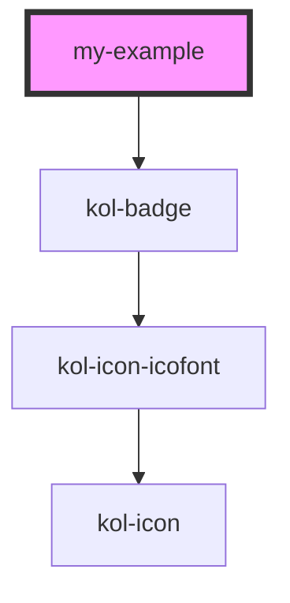

# Example

<!-- Auto Generated Below -->

## Properties

| Property              | Attribute | Description                          | Type     | Default     |
| --------------------- | --------- | ------------------------------------ | -------- | ----------- |
| `_label` _(required)_ | `_label`  | Gibt die Examplesnummer als Text an. | `string` | `undefined` |

## Dependencies

### Depends on

- [kol-badge](../badge)

### Graph

---
