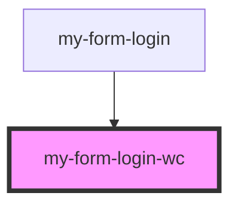

# FormLogin

<!-- Auto Generated Below -->

## Properties

| Property              | Attribute | Description                | Type     | Default     |
| --------------------- | --------- | -------------------------- | -------- | ----------- |
| `_label` _(required)_ | `_label`  | Gibt den Text des Span an. | `string` | `undefined` |

## Dependencies

### Used by

- [my-form-login](.)

### Graph

---
