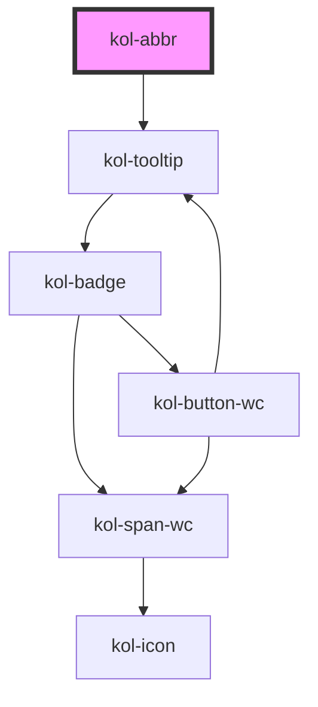

# Abbr

Die **Abbr**-Komponente implementiert den HTML-Tag `abbr`, wobei hier jedoch der Tooltip barrierefrei ist.
Der Tooltip für die Beschreibung wird bei Focus oder Hover der **Abbr**-Komponente angezeigt und vorgelesen.

## Konstruktion

### Code

```html
Ich bin <kol-abbr _title="Abkürzung">z.B.</kol-abbr> eine Abkürzung.<br />
Ich bin <kol-abbr _title="Abkürzung" _tooltip-align="right">z.B.</kol-abbr> eine Abkürzung (rechts).<br />
Ich bin <kol-abbr _title="Abkürzung" _tooltip-align="bottom">z.B.</kol-abbr> eine Abkürzung (unten).<br />
Ich bin <kol-abbr _title="Abkürzung" _tooltip-align="left">z.B.</kol-abbr> eine Abkürzung (links).<br />
Ich bin <kol-abbr _title="Abkürzung" _tooltip-align="top">z.B.</kol-abbr> eine Abkürzung (oben).
```

### Beispiel

Ich bin <kol-abbr _title="Abkürzung">z.B.</kol-abbr> eine Abkürzung.<br />
Ich bin <kol-abbr _title="Abkürzung" _tooltip-align="right">z.B.</kol-abbr> eine Abkürzung (rechts).<br />
Ich bin <kol-abbr _title="Abkürzung" _tooltip-align="bottom">z.B.</kol-abbr> eine Abkürzung (unten).<br />
Ich bin <kol-abbr _title="Abkürzung" _tooltip-align="left">z.B.</kol-abbr> eine Abkürzung (links).<br />
Ich bin <kol-abbr _title="Abkürzung" _tooltip-align="top">z.B.</kol-abbr> eine Abkürzung (oben).

## Verwendung

### Angabe der Beschreibung zur Abkürzung

Die eigentliche Beschreibung wird über das Attribut **`_title`** übergeben.

### Ausrichtung des Tooltip

Über das Attribut **`_tooltip-align`** wird die Positionierung des ToolTip, relativ zur Abkürzung, festgelegt.

<!--### Best practices

### Anwendungsfälle-->

## Barrierefreiheit

Die Abbr-Komponente wurde von KoliBri umgesetzt, weil der Standard-Tooltip nicht barrierefrei bzgl. der Skalierung ist. Mittels der KoliBri-Komponente zoomt der Tooltip proportional zu seinem Text mit und wird vorgelesen.

## Links und Referenzen

- https://developer.mozilla.org/de/docs/Web/HTML/Element/abbr

<!-- Auto Generated Below -->

## Properties

| Property              | Attribute        | Description                                                                            | Type                                                  | Default     |
| --------------------- | ---------------- | -------------------------------------------------------------------------------------- | ----------------------------------------------------- | ----------- |
| `_title` _(required)_ | `_title`         | Dieses Property gibt die Beschreibung oder Erläuterung der Abkürzung an.               | `string`                                              | `undefined` |
| `_tooltipAlign`       | `_tooltip-align` | Gibt an, ob der Tooltip entweder oben, rechts, unten oder links angezeigt werden soll. | `"bottom" \| "left" \| "right" \| "top" \| undefined` | `'top'`     |

## Dependencies

### Depends on

- [kol-tooltip](../tooltip)

### Graph



---
