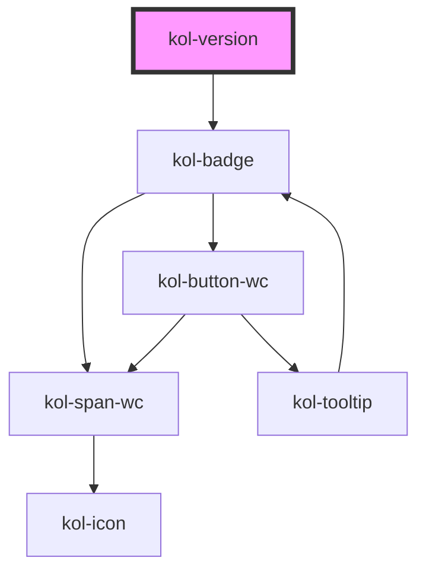

# Version

Die **Version**-Komponente stellt kurze Inhalte auf einem farbigen Hintergrund dar. Die **Version**-Komponente ist mit der **Tag**-Komponente eng verwandt, bietet aber nur ein Attribut zur Konfiguration. Sie ist optimiert für die
Angabe z.B. von Versionen einer Seite.

## Konstruktion

### Code

```tsx
<div>
	<kol-version _version="1.0.0"></kol-version>
</div>
```

### Beispiel

<kol-version _version="1.0.0"></kol-version>

## Verwendung

Für die Konfiguration steht das Attribut `_label_` zur Verfügung und nimmt einen beliebigen Text auf, der in der Komponente angezeigt wird.

Die **Version** wird standardmäßig als **_Inline-Element_** ausgegeben.

Bitte beachten Sie, dass innerhalb der Komponente dem Text aus dem Attribut **\_version** ein **"v"** vorangestellt wird.

<!--### Best practices

### Anwendungsfälle-->

## Barrierefreiheit

<!--## Links und Referenzen

<!-- Auto Generated Below -->

## Properties

| Property                | Attribute  | Description                          | Type     | Default     |
| ----------------------- | ---------- | ------------------------------------ | -------- | ----------- |
| `_version` _(required)_ | `_version` | Gibt die Versionsnummer als Text an. | `string` | `undefined` |

## Dependencies

### Depends on

- [kol-badge](../badge)

### Graph



---
