# kol-all

<!-- Auto Generated Below -->

## Dependencies

### Depends on

- [kol-abbr](../abbr)
- [kol-accordion](../accordion)
- [kol-alert](../alert)
- [kol-badge](../badge)
- [kol-breadcrumb](../breadcrumb)
- [kol-button](../button)
- [kol-button-group](../button-group)
- [kol-card](../card)
- [kol-details](../details)
- [kol-form](../form)
- [kol-heading](../heading)
- [kol-icon](../icon)
- [kol-icon-font-awesome](../icon-font-awesome)
- [kol-icon-icofont](../icon-icofont)
- [kol-indented-text](../indented-text)
- [kol-input-checkbox](../input-checkbox)
- [kol-input-color](../input-color)
- [kol-input-email](../input-email)
- [kol-input-file](../input-file)
- [kol-input-number](../input-number)
- [kol-input-password](../input-password)
- [kol-input-radio](../input-radio)
- [kol-input-range](../input-range)
- [kol-input-text](../input-text)
- [kol-link](../link)
- [kol-link-group](../link-group)
- [kol-logo](../logo)
- [kol-modal](../modal)
- [kol-nav](../nav)
- [kol-pagination](../pagination)
- [kol-progress](../progress)
- [kol-select](../select)
- [kol-skip-nav](../skip-nav)
- [kol-spin](../spin)
- [kol-table](../table)
- [kol-tabs](../tabs)
- [kol-textarea](../textarea)
- [kol-tooltip](../tooltip)
- [kol-version](../version)

### Graph

```mermaid
graph TD;
  kol-all --> kol-abbr
  kol-all --> kol-accordion
  kol-all --> kol-alert
  kol-all --> kol-badge
  kol-all --> kol-breadcrumb
  kol-all --> kol-button
  kol-all --> kol-button-group
  kol-all --> kol-card
  kol-all --> kol-details
  kol-all --> kol-form
  kol-all --> kol-heading
  kol-all --> kol-icon
  kol-all --> kol-icon-font-awesome
  kol-all --> kol-icon-icofont
  kol-all --> kol-indented-text
  kol-all --> kol-input-checkbox
  kol-all --> kol-input-color
  kol-all --> kol-input-email
  kol-all --> kol-input-file
  kol-all --> kol-input-number
  kol-all --> kol-input-password
  kol-all --> kol-input-radio
  kol-all --> kol-input-range
  kol-all --> kol-input-text
  kol-all --> kol-link
  kol-all --> kol-link-group
  kol-all --> kol-logo
  kol-all --> kol-modal
  kol-all --> kol-nav
  kol-all --> kol-pagination
  kol-all --> kol-progress
  kol-all --> kol-select
  kol-all --> kol-skip-nav
  kol-all --> kol-spin
  kol-all --> kol-table
  kol-all --> kol-tabs
  kol-all --> kol-textarea
  kol-all --> kol-tooltip
  kol-all --> kol-version
  kol-abbr --> kol-tooltip
  kol-tooltip --> kol-badge
  kol-badge --> kol-icon-icofont
  kol-icon-icofont --> kol-icon
  kol-accordion --> kol-heading
  kol-accordion --> kol-icon-icofont
  kol-alert --> kol-icon-icofont
  kol-alert --> kol-heading
  kol-breadcrumb --> kol-icon-icofont
  kol-breadcrumb --> kol-link
  kol-link --> kol-icon-icofont
  kol-link --> kol-tooltip
  kol-button --> kol-icon-icofont
  kol-button --> kol-tooltip
  kol-card --> kol-heading
  kol-details --> kol-icon-icofont
  kol-details --> kol-indented-text
  kol-form --> kol-indented-text
  kol-icon-font-awesome --> kol-icon
  kol-input-checkbox --> kol-alert
  kol-input-color --> kol-alert
  kol-input-email --> kol-alert
  kol-input-file --> kol-alert
  kol-input-number --> kol-alert
  kol-input-password --> kol-alert
  kol-input-radio --> kol-alert
  kol-input-range --> kol-alert
  kol-input-text --> kol-alert
  kol-link-group --> kol-heading
  kol-link-group --> kol-link
  kol-nav --> kol-link
  kol-nav --> kol-button
  kol-pagination --> kol-button
  kol-select --> kol-alert
  kol-skip-nav --> kol-link
  kol-table --> kol-button
  kol-table --> kol-button-group
  kol-table --> kol-select
  kol-tabs --> kol-button-group
  kol-tabs --> kol-icon-icofont
  kol-textarea --> kol-alert
  kol-version --> kol-badge
  style kol-all fill:#f9f,stroke:#333,stroke-width:4px
```

---
