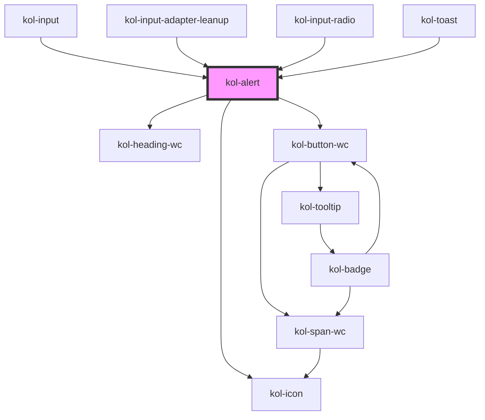

# Alert

Die **Alert**-Komponente gibt ein optisches Feedback an die Nutzer:innen. Sie besteht aus einem farblich gestalteten Container, einer Überschrift, einem Inhaltstext sowie einem Icon. Das verwendete Icon und die farbliche Gestaltung sind abhängig vom Typ `_type` des Alert.

## Konstruktion

### Code

```html
<kol-alert _alert _heading="Überschrift im Alert" _level="1" _type="info" _variant="msg"> Textbereich im Alert </kol-alert>
```

### Beispiel

<kol-alert _alert _heading="Überschrift im Alert" _level="1" _type="info" _variant="msg">Textbereich im Alert</kol-alert>

## Verwendung

### Überschrift

Die **Überschrift** der Alert-Komponente wird über das Attribut `_heading` bestimmt.

### Größe der Überschrift

Die **Größe** der Überschrift wird über das Attribut `_level` bestimmt und lässt die Werte 1 - 6 zu.

### Typ des Alert

Die **Alert**-Komponente bietet **vier** unterschiedliche Typen, die sich jeweils auf die farbliche Gestaltung und das verwendetet Icon im Alert beziehen. Zur Wahl stehen:

<ul>
<li>Success</li>
<li>Error</li>
<li>Info</li>
<li>Warning</li>
</ul>

Der Typ eines Alert wird über das Attribut `_type` festgelegt.

### Inhalt des Alert

Der Inhalt des Alert wird zwischen das öffnende Element `<kol-alert>` und das schließende `</kol-alert>` geschrieben. Der Inhalt kann aus beliebigem **HTML-Code**, aber auch aus weiteren **KoliBri**-Komponenten bestehen.

### Variante des Alert

Über das Attribut **`_variant`** kann festgelegt werden, in welcher Darstellungsvariante das Alert angezeigt wird.

### Best practices

- Verwenden Sie die **Alert**-Komponente an geeigneten Positionen auf Ihrer Webseite, um Informationen im richtigen Zusammenhang darzustellen.
- Verwenden Sie immer den richtigen **Type** der **Alert**-Komponente, um bei den Benutzer:innen die gewünschte Reaktion zu erzeugen. Vermeiden Sie bspw. den Typ **_Error_**, wenn Sie auf den erfolgreichen Abschluss eines Speichervorgangs hinweisen möchten.
- Vermeiden Sie, zu viele **Alert**-Komponenten auf einer Seite zu platzieren, da der Informationsgehalt von den Benutzer:innen dann oft nicht mehr als besonders wichtig wahrgenommen wird.

### Anwendungsfälle

- Verwenden Sie die **Alert**-Komponente, wenn Sie die Benutzer:innen auf Fehler bei der Eingabe in Formularen hinweisen möchten.
- Verwenden Sie die **Alert**-Komponente, um Nutzer:innen auf die erfolgreiche Ausführung von Funktionen hinzuweisen, z.B. **`Ihre Anfrage wurde erfolgreich gespeichert`**.
- Verwenden Sie die **Alert**-Komponente, um Nutzer:innen weitere Informationen zu einem Thema zur Verfügung zu stellen.

## Barrierefreiheit

Die **Alert**-Komponente wurde auf die Darstellung mit höchstmöglichen Kontrast optimiert.

Das zusätzliche Icon (je nach gewähltem Typ) gewährleistet, dass die Information vom Nutzer nicht allein über die Farbe klassifiziert werden muss.

Bei der **Alert**-Komponente wurden insbesondere folgende Punkte der Barrierefreiheit betrachtet:

- Die Schriftfarbe ist entweder weiß oder schwarz.
- Die Schriftfarbe ist abhängig von der Hintergrundfarbe und wechselt immer auf die Schriftfarbe mit dem größeren Farbkontrast zur Hintergrundfarbe.
- Ist der Farbkontrast für AA nicht ausreichend, wird die Hintergrundfarbe überschrieben.

## Links und Referenzen

- https://www.w3.org/TR/wai-aria-practices/#alert

<!-- Auto Generated Below -->

## Properties

| Property     | Attribute     | Description                                                                       | Type                                                                    | Default     |
| ------------ | ------------- | --------------------------------------------------------------------------------- | ----------------------------------------------------------------------- | ----------- |
| `_alert`     | `_alert`      | Gibt an, ob der Screenreader die Meldung vorlesen soll.                           | `boolean \| undefined`                                                  | `false`     |
| `_hasCloser` | `_has-closer` | Gibt an, ob der Alert ein Schließen-Icon hat.                                     | `boolean \| undefined`                                                  | `false`     |
| `_heading`   | `_heading`    | Gibt den Titel der Meldung an.                                                    | `string \| undefined`                                                   | `undefined` |
| `_level`     | `_level`      | Gibt an, welchen H-Level von 1 bis 6 die Überschrift hat.                         | `0 \| 1 \| 2 \| 3 \| 4 \| 5 \| 6 \| undefined`                          | `1`         |
| `_on`        | --            | Gibt die EventCallback-Function für das Schließen des Alerts an.                  | `undefined \| { onClose?: EventCallback<Event> \| undefined; }`         | `undefined` |
| `_type`      | `_type`       | Gibt an, ob es sich um eine Erfolgs-, Info-, Warnung- oder Fehlermeldung handelt. | `"default" \| "error" \| "info" \| "success" \| "warning" \| undefined` | `'default'` |
| `_variant`   | `_variant`    | Gibt an, welche Benachrichtigungsvariante dargestellt wird.                       | `"card" \| "msg" \| undefined`                                          | `'msg'`     |

## CSS Custom Properties

| Name                        | Description                     |
| --------------------------- | ------------------------------- |
| `--kolibri-border-color`    | Default color of the border.    |
| `--kolibri-border-radius`   | Default radius of the border.   |
| `--kolibri-border-width`    | Default width of the border.    |
| `--kolibri-color-danger`    | Default color of the danger.    |
| `--kolibri-color-disabled`  | Default color of the disabled.  |
| `--kolibri-color-error`     | Default color of the error.     |
| `--kolibri-color-ghost`     | Default color of the ghost.     |
| `--kolibri-color-info`      | Default color of the info.      |
| `--kolibri-color-normal`    | Default color of the normal.    |
| `--kolibri-color-primary`   | Default color of the primary.   |
| `--kolibri-color-secondary` | Default color of the secondary. |
| `--kolibri-color-success`   | Default color of the success.   |
| `--kolibri-color-warning`   | Default color of the warning.   |

## Dependencies

### Used by

- kol-input
- [kol-input-adapter-leanup](../input-adapter-leanup)
- [kol-input-radio](../input-radio)
- [kol-toast](../toast)

### Depends on

- [kol-heading-wc](../heading)
- kol-button-wc
- [kol-icon](../icon)

### Graph



---
