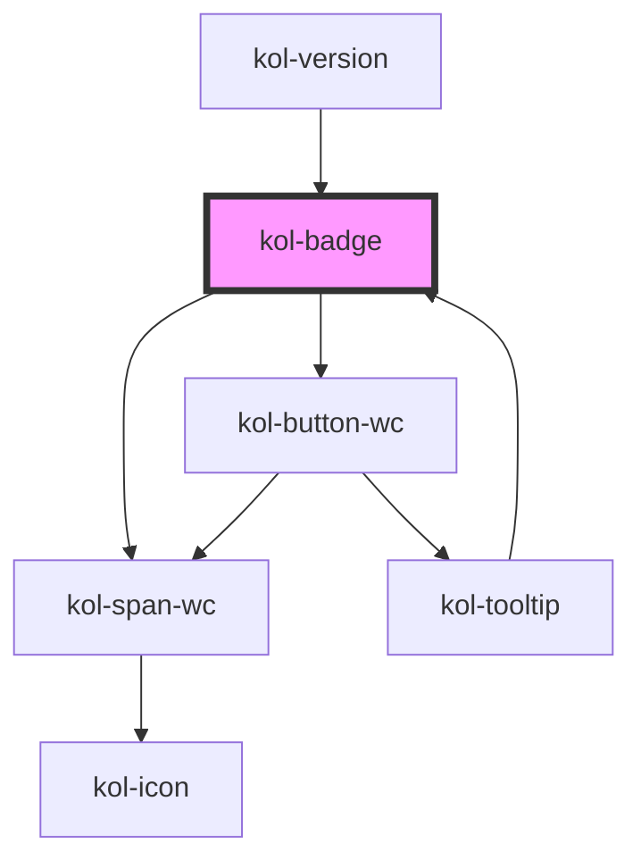

# Badge

Mit **Badges** können Sie bestimmte Informationen auf Ihrer Webseite optisch hervorheben.
KoliBri bietet neben der Angabe der Hintergrundfarbe und automatischer Berechnung der Textfarbe auch die Möglichkeit, einem Badge ein Icon und/oder einen anderen Schriftschnitt mitzugeben.

## Konstruktion

### Code

```tsx
<kol-badge _label="Beispieltext" _color="#000000" _icon="home" _icon-align="right" style={{ fontWeight: '600' }}></kol-badge>
```

### Beispiel

<kol-badge
\_label="Beispieltext"
\_color="#000000"
\_icon="home"
\_icon-align="right"
style={{ fontWeight: '600' }}

> </kol-badge>

## Verwendung

### Label im Badge

Der Text, der im Badge angezeigt werden soll, wird über das Attribut **\_label** übergeben. Der Text kann neben Sonderzeichen auch Umlaute oder Leerzeichen enthalten.
Das Element `<kol-badge></kol-badge>` beinhaltet selbst keinen Text.

### Hintergrundfarbe des Badge

Ein Badge, ohne weitere Angaben zur Hintergrundfarbe, wird standardmäßig mit hellgrauer Schriftfarbe auf schwarzem Hintergrund angezeigt. Über das Attribut **\_color** können andere Hintergrundfarben gewählt werden.

Die Angabe der gewünschten Hintergrundfarbe erfolgt in hexadezimaler Schreibweise, z.B. **\_color="#000000"** für schwarz.

Die Textfarbe wird automatisch als Kontrastfarbe zur gewählten Hintergrundfarbe errechnet.

### Anzeige eines Icon im Badge

KoliBri stellt die komplette Bibliothek von **Icofont** zur Verfügung. Sie können daher optional im Badge ein Icon aus Icofont anzeigen lassen. Bestimmen Sie das Icon über das Attribut **\_icon="_Name des Icon_"**.

Eine Übersicht über die zur Verfügung stehenden Icons in KoliBri finden Sie [hier](https://icofont.com/icons)

### Position des Icon

Das Icon kann zusätzlich entweder links oder rechts vom Text angezeigt werden. Verwenden Sie für die Angabe der Ausgabeposition das Attribut **\_icon-align=""**.
Als Wert können Sie `_icon-align="left"` oder `_icon-align="right"` angeben.

### Nur Icon anzeigen

Mit dem Attribut **`_icon-only`** kann festgelegt werden, dass nur das mit dem Attribut **`_icon`** gewählte Icon angezeigt wird. Der Wert im Attribut **`_label`** wird in diesem Fall ignoriert.

### Schriftschnitt

Über Stylinganweisungen im Attribut **style** können Sie den Schriftschnitt im Badge festlegen. Das Attribut **style** erwartet als Wert ein Objekt.
`style={{ fontWeight: '600' }}`

### Best practices

- Verwenden Sie Badges, um wichtige Informationen in unmittelbarer Nähe des jeweiligen Elements anzuzeigen.
- Verwenden Sie Badges, um auf geänderte Werte oder einen geänderten Status aufmerksam zu machen.
- Ein Badge weist den Benutzer darauf hin, dass etwas neu erzeugt oder aktualisiert wurde, z. B. ein „ungelesener Bericht“ oder eine Aktivitätsbenachrichtigung.
- Behalten Sie in gleichen Anwendungsfällen immer die gleiche Position des Badges bei, um ein einheitliches Erscheinungsbild zu gewährleisten.

## Anwendungsfälle

#### Badge als Aufzählungszeichen verwenden

<div style="display: flex; gap: 0.25em;">
    <kol-badge _label="1" _color="#0747a6"></kol-badge>
    <kol-heading _level="2" style="margin-left: 10px;">
    Auswahl Anliegen
    </kol-heading>
</div>
<div style="display: flex; gap: 0.25em;">
    <kol-badge _label="2" _color="#0747a6"></kol-badge>
    <kol-heading _level="2" style="margin-left: 10px;">
    Auswahl Amtsstelle
    </kol-heading>
</div>
<div style="display: flex; gap: 0.25em;">
    <kol-badge _label="3" _color="#0747a6"></kol-badge>
    <kol-heading _level="2" style="margin-left: 10px;">
    Terminauswahl
    </kol-heading>
</div>

## Barrierefreiheit

Für die Einhaltung der Regeln zur Barrierefreiheit, ist ein optimaler Kontrast zwischen der Hintergrundfarbe und Textfarbe des Badge zwingend erforderlich. KoliBri bietet daher eine automatische Berechnung der Textfarbe aus der gewählten Hintergrundfarbe heraus. Möglich sind die Textfarben **schwarz** und **weiß**, die in Abhängigkeit zur Hintergrundfarbe ausgegeben werden.

Die zusätzliche Ausgabe eines **Icon** gewährleistet, dass der Nutzer auch hierüber die Art der Information erfassen kann.

<kol-alert _type="info">
Eine explizite Angabe der Textfarbe ist nicht möglich.
</kol-alert>

<!--## Links und Referenzen

<!-- Auto Generated Below -->

## Properties

| Property              | Attribute       | Description                                                                                                                        | Type                                                                                                                                                                                                                                                                                                                                                                                                                                                                                                                                                                                                                                                                                                                                                                                                              | Default                  |
| --------------------- | --------------- | ---------------------------------------------------------------------------------------------------------------------------------- | ----------------------------------------------------------------------------------------------------------------------------------------------------------------------------------------------------------------------------------------------------------------------------------------------------------------------------------------------------------------------------------------------------------------------------------------------------------------------------------------------------------------------------------------------------------------------------------------------------------------------------------------------------------------------------------------------------------------------------------------------------------------------------------------------------------------- | ------------------------ |
| `_color`              | `_color`        | Gibt die Farbe des Hintergrundes bzw. der Schrift an.                                                                              | `string \| undefined \| { backgroundColor: string; color: string; }`                                                                                                                                                                                                                                                                                                                                                                                                                                                                                                                                                                                                                                                                                                                                              | `Nationalfarben.Schwarz` |
| `_icon`               | `_icon`         | Gibt einen Identifier eines Icons aus den Icofont's an. (https://icofont.com/)                                                     | `string \| undefined \| { top: string \| KoliBriCustomIcon; right?: string \| KoliBriCustomIcon \| undefined; bottom?: string \| KoliBriCustomIcon \| undefined; left?: string \| KoliBriCustomIcon \| undefined; } \| { top?: string \| KoliBriCustomIcon \| undefined; right: string \| KoliBriCustomIcon; bottom?: string \| KoliBriCustomIcon \| undefined; left?: string \| KoliBriCustomIcon \| undefined; } \| { top?: string \| KoliBriCustomIcon \| undefined; right?: string \| KoliBriCustomIcon \| undefined; bottom: string \| KoliBriCustomIcon; left?: string \| KoliBriCustomIcon \| undefined; } \| { top?: string \| KoliBriCustomIcon \| undefined; right?: string \| KoliBriCustomIcon \| undefined; bottom?: string \| KoliBriCustomIcon \| undefined; left: string \| KoliBriCustomIcon; }` | `undefined`              |
| `_iconAlign`          | `_icon-align`   | <span style="color:red">**[DEPRECATED]**</span> <br/><br/>Gibt an, ob das Icon entweder links oder rechts dargestellt werden soll. | `"left" \| "right" \| undefined`                                                                                                                                                                                                                                                                                                                                                                                                                                                                                                                                                                                                                                                                                                                                                                                  | `'left'`                 |
| `_iconOnly`           | `_icon-only`    | Gibt an, ob nur das Icon angezeigt wird.                                                                                           | `boolean \| undefined`                                                                                                                                                                                                                                                                                                                                                                                                                                                                                                                                                                                                                                                                                                                                                                                            | `false`                  |
| `_label` _(required)_ | `_label`        | Gibt den Label-Text des Badges an.                                                                                                 | `string`                                                                                                                                                                                                                                                                                                                                                                                                                                                                                                                                                                                                                                                                                                                                                                                                          | `undefined`              |
| `_smartButton`        | `_smart-button` | Ermöglicht einen Schalter ins das Eingabefeld mit einer beliebigen Aktion zu einzufügen (nur Icon-Only).                           | `string \| undefined \| { _label: string; } & { _ariaControls?: string \| undefined; _ariaCurrent?: AriaCurrent \| undefined; _ariaExpanded?: boolean \| undefined; _ariaLabel?: string \| undefined; _disabled?: boolean \| undefined; _icon?: Stringified<KoliBriIconProp> \| undefined; _iconAlign?: Alignment \| undefined; _iconOnly?: boolean \| undefined; _tabIndex?: number \| undefined; _tooltipAlign?: TooltipAlignment \| undefined; _accessKey?: string \| undefined; _id?: string \| undefined; _on?: KoliBriButtonCallbacks \| undefined; _type?: KoliBriButtonType \| undefined; _customClass?: string \| undefined; _variant?: KoliBriButtonVariant \| undefined; }`                                                                                                                            | `undefined`              |

## Dependencies

### Used by

- [kol-tooltip](../tooltip)
- [kol-version](../version)

### Depends on

- kol-span-wc
- kol-button-wc

### Graph



---
