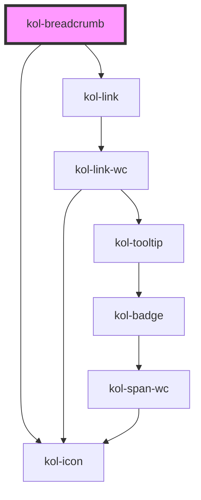

# Breadcrumb

Mit Hilfe der **Breadcrumb**-Komponente kann der Pfad zur aktuellen Position einer Webseite in einer hierarchischen Struktur dargestellt werden.

## Funktionsweise

Die **Breadcrumb**-Komponente zeigt die aktuelle Position einer Webseite in einer horizontalen Navigationsstruktur an. Das jeweils letzte Element rechts stellt die aktuelle Seite selbst dar.
Diese ist nicht mit einem link versehen. Alle Elemente links der aktuellen Seite sind mit einem Link auf die verknüpfte Seite versehen.

## Konstruktion

### Code

```tsx
<div>
	<kol-breadcrumb _links='[{"_label":"Startseite","_href":"#/"},{"_label":"Unterseite von Startseite","_href":"#/unterseite"}]'></kol-breadcrumb>
</div>
```

### Beispiel

<kol-breadcrumb _links='[{"_label":"Startseite","_href":"#/"},{"_label":"Unterseite von Startseite","_href":"#/unterseite"}]'></kol-breadcrumb>

## Verwendung

### Definition der Links

Das Attribut **\_links** erwartet die Übergabe eines JSON-Objekts, aus dem sich der Aufbau der anzuzeigenden Breadcrumb-Pfade ergibt. Das JSON-Objekt übergibt beliebig viele Elemente, die jeweils eine Anzahl an Eigenschaften und Werten bereitstellen.

Jede Eigenschaft und der zugehörige Wert müssen in doppelten Anführungszeichen gesetzt werden.

Einzelne Elemente werden in geschweiften Klammern und durch **Komma** separiert geschrieben.

Das gesamte JSON-Objekt muss in eckigen Klammern an das Attribut **`_links`** übergeben werden.

<b>Folgende Eigenschaften stehen zur Verfügung:</b>

- **`_href`** übergibt den Link, der für dieses Element verwendet werden soll.
- **`_icon`** (optional) übergibt den Namen des Icon, wenn zusätzlich zum Text des Elements noch ein Icon angezeigt werden soll. Es stehen alle Icons aus der **Icofont-Bibliothek** zur Verfügung
- **`_iconOnly`** (optional). Wenn der Wert auf **true** gesetzt wird, erscheint im Link ausschließlich das Icon, ohne weiteren Text. Die Eigenschaft `_icon` muss gesetzt werden.
- **`_label`** übergibt den Text, der für dieses Element angezeigt werden soll.
- **`_links`** übergibt den Pfadaufbau der Komponente als JSON-Objekt.

Beispiel für ein JSON-Objekt, das an das Attribut **\_links** übergeben wird:

```tsx
[
	{
		_label: 'Startseite',
		_href: '#/',
		_icon: 'home',
		_iconOnly: true,
	},
	{
		_label: '1. Unterseite',
		_href: '/1_unterseite',
	},
	{
		_label: '2. Unterseite',
		_href: '/2_unterseite',
	},
];
```

<kol-breadcrumb _links='[{"_label":"Startseite","_href":"#/","_icon":"home","_icon-only": "true"},{"_label":"1. Unterseite","_href":"#/1_unterseite"},{"_label":"2. Unterseite","_href":"#/2_unterseite"}]'></kol-breadcrumb>

### Best practices

- Die **Breadcrumb**-Komponente ist ein wichtiges Element für eine effektive Suchmaschinenoptimierung Ihrer Webseite.
- Auch für Benutzer:innen der Webseite bietet eine Breadcrumb-Navigation zusätzliche Übersicht.
- Positionieren Sie die Breadcrumb möglichst weit oben auf Ihren Inhaltsseiten, um zu gewährleisten, dass Suchmaschinen diese als zusätzliche Informationsquelle zur Struktur Ihrer Webseite nutzen können.
- Positionieren Sie die Breadcrumb-Komponente auf jeder Inhaltsseite Ihre Webseite. Sie gewährleisten so, dass sich Besucher:innen jederzeit zurecht finden und die aktuelle Position erkennen können.
- Vermeiden Sie, die Breadcrumb-Navigation auf der Startseite zu positionieren.
- Verwenden Sie eine Breadcrumb-Navigation nur dann, wenn sie für Benutzer:innen einen wirklichen Mehrwert bieten.
- Auf mobilen Varianten einer Webseite ist eine Breadcrumb-Navigation möglicherweise nicht sinnvoll.

### Anwendungsfälle

Eine Breadcrumb-Navigation ist auf einer großen Mehrzahl der aktuellen Webseiten zu finden. Somit beschreibt der klassische Anwendungsfall den generellen Einbau dieser Komponente.

## Barrierefreiheit

Achten Sie im Sinne der optimalen Barrierefreiheit darauf, das Attribut `_aria-label` korrekt auszuzeichnen. Beachten Sie diesen Hinweis insbesondere dann, wenn Sie die Option `_icon-only` verwenden und so auf einen beschreibenden Text im Link verzichten würden.

Beachten Sie, dass auch das letzte Element in der Breadcrumb-Komponente per Tab-Taste angesprungen werden kann, obwohl dort kein Link hinterlegt ist. Hierdurch kann auch dieses Element von Screenreader erreicht und vorgelesen werden.

### Tastatursteuerung

| Taste   | Funktion                                                     |
| ------- | ------------------------------------------------------------ |
| `Tab`   | Springt die einzelnen Elemente der Breadcrumb-Navigation an. |
| `Enter` | Öffnet den Link des aktuellen Elements.                      |

## Links und Referenzen

- https://www.w3.org/TR/wai-aria-practices/#breadcrumb

<!-- Auto Generated Below -->

## Properties

| Property                  | Attribute     | Description                                                                  | Type                       | Default     |
| ------------------------- | ------------- | ---------------------------------------------------------------------------- | -------------------------- | ----------- |
| `_ariaLabel` _(required)_ | `_aria-label` | Gibt den Text an, der die Navigation von anderen Navigationen differenziert. | `string`                   | `undefined` |
| `_links` _(required)_     | `_links`      | Gibt die geordnete Liste der Seitenhierarchie in Links an.                   | `NavLinkProps[] \| string` | `undefined` |

## Shadow Parts

| Part          | Description                                |
| ------------- | ------------------------------------------ |
| `"link"`      | Ermöglicht das Stylen der Links.           |
| `"separator"` | Ermöglicht das Ändern des Separator-Icons. |

## Dependencies

### Depends on

- [kol-icon](../icon)
- [kol-link](../link)

### Graph



---
