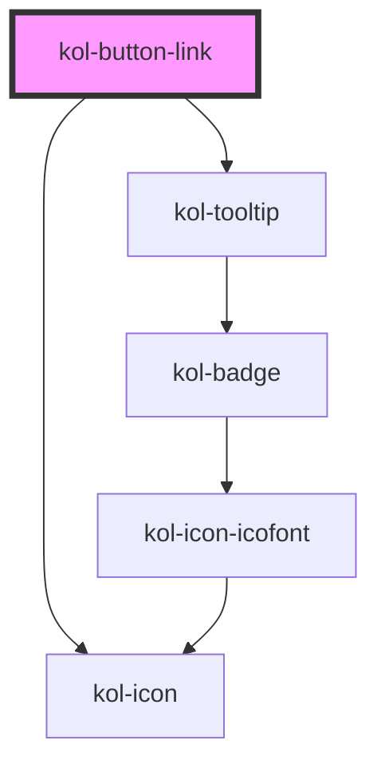

# kol-button-link

<!-- Auto Generated Below -->

## Properties

| Property              | Attribute        | Description                                                                                                                                                                                                                      | Type                                                                                                                                                                                                                                                                                                                                                                                                                                                                                                                                                                                                                                                                                                                                                                                                              | Default     |
| --------------------- | ---------------- | -------------------------------------------------------------------------------------------------------------------------------------------------------------------------------------------------------------------------------- | ----------------------------------------------------------------------------------------------------------------------------------------------------------------------------------------------------------------------------------------------------------------------------------------------------------------------------------------------------------------------------------------------------------------------------------------------------------------------------------------------------------------------------------------------------------------------------------------------------------------------------------------------------------------------------------------------------------------------------------------------------------------------------------------------------------------- | ----------- |
| `_accessKey`          | `_access-key`    | Gibt an, mit welcher Tastenkombination man den Button auslösen oder fokussieren kann.                                                                                                                                            | `string \| undefined`                                                                                                                                                                                                                                                                                                                                                                                                                                                                                                                                                                                                                                                                                                                                                                                             | `undefined` |
| `_ariaControls`       | `_aria-controls` | Gibt an, welche Elemente kontrolliert werden. (https://developer.mozilla.org/en-US/docs/Web/Accessibility/ARIA/Attributes/aria-controls)                                                                                         | `string \| undefined`                                                                                                                                                                                                                                                                                                                                                                                                                                                                                                                                                                                                                                                                                                                                                                                             | `undefined` |
| `_ariaCurrent`        | `_aria-current`  | Gibt an, welchen aktuellen Auswahlstatus der Button hat. (https://developer.mozilla.org/en-US/docs/Web/Accessibility/ARIA/Attributes/aria-current)                                                                               | `"date" \| "location" \| "page" \| "step" \| "time" \| boolean \| undefined`                                                                                                                                                                                                                                                                                                                                                                                                                                                                                                                                                                                                                                                                                                                                      | `undefined` |
| `_ariaExpanded`       | `_aria-expanded` | Gibt an, ob durch den Button etwas aufgeklappt wurde. (https://developer.mozilla.org/en-US/docs/Web/Accessibility/ARIA/Attributes/aria-expanded)                                                                                 | `boolean \| undefined`                                                                                                                                                                                                                                                                                                                                                                                                                                                                                                                                                                                                                                                                                                                                                                                            | `undefined` |
| `_ariaLabel`          | `_aria-label`    | Gibt einen Text des Buttons für den Screenreader an. Für die Sprachsteuerung muss der Aria-Text mit dem Label-Text des Buttons beginnen. (https://developer.mozilla.org/en-US/docs/Web/Accessibility/ARIA/Attributes/aria-label) | `string \| undefined`                                                                                                                                                                                                                                                                                                                                                                                                                                                                                                                                                                                                                                                                                                                                                                                             | `''`        |
| `_disabled`           | `_disabled`      | Gibt an, ob der Button deaktiviert ist.                                                                                                                                                                                          | `boolean \| undefined`                                                                                                                                                                                                                                                                                                                                                                                                                                                                                                                                                                                                                                                                                                                                                                                            | `false`     |
| `_icon`               | `_icon`          | Gibt den Class-Identifier eines Icons eine eingebunden Icofont an. (z.B. https://icofont.com/)                                                                                                                                   | `string \| undefined \| { top: string \| KoliBriCustomIcon; right?: string \| KoliBriCustomIcon \| undefined; bottom?: string \| KoliBriCustomIcon \| undefined; left?: string \| KoliBriCustomIcon \| undefined; } \| { top?: string \| KoliBriCustomIcon \| undefined; right: string \| KoliBriCustomIcon; bottom?: string \| KoliBriCustomIcon \| undefined; left?: string \| KoliBriCustomIcon \| undefined; } \| { top?: string \| KoliBriCustomIcon \| undefined; right?: string \| KoliBriCustomIcon \| undefined; bottom: string \| KoliBriCustomIcon; left?: string \| KoliBriCustomIcon \| undefined; } \| { top?: string \| KoliBriCustomIcon \| undefined; right?: string \| KoliBriCustomIcon \| undefined; bottom?: string \| KoliBriCustomIcon \| undefined; left: string \| KoliBriCustomIcon; }` | `undefined` |
| `_iconAlign`          | `_icon-align`    | **[DEPRECATED]**   Gibt an, ob das Icon links oder rechts dargestellt werden soll.                                                                                                        | `"left" \| "right" \| undefined`                                                                                                                                                                                                                                                                                                                                                                                                                                                                                                                                                                                                                                                                                                                                                                                  | `'left'`    |
| `_iconOnly`           | `_icon-only`     | Gibt an, ob nur das Icon angezeigt wird.                                                                                                                                                                                         | `boolean \| undefined`                                                                                                                                                                                                                                                                                                                                                                                                                                                                                                                                                                                                                                                                                                                                                                                            | `false`     |
| `_id`                 | `_id`            | Gibt die ID der Schaltfläche an. (Selection, Testing)                                                                                                                                                                            | `string \| undefined`                                                                                                                                                                                                                                                                                                                                                                                                                                                                                                                                                                                                                                                                                                                                                                                             | `undefined` |
| `_label` _(required)_ | `_label`         | Gibt den Label für die Beschriftung der Schaltfläche an.                                                                                                                                                                         | `string`                                                                                                                                                                                                                                                                                                                                                                                                                                                                                                                                                                                                                                                                                                                                                                                                          | `undefined` |
| `_on`                 | --               | Gibt die EventCallback-Funktionen für die Button-Events an.                                                                                                                                                                      | `undefined \| { onClick?: EventCallback<PointerEvent> \| undefined; }`                                                                                                                                                                                                                                                                                                                                                                                                                                                                                                                                                                                                                                                                                                                                            | `undefined` |
| `_tooltipAlign`       | `_tooltip-align` | Gibt an, ob der Tooltip oben, rechts, unten oder links angezeigt werden soll.                                                                                                                                                    | `"bottom" \| "left" \| "right" \| "top" \| undefined`                                                                                                                                                                                                                                                                                                                                                                                                                                                                                                                                                                                                                                                                                                                                                             | `'top'`     |
| `_type`               | `_type`          | Gibt an, welche Typ der Button hat.                                                                                                                                                                                              | `"button" \| "reset" \| "submit" \| undefined`                                                                                                                                                                                                                                                                                                                                                                                                                                                                                                                                                                                                                                                                                                                                                                    | `'button'`  |

## Dependencies

### Depends on

- [kol-icon](../icon)
- [kol-tooltip](../tooltip)

### Graph

---
