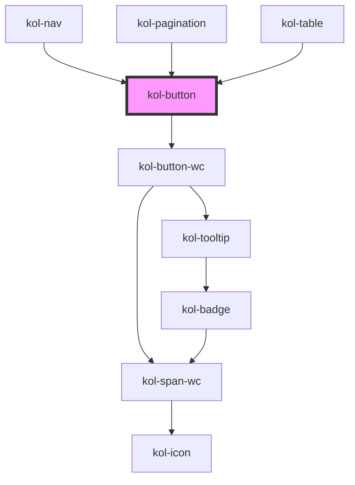

# Button

**Buttons** dienen dazu, Benutzer:innen Auswahlmöglichkeiten für Aktionen anzuzeigen und diese in einer klaren Hierarchie anzuordnen. Sie helfen Nutzer:innen, die wichtigsten Aktionen einer Seite oder innerhalb eines Viewports zu finden und ermöglichen es ihm, diese Aktionen auszuführen. Die Beschriftung des Buttons wird verwendet, um Nutzer:innen klar anzuzeigen, welche Aktion ausgelöst wird. Buttons ermöglichen es Nutzer:innen, eine Änderung zu bestätigen, Schritte in einer Aufgabe abzuschließen oder Entscheidungen zu treffen.

## Konstruktion

### Code

```tsx
<kol-button _label="Primary" _variant="primary"></kol-button>
<kol-button _label="Secondary" _variant="secondary"></kol-button>
<kol-button _label="Normal" _variant="normal"></kol-button>
<kol-button _label="Secondary" _variant="danger"></kol-button>
<kol-button _label="Ghost" _variant="ghost"></kol-button>
<kol-button _label="Custom" _variant="custom" _custom-class="myClass"></kol-button>
```

### Beispiel

Default

<div style="display: flex;gap: 0.25em;">
  <kol-button _label="Primary" _variant="primary"></kol-button>
  <kol-button _label="Secondary" _variant="secondary"></kol-button>
  <kol-button _label="Normal" _variant="normal"></kol-button>
  <kol-button _label="Danger" _variant="danger"></kol-button>
  <kol-button _label="Ghost" _variant="ghost"></kol-button>
  <kol-button _label="Custom" _variant="custom" _custom-class="myClass"></kol-button>
</div>

Disabled

<div style="display: flex;gap: 0.25em;">
  <kol-button _label="Primary" _variant="primary" _disabled></kol-button>
  <kol-button _label="Secondary" _variant="secondary" _disabled></kol-button>
  <kol-button _label="Normal" _variant="normal" _disabled></kol-button>
  <kol-button _label="Danger" _variant="danger" _disabled></kol-button>
  <kol-button _label="Ghost" _variant="ghost" _disabled></kol-button>
  <kol-button _label="Custom" _variant="custom" _custom-class="myClass" _disabled></kol-button>
</div>

## Verwendung

### Beschriftung

Für die eindeutige Beschriftung des Buttons nutzen Sie das Attribut **`_label`**.
`_label="Buttonbeschriftung"`

### Button mit Icon

Über das Attribut **`_icon`** wird eine JSON-Struktur übergeben, mit der alle Paramater zu Anzeige des Icon im Button festgelegt wird.

```tsx
_icon =
	"{'top': {'style': {'font-size': '200%', 'transform': 'rotate(45deg)'}, 'icon': 'fa-solid fa-arrow-up'},'right': {'icon': 'fa-solid fa-arrow-right'},'bottom': {'icon': 'fa-solid fa-arrow-down'},'left': {'icon': 'fa-solid fa-arrow-left'}}";
```

Es ist möglich, ein Icon an jeder Position des Button anzuzeigen, sowie die Ausgabe mehrerer Icons im Button. Jedes Icon erhält in der JSON-Struktur einen eigenen Abschnitt, in dem seine Properties festgelegt werden.<br>

Jeder Abschnitt beginnt mit der gewünschten Position des Icon im Button:

- top
- bottom
- right
- left

```tsx
"{'top': {weitere Properties}";
```

Als weitere Properties zur Konfiguration des Icon stehen zur Verfügung:

- icon: legt das anzuzeigende Icon aus der Icofont-Bibliothek fest.

```tsx
"{'top': {'icon':'fa-solid fa-arrow-up'}";
```

- style: übergibt ggfls. eigene CSS-Stylinganweisungen an das Icon, wie z.B. font-size, transform oder color.

```tsx
"{'top': {'style': {'font-size':'200%','color':'#040404','transform':'rotate(45deg)'},'icon':'fa-solid fa-arrow-up'}";
```

Eine Übersicht über die zur Verfügung stehenden Icons in KoliBri finden Sie [hier](https://icofont.com/icons)

### Nur Icon im Button anzeigen

In der **Button**-Komponente kann auf die Beschriftung auch verzichtet werden. Hierzu wird das Attribut **`_iconOnly`** gesetzt.

Beachten Sie, dass das Attribut **`_label`** auch dann gesetzt werden muss, wenn nur ein Icon angezeigt werden soll. Die Komponente gibt in diesem Fall drei Punkte (...) als Platzhalter aus.

`_icon-only="true"`

### Style angeben

Die Button-Komponente kann als primärer oder sekundärer Button ausgegeben werden. Zur Steuerung verwenden Sie das Attribut `_variant="primary/secondary/normal/danger/ghost/custom"`. Als Default-Wert wird ein Button als **primary** gerendert.<br/>

Bei Verwendung des Attribut **\_variant="custom"** kann der Entwickler für den Button eigene Styles realisieren. Verpflichtend ist in diesem Fall das Setzen des Attribut **\_custom-class**, damit das Button-Element im Shadow-Dom mittels CSS selektiert werden kann.

### Best practices

- Verwenden Sie eine primäre Schaltfläche für die nächstbeste Aktion. Verbleibende Calls-to-Action sollten als sekundäre Schaltfläche dargestellt werden.
- Verwenden Sie Schaltflächen an einheitlichen Stellen in der Benutzeroberfläche, um die Benutzererfahrung zu verbessern.
- Verwenden Sie nur eine primäre Schaltfläche je Viewport. Auf der gesamten Seite kann ein Button-Style beliebig oft auftreten.
- Die Beschriftung des Button muss die Aktion beschreiben, die die Schaltfläche ausführt. Sie sollte ein Verb enthalten (z.B. Speichern). Verwenden Sie prägnante, spezifische, selbsterklärende Beschriftungen.
- Schaltflächenbeschriftungen sollten immer dann auch ein Nomen enthalten, wenn es Raum für Interpretationen darüber gibt, wofür das Verb zuständig ist. Verwenden Sie keine generischen Bezeichnungen wie "OK", insbesondere nicht im Fehlerfall. Fehler sind nie "OK".
- Wenn Sie mehrere Buttons kombinieren oder anordnen möchten, verwenden Sie die **ButtonGroup**-Komponente.
- Verwenden Sie nicht mehrere Buttons im Style "primär" in einer **ButtonGroup**.
- Verwenden Sie Buttons nicht als Link oder als Navigationselement.

## Barrierefreiheit

Für Menschen mit einem eingeschränkten Sichtfeld ist die Positionierung des **Icons** im Button links von der Beschriftung optimal (**`_icon-align="left"`**, bzw. kein **`_icon-align`**).

Ebenfalls aus Gründen optimaler Barrierefreiheit verzichtet KoliBri bei der **Button**-Komponente auf den Status **disabled**.

Probleme mit Disabled-Status

- Darstellung Kontraste
- Möglichkeit des Nutzerfeedbacks

### Tastatursteuerung

| Taste   | Funktion                                                                       |
| ------- | ------------------------------------------------------------------------------ |
| `Tab`   | Springt den einzelnen Button an und fokussiert ihn.                            |
| `Enter` | Öffnet den Link des fokussierten Button oder führt dessen onClick-Methode aus. |

## Links und Referenzen

- https://www.w3.org/TR/wai-aria-practices/#button

<!-- Auto Generated Below -->

## Properties

| Property              | Attribute        | Description                                                                                                                                        | Type                                                                                                                                                                                                                                                                                                                                                                                                                                                                                                                                                                                                                                                                                                                                                                                                              | Default     |
| --------------------- | ---------------- | -------------------------------------------------------------------------------------------------------------------------------------------------- | ----------------------------------------------------------------------------------------------------------------------------------------------------------------------------------------------------------------------------------------------------------------------------------------------------------------------------------------------------------------------------------------------------------------------------------------------------------------------------------------------------------------------------------------------------------------------------------------------------------------------------------------------------------------------------------------------------------------------------------------------------------------------------------------------------------------- | ----------- |
| `_accessKey`          | `_access-key`    | Gibt an, mit welcher Tastenkombination man den Button auslösen oder fokussieren kann.                                                              | `string \| undefined`                                                                                                                                                                                                                                                                                                                                                                                                                                                                                                                                                                                                                                                                                                                                                                                             | `undefined` |
| `_ariaControls`       | `_aria-controls` | Gibt an, welche Elemente kontrolliert werden. (https://developer.mozilla.org/en-US/docs/Web/Accessibility/ARIA/Attributes/aria-controls)           | `string \| undefined`                                                                                                                                                                                                                                                                                                                                                                                                                                                                                                                                                                                                                                                                                                                                                                                             | `undefined` |
| `_ariaCurrent`        | `_aria-current`  | Gibt an, welchen aktuellen Auswahlstatus der Button hat. (https://developer.mozilla.org/en-US/docs/Web/Accessibility/ARIA/Attributes/aria-current) | `"date" \| "location" \| "page" \| "step" \| "time" \| boolean \| undefined`                                                                                                                                                                                                                                                                                                                                                                                                                                                                                                                                                                                                                                                                                                                                      | `undefined` |
| `_ariaExpanded`       | `_aria-expanded` | Gibt an, ob durch den Button etwas aufgeklappt wurde. (https://developer.mozilla.org/en-US/docs/Web/Accessibility/ARIA/Attributes/aria-expanded)   | `boolean \| undefined`                                                                                                                                                                                                                                                                                                                                                                                                                                                                                                                                                                                                                                                                                                                                                                                            | `undefined` |
| `_ariaLabel`          | `_aria-label`    | Gibt einen beschreibenden Text des Buttons an. (https://developer.mozilla.org/en-US/docs/Web/Accessibility/ARIA/Attributes/aria-label)             | `string \| undefined`                                                                                                                                                                                                                                                                                                                                                                                                                                                                                                                                                                                                                                                                                                                                                                                             | `''`        |
| `_customClass`        | `_custom-class`  | Gibt an, welche Custom-Class übergeben werden soll, wenn \_variant="custom" gesetzt ist.                                                           | `string \| undefined`                                                                                                                                                                                                                                                                                                                                                                                                                                                                                                                                                                                                                                                                                                                                                                                             | `undefined` |
| `_disabled`           | `_disabled`      | Gibt an, ob der Button deaktiviert ist.                                                                                                            | `boolean \| undefined`                                                                                                                                                                                                                                                                                                                                                                                                                                                                                                                                                                                                                                                                                                                                                                                            | `false`     |
| `_icon`               | `_icon`          | Gibt den Class-Identifier eines Icons eine eingebunden Icofont an. (z.B. https://icofont.com/)                                                     | `string \| undefined \| { top: string \| KoliBriCustomIcon; right?: string \| KoliBriCustomIcon \| undefined; bottom?: string \| KoliBriCustomIcon \| undefined; left?: string \| KoliBriCustomIcon \| undefined; } \| { top?: string \| KoliBriCustomIcon \| undefined; right: string \| KoliBriCustomIcon; bottom?: string \| KoliBriCustomIcon \| undefined; left?: string \| KoliBriCustomIcon \| undefined; } \| { top?: string \| KoliBriCustomIcon \| undefined; right?: string \| KoliBriCustomIcon \| undefined; bottom: string \| KoliBriCustomIcon; left?: string \| KoliBriCustomIcon \| undefined; } \| { top?: string \| KoliBriCustomIcon \| undefined; right?: string \| KoliBriCustomIcon \| undefined; bottom?: string \| KoliBriCustomIcon \| undefined; left: string \| KoliBriCustomIcon; }` | `undefined` |
| `_iconAlign`          | `_icon-align`    | <span style="color:red">**[DEPRECATED]**</span> <br/><br/>Gibt an, ob das Icon links oder rechts dargestellt werden soll.                          | `"left" \| "right" \| undefined`                                                                                                                                                                                                                                                                                                                                                                                                                                                                                                                                                                                                                                                                                                                                                                                  | `'left'`    |
| `_iconOnly`           | `_icon-only`     | Gibt an, ob nur das Icon angezeigt wird.                                                                                                           | `boolean \| undefined`                                                                                                                                                                                                                                                                                                                                                                                                                                                                                                                                                                                                                                                                                                                                                                                            | `false`     |
| `_id`                 | `_id`            | Gibt die ID der Schaltfläche an. (Selection, Testing)                                                                                              | `string \| undefined`                                                                                                                                                                                                                                                                                                                                                                                                                                                                                                                                                                                                                                                                                                                                                                                             | `undefined` |
| `_label` _(required)_ | `_label`         | Gibt den Label für die Beschriftung der Schaltfläche an.                                                                                           | `string`                                                                                                                                                                                                                                                                                                                                                                                                                                                                                                                                                                                                                                                                                                                                                                                                          | `undefined` |
| `_on`                 | --               | Gibt die EventCallback-Funktionen für die Button-Events an.                                                                                        | `undefined \| { onClick?: EventCallback<PointerEvent> \| undefined; onMouseDown?: EventCallback<MouseEvent> \| undefined; }`                                                                                                                                                                                                                                                                                                                                                                                                                                                                                                                                                                                                                                                                                      | `undefined` |
| `_tabIndex`           | `_tab-index`     | Gibt an, welchen Tab-Index der Button hat. (https://developer.mozilla.org/en-US/docs/Web/HTML/Global_attributes/tabindex)                          | `number \| undefined`                                                                                                                                                                                                                                                                                                                                                                                                                                                                                                                                                                                                                                                                                                                                                                                             | `undefined` |
| `_tooltipAlign`       | `_tooltip-align` | Gibt an, ob der Tooltip oben, rechts, unten oder links angezeigt werden soll.                                                                      | `"bottom" \| "left" \| "right" \| "top" \| undefined`                                                                                                                                                                                                                                                                                                                                                                                                                                                                                                                                                                                                                                                                                                                                                             | `'top'`     |
| `_type`               | `_type`          | Gibt an, welche Typ der Button hat.                                                                                                                | `"button" \| "reset" \| "submit" \| undefined`                                                                                                                                                                                                                                                                                                                                                                                                                                                                                                                                                                                                                                                                                                                                                                    | `'button'`  |
| `_variant`            | `_variant`       | Gibt an, welche Ausprägung der Button hat.                                                                                                         | `"custom" \| "danger" \| "ghost" \| "normal" \| "primary" \| "secondary" \| undefined`                                                                                                                                                                                                                                                                                                                                                                                                                                                                                                                                                                                                                                                                                                                            | `'normal'`  |

## Methods

### `getInteractiveElementRef() => Promise<HTMLButtonElement | undefined>`

Gibt die Referenz auf das interaktive Element in der Komponente zurück.

#### Returns

Type: `Promise<HTMLButtonElement | undefined>`

## Dependencies

### Used by

- [kol-nav](../nav)
- [kol-pagination](../pagination)
- [kol-table](../table)

### Depends on

- kol-button-wc

### Graph



---
