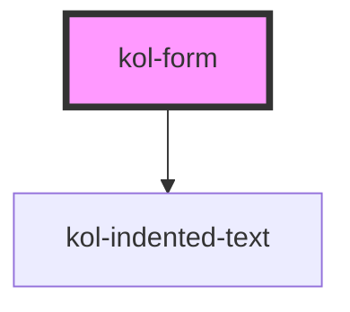

# Form

## Konstruktion

### Code

### Beispiel

## Verwendung

### Anwendungsfälle

### Best practices

## Barrierefreiheit

## Links und Referenzen

<!-- Auto Generated Below -->

## Properties

| Property        | Attribute        | Description                                                   | Type                                                                                                          | Default     |
| --------------- | ---------------- | ------------------------------------------------------------- | ------------------------------------------------------------------------------------------------------------- | ----------- |
| `_on`           | --               | Gibt die EventCallback-Funktionen für die Form-Events an.     | `undefined \| { onSubmit?: EventCallback<Event> \| undefined; onReset?: EventCallback<Event> \| undefined; }` | `undefined` |
| `_requiredText` | `_required-text` | Gibt an, ob der Pflichtfeld-Hinweis eingeblendet werden soll. | `boolean \| string \| undefined`                                                                              | `true`      |

## Dependencies

### Depends on

- [kol-indented-text](../indented-text)

### Graph

---
